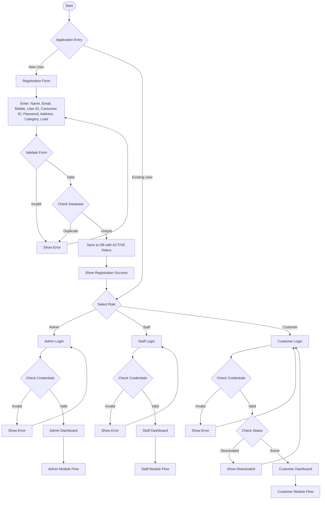

# A4-01 - Main Authentication & User Flow (Simplified for Hand Drawing)

## User-Consumer Relationship
- **One User** → Can have **Multiple Consumer IDs**
- **One Consumer ID** → Belongs to **Only One User**

## Key Points for Drawing:
1. **Diamond shapes** for decisions/conditions
2. **Rectangle shapes** for processes/actions
3. **Cylinder/Database shape** for database operations
4. **Arrows** showing flow direction
5. **Different colors** for different user types (Admin=Red, Staff=Blue, Customer=Green)
