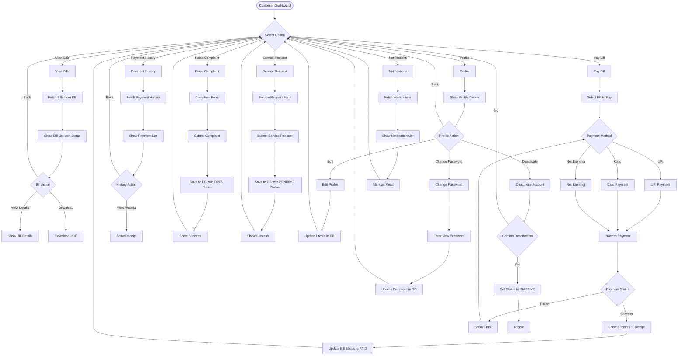

# A4-02 - Customer Module Flow (Simplified for Hand Drawing)

## Key Points for Drawing:
1. **Customer Dashboard** as central hub
2. **6 Main Options** branching out
3. **Each option** has its own sub-flow
4. **Payment flow** has multiple methods
5. **Profile** includes edit, password change, deactivate
6. **Color coding**: Bills=Blue, Payments=Green, Complaints=Orange, Profile=Purple
