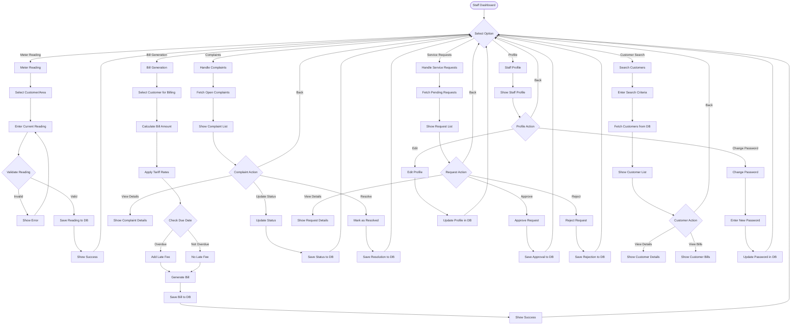

# A4-03 - Staff Module Flow (Simplified for Hand Drawing)

## Key Points for Drawing:
1. **Staff Dashboard** as central hub
2. **6 Main Options** for staff operations
3. **Meter Reading**: Select customer → Enter reading → Validate → Save
4. **Bill Generation**: Select customer → Calculate → Apply tariff → Check overdue → Generate
5. **Complaints**: View → Update status → Resolve
6. **Service Requests**: View → Approve/Reject
7. **Customer Search**: Search → View details/bills
8. **Color coding**: Meter Reading=Blue, Bills=Green, Complaints=Orange, Service Requests=Red
