# A4-04 - Admin Module Flow (Simplified for Hand Drawing)

```mermaid
flowchart TD
    ADMIN_START([Admin Dashboard]) --> ADMIN_OPT{Select Option}
    
    ADMIN_OPT -->|Staff Management| STAFF_MGMT[Staff Management]
    ADMIN_OPT -->|Customer Management| CUST_MGMT[Customer Management]
    ADMIN_OPT -->|Tariff Management| TARIFF_MGMT[Tariff Management]
    ADMIN_OPT -->|Analytics & Reports| ANALYTICS[Analytics & Reports]
    ADMIN_OPT -->|Area Management| AREA_MGMT[Area Management]
    ADMIN_OPT -->|Profile| ADMIN_PROF[Admin Profile]
    
    %% Staff Management Flow
    STAFF_MGMT --> STAFF_ACTION{Staff Action}
    STAFF_ACTION -->|Add Staff| ADD_STAFF[Add New Staff]
    STAFF_ACTION -->|Edit Staff| EDIT_STAFF[Edit Staff Details]
    STAFF_ACTION -->|Assign Area| ASSIGN_AREA[Assign Area]
    STAFF_ACTION -->|Deactivate| DEACT_STAFF[Deactivate Staff]
    STAFF_ACTION -->|Back| ADMIN_OPT
    
    ADD_STAFF --> STAFF_FORM[Staff Form: Name, ID, Password, Area]
    STAFF_FORM --> SAVE_STAFF[Save Staff to DB]
    SAVE_STAFF --> STAFF_SUCCESS[Show Success]
    STAFF_SUCCESS --> ADMIN_OPT
    
    EDIT_STAFF --> UPDATE_STAFF[Update Staff in DB]
    UPDATE_STAFF --> ADMIN_OPT
    
    ASSIGN_AREA --> SET_AREA[Set Area for Staff]
    SET_AREA --> ADMIN_OPT
    
    DEACT_STAFF --> CONFIRM_STAFF{Confirm Deactivation}
    CONFIRM_STAFF -->|Yes| SET_STAFF_INACTIVE[Set Staff INACTIVE]
    CONFIRM_STAFF -->|No| ADMIN_OPT
    SET_STAFF_INACTIVE --> ADMIN_OPT
    
    %% Customer Management Flow
    CUST_MGMT --> CUST_ACTION{Customer Action}
    CUST_ACTION -->|Search Customer| SEARCH_CUST[Search Customer]
    CUST_ACTION -->|Edit Customer| EDIT_CUST[Edit Customer]
    CUST_ACTION -->|Deactivate| DEACT_CUST[Deactivate Customer]
    CUST_ACTION -->|View Bills| VIEW_CUST_BILLS[View Customer Bills]
    CUST_ACTION -->|Back| ADMIN_OPT
    
    SEARCH_CUST --> CUST_SEARCH_INPUT[Enter Search Criteria]
    CUST_SEARCH_INPUT --> FETCH_CUST_LIST[Fetch Customer List]
    FETCH_CUST_LIST --> SHOW_CUST_LIST[Show Customer List]
    SHOW_CUST_LIST --> ADMIN_OPT
    
    EDIT_CUST --> UPDATE_CUST[Update Customer in DB]
    UPDATE_CUST --> ADMIN_OPT
    
    DEACT_CUST --> CONFIRM_CUST{Confirm Deactivation}
    CONFIRM_CUST -->|Yes| SET_CUST_INACTIVE[Set Customer INACTIVE]
    CONFIRM_CUST -->|No| ADMIN_OPT
    SET_CUST_INACTIVE --> ADMIN_OPT
    
    VIEW_CUST_BILLS --> FETCH_BILLS_ADMIN[Fetch Bills]
    FETCH_BILLS_ADMIN --> SHOW_BILLS_ADMIN[Show Bills]
    SHOW_BILLS_ADMIN --> ADMIN_OPT
    
    %% Tariff Management Flow
    TARIFF_MGMT --> TARIFF_ACTION{Tariff Action}
    TARIFF_ACTION -->|View Tariffs| VIEW_TARIFF[View Current Tariffs]
    TARIFF_ACTION -->|Update Tariff| UPDATE_TARIFF[Update Tariff Rates]
    TARIFF_ACTION -->|Back| ADMIN_OPT
    
    VIEW_TARIFF --> SHOW_TARIFF[Show Tariff Structure]
    SHOW_TARIFF --> ADMIN_OPT
    
    UPDATE_TARIFF --> TARIFF_FORM[Update Form: Base Rate, Slabs, Fixed Charge]
    TARIFF_FORM --> SAVE_TARIFF[Save Tariff with Version]
    SAVE_TARIFF --> TARIFF_SUCCESS[Show Success]
    TARIFF_SUCCESS --> ADMIN_OPT
    
    %% Analytics & Reports Flow
    ANALYTICS --> REPORT_ACTION{Report Type}
    REPORT_ACTION -->|Revenue Summary| REV_SUM[Revenue Summary]
    REPORT_ACTION -->|Defaulters| DEFAULTERS[Defaulters Report]
    REPORT_ACTION -->|City Stats| CITY_STATS[City Consumption Stats]
    REPORT_ACTION -->|Payment Trends| PAY_TRENDS[Payment Trends]
    REPORT_ACTION -->|Back| ADMIN_OPT
    
    REV_SUM --> FETCH_REV[Fetch Revenue Data]
    FETCH_REV --> SHOW_REV[Show Revenue Cards]
    SHOW_REV --> ADMIN_OPT
    
    DEFAULTERS --> FETCH_DEF[Fetch Defaulters List]
    FETCH_DEF --> SHOW_DEF[Show Defaulters Table]
    SHOW_DEF --> ADMIN_OPT
    
    CITY_STATS --> FETCH_CITY[Fetch City Data]
    FETCH_CITY --> SHOW_CITY[Show City Charts]
    SHOW_CITY --> ADMIN_OPT
    
    PAY_TRENDS --> FETCH_TRENDS[Fetch Payment Data]
    FETCH_TRENDS --> SHOW_TRENDS[Show Trend Charts]
    SHOW_TRENDS --> ADMIN_OPT
    
    %% Area Management Flow
    AREA_MGMT --> AREA_ACTION{Area Action}
    AREA_ACTION -->|Add Area| ADD_AREA[Add New Area]
    AREA_ACTION -->|Edit Area| EDIT_AREA[Edit Area]
    AREA_ACTION -->|Deactivate Area| DEACT_AREA[Deactivate Area]
    AREA_ACTION -->|Back| ADMIN_OPT
    
    ADD_AREA --> AREA_FORM[Area Form: Name, Code, City]
    AREA_FORM --> SAVE_AREA[Save Area to DB]
    SAVE_AREA --> AREA_SUCCESS[Show Success]
    AREA_SUCCESS --> ADMIN_OPT
    
    EDIT_AREA --> UPDATE_AREA[Update Area in DB]
    UPDATE_AREA --> ADMIN_OPT
    
    DEACT_AREA --> CONFIRM_AREA{Confirm Deactivation}
    CONFIRM_AREA -->|Yes| SET_AREA_INACTIVE[Set Area INACTIVE]
    CONFIRM_AREA -->|No| ADMIN_OPT
    SET_AREA_INACTIVE --> ADMIN_OPT
    
    %% Admin Profile Flow
    ADMIN_PROF --> SHOW_ADMIN_PROF[Show Admin Profile]
    SHOW_ADMIN_PROF --> ADMIN_PROF_ACTION{Profile Action}
    ADMIN_PROF_ACTION -->|Edit| EDIT_ADMIN[Edit Profile]
    ADMIN_PROF_ACTION -->|Change Password| ADMIN_PASS[Change Password]
    ADMIN_PROF_ACTION -->|Back| ADMIN_OPT
    
    EDIT_ADMIN --> UPDATE_ADMIN[Update Profile in DB]
    UPDATE_ADMIN --> ADMIN_OPT
    
    ADMIN_PASS --> NEW_ADMIN_PASS[Enter New Password]
    NEW_ADMIN_PASS --> UPDATE_ADMIN_PASS[Update Password in DB]
    UPDATE_ADMIN_PASS --> ADMIN_OPT
```

## Key Points for Drawing:
1. **Admin Dashboard** as central hub
2. **6 Main Options** for admin operations
3. **Staff Management**: Add, Edit, Assign Area, Deactivate
4. **Customer Management**: Search, Edit, Deactivate, View Bills
5. **Tariff Management**: View, Update with versioning
6. **Analytics**: Revenue, Defaulters, City Stats, Payment Trends
7. **Area Management**: Add, Edit, Deactivate areas
8. **Color coding**: Staff=Blue, Customer=Green, Tariff=Orange, Analytics=Purple, Area=Red
