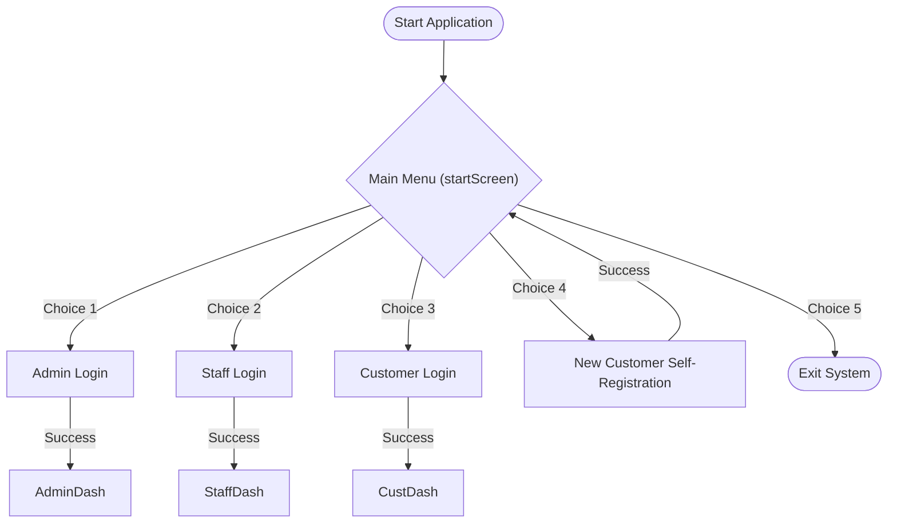
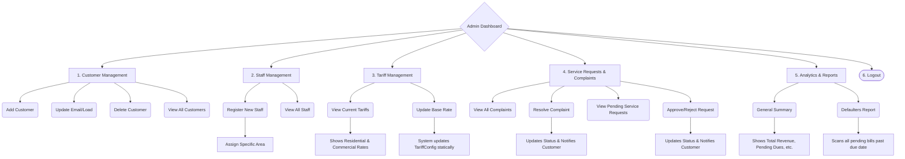
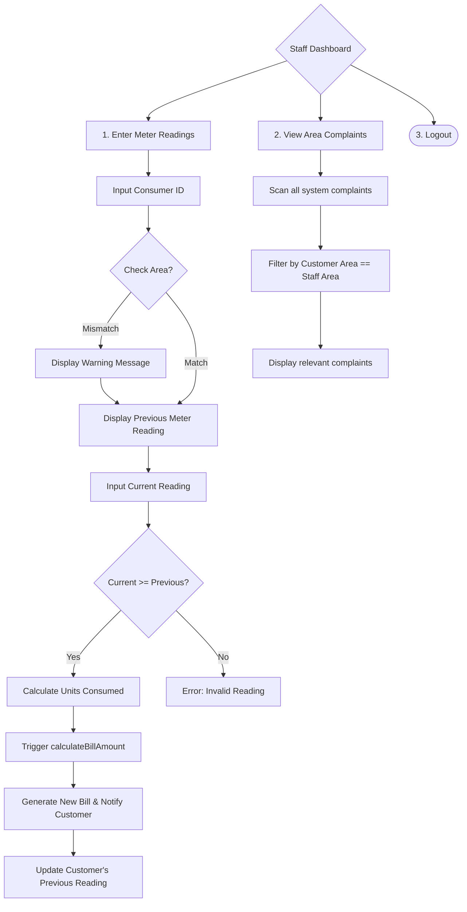
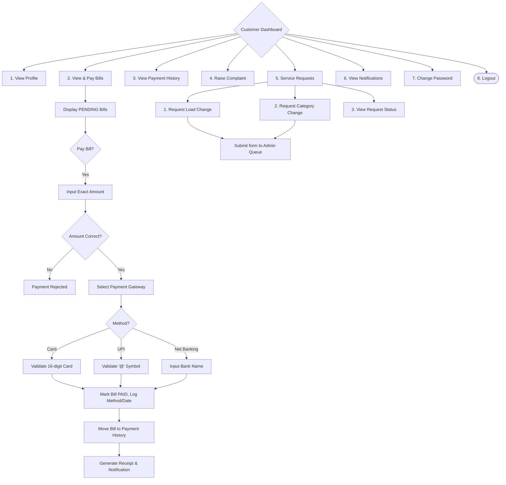

# Electricity Bill Management System - Flowcharts

The following flowcharts outline the detailed application flow for all three user roles: **Admin**, **Staff (Meter Reader)**, and **Customer**, as well as the main entry point to the system.

## Main Application Entry

***

## 1. Admin Application Flow

The Admin has full control over the system, handling staff assignments, managing tariffs dynamically, resolving escalated complaints, and viewing high-level analytics.

***

## 2. Staff (Meter Reader) Application Flow

Staff members are assigned to specific geographical areas. Their primary job is entering meter readings to automatically generate new bills for the customers.

***

## 3. Customer Application Flow

Customers can manage their own profiles, track their usage, pay bills through simulated gateways, and submit requests for load/category changes.

