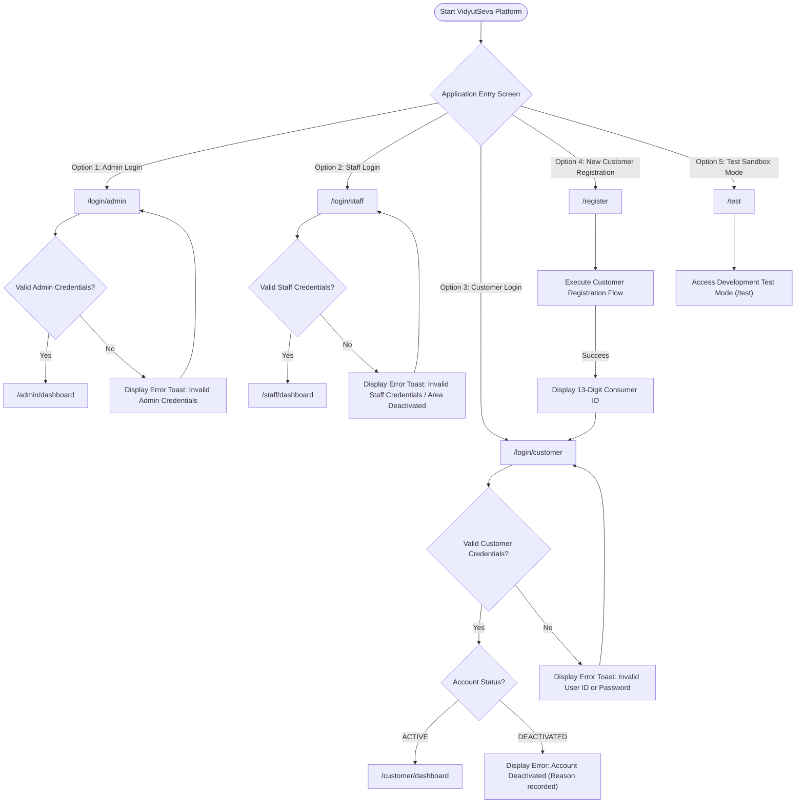

# 01 - Main Application Entry Flowchart

```mermaid
flowchart TD
    Start([Start VidyutSeva Platform]) --> EntryScreen{"Application Entry Screen"}

    EntryScreen -->|Option 1: Admin Login| AdminLoginRoute["/login/admin"]
    EntryScreen -->|Option 2: Staff Login| StaffLoginRoute["/login/staff"]
    EntryScreen -->|Option 3: Customer Login| CustLoginRoute["/login/customer"]
    EntryScreen -->|Option 4: New Customer Registration| RegisterRoute["/register"]
    EntryScreen -->|Option 5: Test Sandbox Mode| TestRoute["/test"]

    AdminLoginRoute --> AdminAuthCheck{Valid Admin Credentials?}
    AdminAuthCheck -->|Yes| AdminDashboard["/admin/dashboard"]
    AdminAuthCheck -->|No| AdminLoginError["Display Error Toast: Invalid Admin Credentials"]
    AdminLoginError --> AdminLoginRoute

    StaffLoginRoute --> StaffAuthCheck{Valid Staff Credentials?}
    StaffAuthCheck -->|Yes| StaffDashboard["/staff/dashboard"]
    StaffAuthCheck -->|No| StaffLoginError["Display Error Toast: Invalid Staff Credentials / Area Deactivated"]
    StaffLoginError --> StaffLoginRoute

    CustLoginRoute --> CustAuthCheck{Valid Customer Credentials?}
    CustAuthCheck -->|Yes| CustStatusCheck{Account Status?}
    CustStatusCheck -->|ACTIVE| CustDashboard["/customer/dashboard"]
    CustStatusCheck -->|DEACTIVATED| CustDeactivatedError["Display Error: Account Deactivated (Reason recorded)"]
    CustAuthCheck -->|No| CustLoginError["Display Error Toast: Invalid User ID or Password"]
    CustLoginError --> CustLoginRoute

    RegisterRoute --> RegistrationFlow["Execute Customer Registration Flow"]
    RegistrationFlow -->|Success| RegSuccessScreen["Display 13-Digit Consumer ID"]
    RegSuccessScreen --> CustLoginRoute

    TestRoute --> InteractiveSandbox["Access Development Test Mode (/test)"]
```
