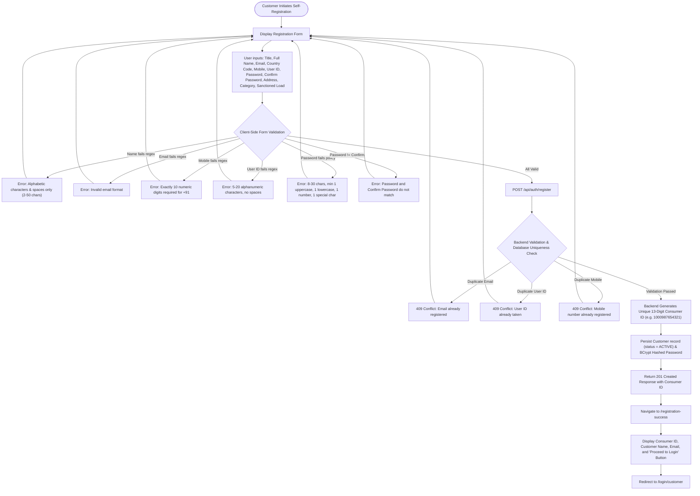

# 02 - Customer Registration Flowchart

```mermaid
flowchart TD
    StartReg([Customer Initiates Self-Registration]) --> DisplayForm["Display Registration Form"]

    DisplayForm --> InputFields["User inputs: Title, Full Name, Email, Country Code, Mobile, User ID, Password, Confirm Password, Address, Category, Sanctioned Load"]

    InputFields --> ValClient{"Client-Side Form Validation"}

    ValClient -->|Name fails regex| ErrName["Error: Alphabetic characters & spaces only (2-50 chars)"]
    ValClient -->|Email fails regex| ErrEmail["Error: Invalid email format"]
    ValClient -->|Mobile fails regex| ErrMobile["Error: Exactly 10 numeric digits required for +91"]
    ValClient -->|User ID fails regex| ErrUserId["Error: 5-20 alphanumeric characters, no spaces"]
    ValClient -->|Password fails policy| ErrPass["Error: 8-30 chars, min 1 uppercase, 1 lowercase, 1 number, 1 special char"]
    ValClient -->|Password != Confirm| ErrMismatch["Error: Password and Confirm Password do not match"]

    ErrName --> DisplayForm
    ErrEmail --> DisplayForm
    ErrMobile --> DisplayForm
    ErrUserId --> DisplayForm
    ErrPass --> DisplayForm
    ErrMismatch --> DisplayForm

    ValClient -->|All Valid| SubmitAPI["POST /api/auth/register"]

    SubmitAPI --> ValServer{"Backend Validation & Database Uniqueness Check"}

    ValServer -->|Duplicate Email| ErrDupEmail["409 Conflict: Email already registered"]
    ValServer -->|Duplicate User ID| ErrDupUser["409 Conflict: User ID already taken"]
    ValServer -->|Duplicate Mobile| ErrDupMobile["409 Conflict: Mobile number already registered"]

    ErrDupEmail --> DisplayForm
    ErrDupUser --> DisplayForm
    ErrDupMobile --> DisplayForm

    ValServer -->|Validation Passed| GenConsumerID["Backend Generates Unique 13-Digit Consumer ID (e.g. 1000987654321)"]

    GenConsumerID --> PersistData["Persist Customer record (status = ACTIVE) & BCrypt Hashed Password"]

    PersistData --> Return201["Return 201 Created Response with Consumer ID"]

    Return201 --> DisplaySuccessScreen["Navigate to /registration-success"]

    DisplaySuccessScreen --> ViewDetails["Display Consumer ID, Customer Name, Email, and 'Proceed to Login' Button"]

    ViewDetails --> LoginRedirect["Redirect to /login/customer"]
```
