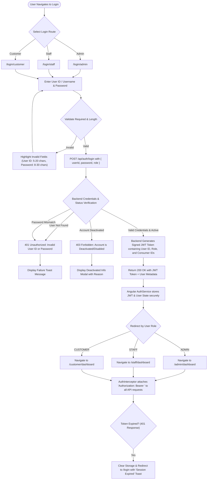

# 03 - Login & Authentication Flowchart

```mermaid
flowchart TD
    StartLogin([User Navigates to Login]) --> SelectRole{"Select Login Route"}

    SelectRole -->|Admin| AdminForm["/login/admin"]
    SelectRole -->|Staff| StaffForm["/login/staff"]
    SelectRole -->|Customer| CustForm["/login/customer"]

    AdminForm --> EnterCreds["Enter User ID / Username & Password"]
    StaffForm --> EnterCreds
    CustForm --> EnterCreds

    EnterCreds --> FormVal{"Validate Required & Length"}
    FormVal -->|Invalid| ShowFormError["Highlight Invalid Fields (User ID: 5-20 chars, Password: 8-30 chars)"]
    ShowFormError --> EnterCreds

    FormVal -->|Valid| CallAuthAPI["POST /api/auth/login with { userId, password, role }"]

    CallAuthAPI --> ServerCheck{"Backend Credentials & Status Verification"}

    ServerCheck -->|User Not Found| Err401["401 Unauthorized: Invalid User ID or Password"]
    ServerCheck -->|Password Mismatch| Err401
    ServerCheck -->|Account Deactivated| Err403["403 Forbidden: Account is Deactivated/Disabled"]

    Err401 --> DisplayToast["Display Failure Toast Message"]
    Err403 --> DisplayDeactivatedModal["Display Deactivated Info Modal with Reason"]

    ServerCheck -->|Valid Credentials & Active| GenJWT["Backend Generates Signed JWT Token containing User ID, Role, and Consumer IDs"]

    GenJWT --> ReturnToken["Return 200 OK with JWT Token + User Metadata"]

    ReturnToken --> StoreState["Angular AuthService stores JWT & User State securely"]

    StoreState --> RoleRedirect{"Redirect by User Role"}

    RoleRedirect -->|ADMIN| GoAdminDash["Navigate to /admin/dashboard"]
    RoleRedirect -->|STAFF| GoStaffDash["Navigate to /staff/dashboard"]
    RoleRedirect -->|CUSTOMER| GoCustDash["Navigate to /customer/dashboard"]

    GoAdminDash --> SessionGuard["AuthInterceptor attaches 'Authorization: Bearer <token>' to all API requests"]
    GoStaffDash --> SessionGuard
    GoCustDash --> SessionGuard

    SessionGuard --> TokenExpired{"Token Expired? (401 Response)"}
    TokenExpired -->|Yes| AutoLogout["Clear Storage & Redirect to /login with 'Session Expired' Toast"]
```
