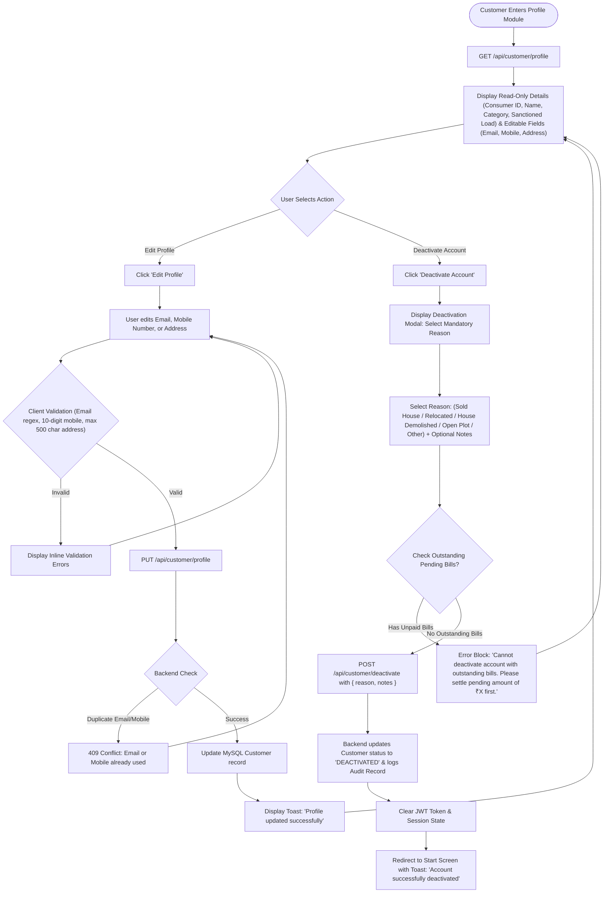

# 04 - Customer Profile Edit & Self-Deactivation Flowchart

```mermaid
flowchart TD
    StartProfile([Customer Enters Profile Module]) --> ViewProfile["GET /api/customer/profile"]

    ViewProfile --> RenderProfile["Display Read-Only Details (Consumer ID, Name, Category, Sanctioned Load) & Editable Fields (Email, Mobile, Address)"]

    RenderProfile --> ActionChoice{"User Selects Action"}

    ActionChoice -->|Edit Profile| OpenEditForm["Click 'Edit Profile'"]
    ActionChoice -->|Deactivate Account| OpenDeactivateModal["Click 'Deactivate Account'"]

    OpenEditForm --> ModifyFields["User edits Email, Mobile Number, or Address"]
    ModifyFields --> ValEdit{"Client Validation (Email regex, 10-digit mobile, max 500 char address)"}

    ValEdit -->|Invalid| ShowEditValErr["Display Inline Validation Errors"]
    ShowEditValErr --> ModifyFields

    ValEdit -->|Valid| SubmitProfileUpdate["PUT /api/customer/profile"]
    SubmitProfileUpdate --> BackendValProfile{"Backend Check"}
    BackendValProfile -->|Duplicate Email/Mobile| ProfileDupErr["409 Conflict: Email or Mobile already used"]
    ProfileDupErr --> ModifyFields
    BackendValProfile -->|Success| SaveProfileDB["Update MySQL Customer record"]
    SaveProfileDB --> ProfileSuccessToast["Display Toast: 'Profile updated successfully'"]
    ProfileSuccessToast --> RenderProfile

    OpenDeactivateModal --> DeactivateForm["Display Deactivation Modal: Select Mandatory Reason"]

    DeactivateForm --> SelectReason["Select Reason: (Sold House / Relocated / House Demolished / Open Plot / Other) + Optional Notes"]

    SelectReason --> CheckPendingBills{"Check Outstanding Pending Bills?"}

    CheckPendingBills -->|Has Unpaid Bills| BlockDeactivation["Error Block: 'Cannot deactivate account with outstanding bills. Please settle pending amount of ₹X first.'"]
    BlockDeactivation --> RenderProfile

    CheckPendingBills -->|No Outstanding Bills| SubmitDeactivation["POST /api/customer/deactivate with { reason, notes }"]

    SubmitDeactivation --> SoftDeleteBackend["Backend updates Customer status to 'DEACTIVATED' & logs Audit Record"]

    SoftDeleteBackend --> ClearUserSession["Clear JWT Token & Session State"]
    ClearUserSession --> RedirectDeactivatedScreen["Redirect to Start Screen with Toast: 'Account successfully deactivated'"]
```
