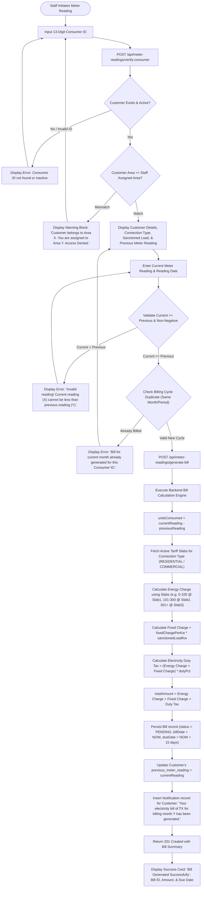

# 05 - Meter Reading & Bill Generation Flowchart

```mermaid
flowchart TD
    StartReading([Staff Initiates Meter Reading]) --> InputConsumerID["Input 13-Digit Consumer ID"]

    InputConsumerID --> SearchCust["POST /api/meter-readings/verify-consumer"]

    SearchCust --> CustExistsCheck{"Customer Exists & Active?"}

    CustExistsCheck -->|No / Invalid ID| ErrCustNotFound["Display Error: Consumer ID not found or inactive"]
    ErrCustNotFound --> InputConsumerID

    CustExistsCheck -->|Yes| AreaCheck{"Customer Area == Staff Assigned Area?"}

    AreaCheck -->|Mismatch| AreaMismatchErr["Display Warning Block: 'Customer belongs to Area X. You are assigned to Area Y. Access Denied.'"]
    AreaMismatchErr --> InputConsumerID

    AreaCheck -->|Match| DisplayPrevReading["Display Customer Details, Connection Type, Sanctioned Load, & Previous Meter Reading"]

    DisplayPrevReading --> InputCurrentReading["Enter Current Meter Reading & Reading Date"]

    InputCurrentReading --> ValReading{"Validate Current >= Previous & Non-Negative"}

    ValReading -->|Current < Previous| ErrNegativeUnits["Display Error: 'Invalid reading! Current reading (X) cannot be less than previous reading (Y).'"]
    ErrNegativeUnits --> InputCurrentReading

    ValReading -->|Current >= Previous| CheckDupCycle{"Check Billing Cycle Duplicate (Same Month/Period)"}

    CheckDupCycle -->|Already Billed| ErrDupCycle["Display Error: 'Bill for current month already generated for this Consumer ID.'"]
    ErrDupCycle --> DisplayPrevReading

    CheckDupCycle -->|Valid New Cycle| SubmitReadingAPI["POST /api/meter-readings/generate-bill"]

    SubmitReadingAPI --> BackendBillEngine["Execute Backend Bill Calculation Engine"]

    BackendBillEngine --> UnitsCalc["unitsConsumed = currentReading - previousReading"]
    UnitsCalc --> FetchTariff["Fetch Active Tariff Slabs for Connection Type (RESIDENTIAL / COMMERCIAL)"]
    FetchTariff --> EnergyCalc["Calculate Energy Charge using Slabs (e.g. 0-100 @ Slab1, 101-300 @ Slab2, 301+ @ Slab3)"]
    EnergyCalc --> FixedCalc["Calculate Fixed Charge = fixedChargePerKw * sanctionedLoadKw"]
    FixedCalc --> DutyCalc["Calculate Electricity Duty Tax = (Energy Charge + Fixed Charge) * dutyPct"]
    DutyCalc --> TotalCalc["totalAmount = Energy Charge + Fixed Charge + Duty Tax"]

    TotalCalc --> CreateBillRecord["Persist Bill record (status = PENDING, billDate = NOW, dueDate = NOW + 15 days)"]
    CreateBillRecord --> UpdatePrevReading["Update Customer's previous_meter_reading = currentReading"]

    UpdatePrevReading --> TriggerNotification["Insert Notification record for Customer: 'Your electricity bill of ₹X for billing month Y has been generated.'"]

    TriggerNotification --> SuccessResponse["Return 201 Created with Bill Summary"]

    SuccessResponse --> DisplaySuccessUI["Display Success Card: 'Bill Generated Successfully', Bill ID, Amount, & Due Date"]
```
