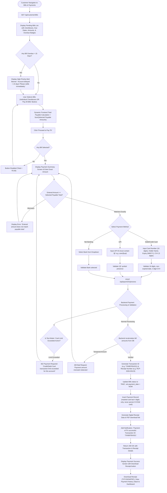

# 06 - Bill Selection & Payment Flowchart (Multi-Bill, Pay-All, Card Limit Handling)

```mermaid
flowchart TD
    StartPay([Customer Navigates to Bills & Payments]) --> FetchBills["GET /api/customer/bills"]

    FetchBills --> RenderBills["Display Pending Bills List with checkboxes, Due Dates, Amounts, & Overdue Badges"]

    RenderBills --> Check15DayOverdue{"Any Bill Overdue > 15 Days?"}
    Check15DayOverdue -->|Yes| DisplayOverdueBanner["Display High-Priority Alert Banner: 'Account delayed > 15 days! Please settle immediately.'"]
    Check15DayOverdue -->|No| SelectBills

    DisplayOverdueBanner --> SelectBills["User Selects Bills (Individual Checkboxes OR 'Pay All Bills' Button)"]

    SelectBills --> CalcTotal["Dynamic Frontend Total Payable Calculation = Sum(Selected Payable Amounts)"]

    CalcTotal --> ClickPay["Click 'Proceed to Pay ₹X'"]

    ClickPay --> CheckSelection{"Any Bill Selected?"}
    CheckSelection -->|No| DisablePay["Button Disabled (Total = ₹0.00)"]
    DisablePay --> SelectBills

    CheckSelection -->|Yes| PaymentSummaryScreen["Display Payment Summary Screen & Enter Exact Amount"]

    PaymentSummaryScreen --> ValAmount{"Entered Amount == Selected Payable Total?"}
    ValAmount -->|Mismatch| ErrAmountMismatch["Display Error: 'Entered amount does not match payable total.'"]
    ErrAmountMismatch --> PaymentSummaryScreen

    ValAmount -->|Matches Exactly| SelectMethod{"Select Payment Method"}

    SelectMethod -->|Debit/Credit Card| CardForm["Input Card Number (16 digits), Holder Name, Expiry (MM/YY), CVV (3 digits)"]
    SelectMethod -->|UPI| UpiForm["Input UPI ID (must contain '@' e.g. user@upi)"]
    SelectMethod -->|Net Banking| BankForm["Select Bank from Dropdown"]

    CardForm --> ValCard["Validate 16 digits, non-expired date, 3 digit CVV"]
    UpiForm --> ValUpi["Validate '@' symbol presence"]
    BankForm --> ValBank["Validate Bank selected"]

    ValCard --> SubmitPaymentAPI["POST /api/payments/process"]
    ValUpi --> SubmitPaymentAPI
    ValBank --> SubmitPaymentAPI

    SubmitPaymentAPI --> ServerPayEngine{"Backend Payment Processing & Validation"}

    ServerPayEngine --> CheckCardLimit{"Is Test Mode / Card Limit Exceeded Active?"}
    CheckCardLimit -->|Limit Exceeded| CardLimitErr["402 Payment Required: 'Credit/Debit Card transaction limit exceeded for this account!'"]
    CardLimitErr --> PaymentSummaryScreen

    ServerPayEngine -->|Normal Processing| VerifyAmountBackend{"Backend recalculates bill amounts from DB"}

    VerifyAmountBackend -->|Tampered Amount| BackendMismatchErr["400 Bad Request: 'Payment amount mismatch detected.'"]
    BackendMismatchErr --> PaymentSummaryScreen

    VerifyAmountBackend -->|Verified| ProcessTxn["Generate Transaction ID (e.g. TXN987654321) & Receipt Number (e.g. RCP-2026-00123)"]

    ProcessTxn --> UpdateBillStatus["Update Bills status to 'PAID', set payment_date = NOW"]
    UpdateBillStatus --> CreatePaymentRecord["Insert Payment Record (masked card last 4 digits only, never persist CVV/full card)"]
    CreatePaymentRecord --> GenReceiptPDF["Generate Digital Receipt Data & PDF download link"]
    GenReceiptPDF --> AddPayNotif["Add Notification: 'Payment of ₹X successful. Transaction ID: TXN987654321'"]

    AddPayNotif --> Return200Pay["Return 200 OK with Transaction & Receipt Details"]

    Return200Pay --> PaymentSuccessScreen["Display Payment Success Screen with Download Receipt button"]
    PaymentSuccessScreen --> Options["Download Receipt (TXT/JSON/PDF) | View Payment History | Back to Dashboard"]
```
