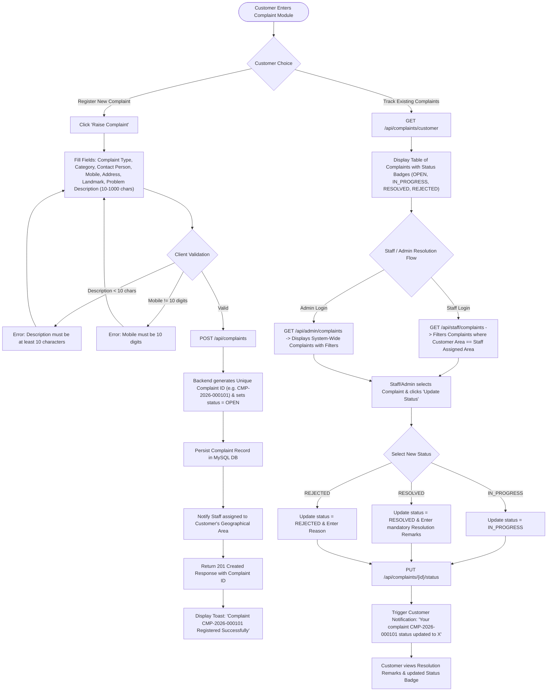

# 07 - Complaint Lifecycle Flowchart

```mermaid
flowchart TD
    StartComplaint([Customer Enters Complaint Module]) --> SelectAction{"Customer Choice"}

    SelectAction -->|Register New Complaint| OpenComplaintForm["Click 'Raise Complaint'"]
    SelectAction -->|Track Existing Complaints| ViewComplaintList["GET /api/complaints/customer"]

    OpenComplaintForm --> FillComplaint["Fill Fields: Complaint Type, Category, Contact Person, Mobile, Address, Landmark, Problem Description (10-1000 chars)"]

    FillComplaint --> ValComplaint{"Client Validation"}
    ValComplaint -->|Description < 10 chars| ErrDesc["Error: Description must be at least 10 characters"]
    ValComplaint -->|Mobile != 10 digits| ErrMob["Error: Mobile must be 10 digits"]
    ErrDesc --> FillComplaint
    ErrMob --> FillComplaint

    ValComplaint -->|Valid| SubmitComplaintAPI["POST /api/complaints"]

    SubmitComplaintAPI --> GenComplaintID["Backend generates Unique Complaint ID (e.g. CMP-2026-000101) & sets status = OPEN"]

    GenComplaintID --> SaveComplaintDB["Persist Complaint Record in MySQL DB"]
    SaveComplaintDB --> NotifyStaffArea["Notify Staff assigned to Customer's Geographical Area"]
    NotifyStaffArea --> ReturnComplaintCreated["Return 201 Created Response with Complaint ID"]
    ReturnComplaintCreated --> ShowRegSuccess["Display Toast: 'Complaint CMP-2026-000101 Registered Successfully'"]

    ViewComplaintList --> DisplayStatusTable["Display Table of Complaints with Status Badges (OPEN, IN_PROGRESS, RESOLVED, REJECTED)"]

    %% Staff & Admin Resolution Flow
    DisplayStatusTable --> StaffAdminView{"Staff / Admin Resolution Flow"}

    StaffAdminView -->|Staff Login| FilterStaffArea["GET /api/staff/complaints -> Filters Complaints where Customer Area == Staff Assigned Area"]
    StaffAdminView -->|Admin Login| AdminAllComplaints["GET /api/admin/complaints -> Displays System-Wide Complaints with Filters"]

    FilterStaffArea --> ProcessComplaint["Staff/Admin selects Complaint & clicks 'Update Status'"]
    AdminAllComplaints --> ProcessComplaint

    ProcessComplaint --> ChooseStatus{"Select New Status"}
    ChooseStatus -->|IN_PROGRESS| SetInProgress["Update status = IN_PROGRESS"]
    ChooseStatus -->|RESOLVED| SetResolved["Update status = RESOLVED & Enter mandatory Resolution Remarks"]
    ChooseStatus -->|REJECTED| SetRejected["Update status = REJECTED & Enter Reason"]

    SetInProgress --> SaveStatusDB["PUT /api/complaints/{id}/status"]
    SetResolved --> SaveStatusDB
    SetRejected --> SaveStatusDB

    SaveStatusDB --> SendCustNotification["Trigger Customer Notification: 'Your complaint CMP-2026-000101 status updated to X'"]
    SendCustNotification --> CustomerViewUpdated["Customer views Resolution Remarks & updated Status Badge"]
```
