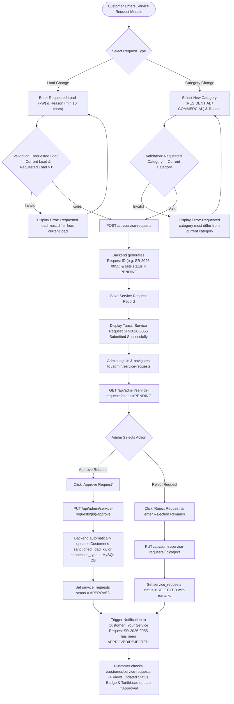

# 08 - Service Request Approval Flowchart

```mermaid
flowchart TD
    StartSR([Customer Enters Service Request Module]) --> SelectSRType{"Select Request Type"}

    SelectSRType -->|Load Change| LoadForm["Enter Requested Load (kW) & Reason (min 10 chars)"]
    SelectSRType -->|Category Change| CatForm["Select New Category (RESIDENTIAL / COMMERCIAL) & Reason"]

    LoadForm --> ValLoad{"Validation: Requested Load != Current Load & Requested Load > 0"}
    CatForm --> ValCat{"Validation: Requested Category != Current Category"}

    ValLoad -->|Invalid| ErrLoadVal["Display Error: Requested load must differ from current load"]
    ValCat -->|Invalid| ErrCatVal["Display Error: Requested category must differ from current category"]
    ErrLoadVal --> LoadForm
    ErrCatVal --> CatForm

    ValLoad -->|Valid| SubmitSRAPI["POST /api/service-requests"]
    ValCat -->|Valid| SubmitSRAPI

    SubmitSRAPI --> GenSRID["Backend generates Request ID (e.g. SR-2026-0055) & sets status = PENDING"]
    GenSRID --> SaveSRDB["Save Service Request Record"]
    SaveSRDB --> CustSRCreated["Display Toast: 'Service Request SR-2026-0055 Submitted Successfully'"]

    %% Admin Review & Action Flow
    CustSRCreated --> AdminReviewFlow["Admin logs in & navigates to /admin/service-requests"]
    AdminReviewFlow --> FetchPendingSRs["GET /api/admin/service-requests?status=PENDING"]

    FetchPendingSRs --> AdminActionChoice{"Admin Selects Action"}

    AdminActionChoice -->|Approve Request| ApproveSR["Click 'Approve Request'"]
    AdminActionChoice -->|Reject Request| RejectSR["Click 'Reject Request' & enter Rejection Remarks"]

    ApproveSR --> ProcessApprovalBackend["PUT /api/admin/service-requests/{id}/approve"]
    ProcessApprovalBackend --> UpdateCustProfile["Backend automatically updates Customer's sanctioned_load_kw or connection_type in MySQL DB"]
    UpdateCustProfile --> SetSRApprovedStatus["Set service_requests status = APPROVED"]

    RejectSR --> ProcessRejectionBackend["PUT /api/admin/service-requests/{id}/reject"]
    ProcessRejectionBackend --> SetSRRejectedStatus["Set service_requests status = REJECTED with remarks"]

    SetSRApprovedStatus --> NotifyCustSR["Trigger Notification to Customer: 'Your Service Request SR-2026-0055 has been APPROVED/REJECTED.'"]
    SetSRRejectedStatus --> NotifyCustSR

    NotifyCustSR --> CustomerTracksStatus["Customer checks /customer/service-requests -> Views updated Status Badge & Tariff/Load update if Approved"]
```
