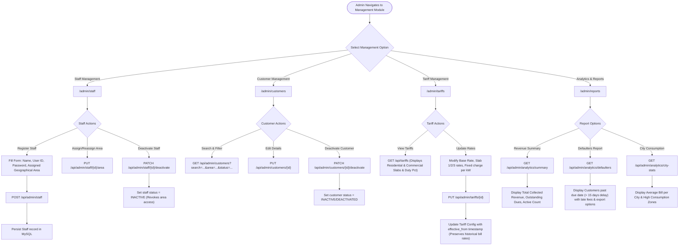

# 09 - Staff & Admin Management Flowchart

```mermaid
flowchart TD
    StartAdmin([Admin Navigates to Management Module]) --> SelectAdminModule{"Select Management Option"}

    SelectAdminModule -->|Staff Management| StaffMgmt["/admin/staff"]
    SelectAdminModule -->|Customer Management| CustMgmt["/admin/customers"]
    SelectAdminModule -->|Tariff Management| TariffMgmt["/admin/tariffs"]
    SelectAdminModule -->|Analytics & Reports| ReportsMgmt["/admin/reports"]

    %% Staff Management Flow
    StaffMgmt --> StaffActions{"Staff Actions"}
    StaffActions -->|Register Staff| AddStaffForm["Fill Form: Name, User ID, Password, Assigned Geographical Area"]
    AddStaffForm --> SubmitAddStaff["POST /api/admin/staff"]
    SubmitAddStaff --> SaveStaffDB["Persist Staff record in MySQL"]
    StaffActions -->|Assign/Reassign Area| UpdateStaffArea["PUT /api/admin/staff/{id}/area"]
    StaffActions -->|Deactivate Staff| DeactivateStaff["PATCH /api/admin/staff/{id}/deactivate"]
    DeactivateStaff --> SoftDeleteStaff["Set staff status = INACTIVE (Revokes area access)"]

    %% Customer Management Flow
    CustMgmt --> CustActions{"Customer Actions"}
    CustActions -->|Search & Filter| SearchCust["GET /api/admin/customers?search=...&area=...&status=..."]
    CustActions -->|Edit Details| EditCustAdmin["PUT /api/admin/customers/{id}"]
    CustActions -->|Deactivate Customer| SoftDeleteCustAdmin["PATCH /api/admin/customers/{id}/deactivate"]
    SoftDeleteCustAdmin --> SetCustInactive["Set customer status = INACTIVE/DEACTIVATED"]

    %% Tariff Management Flow
    TariffMgmt --> TariffActions{"Tariff Actions"}
    TariffActions -->|View Tariffs| ViewTariffRates["GET /api/tariffs (Displays Residential & Commercial Slabs & Duty Pct)"]
    TariffActions -->|Update Rates| UpdateTariffForm["Modify Base Rate, Slab 1/2/3 rates, Fixed charge per kW"]
    UpdateTariffForm --> SubmitTariffUpdate["PUT /api/admin/tariffs/{id}"]
    SubmitTariffUpdate --> VersionTariff["Update Tariff Config with effective_from timestamp (Preserves historical bill rates)"]

    %% Analytics & Reports Flow
    ReportsMgmt --> ReportActions{"Report Options"}
    ReportActions -->|Revenue Summary| FetchRevenue["GET /api/admin/analytics/summary"]
    FetchRevenue --> RenderRevCards["Display Total Collected Revenue, Outstanding Dues, Active Count"]
    ReportActions -->|Defaulters Report| FetchDefaulters["GET /api/admin/analytics/defaulters"]
    FetchDefaulters --> RenderDefaulterTable["Display Customers past due date (> 15 days delay) with late fees & export options"]
    ReportActions -->|City Consumption| FetchCityStats["GET /api/admin/analytics/city-stats"]
    FetchCityStats --> RenderCityChart["Display Average Bill per City & High Consumption Zones"]
```
