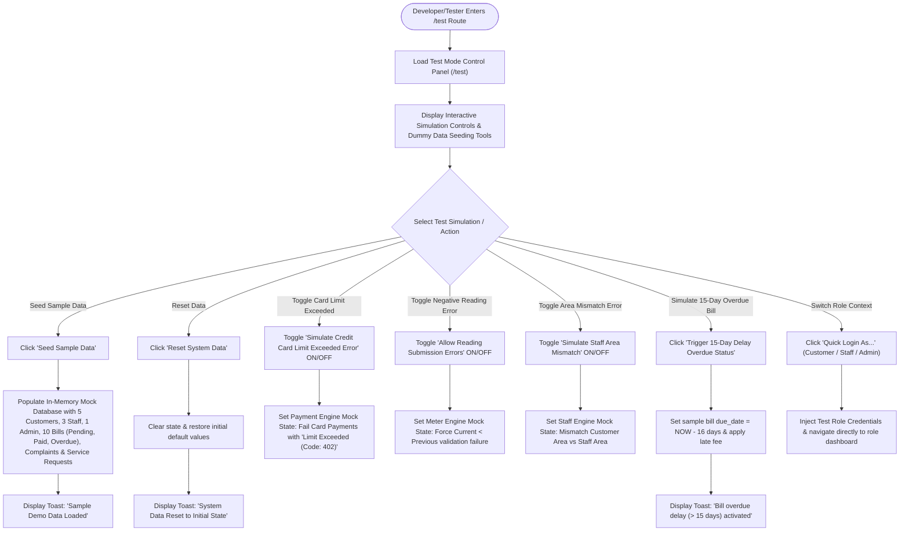

# 10 - Interactive Test Mode Sandbox Flowchart

```mermaid
flowchart TD
    StartTest([Developer/Tester Enters /test Route]) --> LoadTestSandbox["Load Test Mode Control Panel (/test)"]

    LoadTestSandbox --> RenderControls["Display Interactive Simulation Controls & Dummy Data Seeding Tools"]

    RenderControls --> ControlChoice{"Select Test Simulation / Action"}

    ControlChoice -->|Seed Sample Data| SeedAction["Click 'Seed Sample Data'"]
    SeedAction --> PopulateMockDB["Populate In-Memory Mock Database with 5 Customers, 3 Staff, 1 Admin, 10 Bills (Pending, Paid, Overdue), Complaints & Service Requests"]
    PopulateMockDB --> ToastDataSeeded["Display Toast: 'Sample Demo Data Loaded'"]

    ControlChoice -->|Reset Data| ResetAction["Click 'Reset System Data'"]
    ResetAction --> ClearMockDB["Clear state & restore initial default values"]
    ClearMockDB --> ToastReset["Display Toast: 'System Data Reset to Initial State'"]

    ControlChoice -->|Toggle Card Limit Exceeded| ToggleCardLimit["Toggle 'Simulate Credit Card Limit Exceeded Error' ON/OFF"]
    ToggleCardLimit --> UpdatePaymentMockState["Set Payment Engine Mock State: Fail Card Payments with 'Limit Exceeded (Code: 402)'"]

    ControlChoice -->|Toggle Negative Reading Error| ToggleReadingErr["Toggle 'Allow Reading Submission Errors' ON/OFF"]
    ToggleReadingErr --> UpdateMeterMockState["Set Meter Engine Mock State: Force Current < Previous validation failure"]

    ControlChoice -->|Toggle Area Mismatch Error| ToggleAreaErr["Toggle 'Simulate Staff Area Mismatch' ON/OFF"]
    ToggleAreaErr --> UpdateStaffMockState["Set Staff Engine Mock State: Mismatch Customer Area vs Staff Area"]

    ControlChoice -->|Simulate 15-Day Overdue Bill| TriggerOverdue["Click 'Trigger 15-Day Delay Overdue Status'"]
    TriggerOverdue --> ShiftBillDates["Set sample bill due_date = NOW - 16 days & apply late fee"]
    ShiftBillDates --> ToastOverdueTriggered["Display Toast: 'Bill overdue delay (> 15 days) activated'"]

    ControlChoice -->|Switch Role Context| QuickSwitchRole["Click 'Quick Login As...' (Customer / Staff / Admin)"]
    QuickSwitchRole --> InjectTestJWT["Inject Test Role Credentials & navigate directly to role dashboard"]
```
