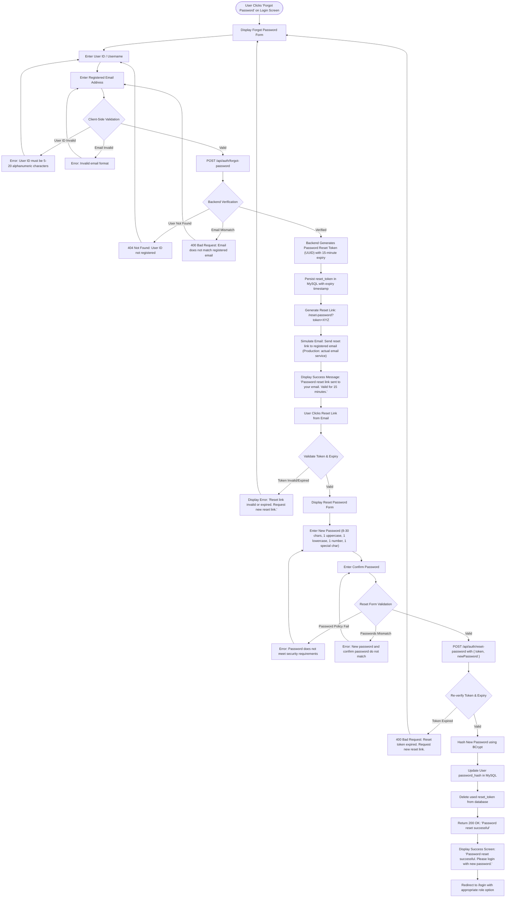

# 11 - Forgot Password Flowchart

```mermaid
flowchart TD
    StartForgot([User Clicks 'Forgot Password' on Login Screen]) --> DisplayForgotForm["Display Forgot Password Form"]

    DisplayForgotForm --> InputUserId["Enter User ID / Username"]
    InputUserId --> InputEmail["Enter Registered Email Address"]

    InputEmail --> ValForgotForm{"Client-Side Validation"}
    ValForgotForm -->|User ID Invalid| ErrUserId["Error: User ID must be 5-20 alphanumeric characters"]
    ValForgotForm -->|Email Invalid| ErrEmailFormat["Error: Invalid email format"]
    ErrUserId --> InputUserId
    ErrEmailFormat --> InputEmail

    ValForgotForm -->|Valid| SubmitForgotAPI["POST /api/auth/forgot-password"]

    SubmitForgotAPI --> BackendVerify{"Backend Verification"}
    BackendVerify -->|User Not Found| ErrUserNotFound["404 Not Found: User ID not registered"]
    BackendVerify -->|Email Mismatch| ErrEmailMismatch["400 Bad Request: Email does not match registered email"]
    ErrUserNotFound --> InputUserId
    ErrEmailMismatch --> InputEmail

    BackendVerify -->|Verified| GenResetToken["Backend Generates Password Reset Token (UUID) with 15-minute expiry"]

    GenResetToken --> SaveTokenDB["Persist reset_token in MySQL with expiry timestamp"]
    SaveTokenDB --> SendResetLink["Generate Reset Link: /reset-password?token=XYZ"]

    SendResetLink --> SimulateEmail["Simulate Email: Send reset link to registered email (Production: actual email service)"]

    SimulateEmail --> DisplaySuccessMsg["Display Success Message: 'Password reset link sent to your email. Valid for 15 minutes.'"]

    DisplaySuccessMsg --> UserClicksLink["User Clicks Reset Link from Email"]

    UserClicksLink --> ValidateToken{"Validate Token & Expiry"}
    ValidateToken -->|Token Invalid/Expired| ErrToken["Display Error: 'Reset link invalid or expired. Request new reset link.'"]
    ErrToken --> DisplayForgotForm

    ValidateToken -->|Valid| DisplayResetForm["Display Reset Password Form"]

    DisplayResetForm --> InputNewPass["Enter New Password (8-30 chars, 1 uppercase, 1 lowercase, 1 number, 1 special char)"]
    InputNewPass --> InputConfirmPass["Enter Confirm Password"]

    InputConfirmPass --> ValResetForm{"Reset Form Validation"}
    ValResetForm -->|Password Policy Fail| ErrPassPolicy["Error: Password does not meet security requirements"]
    ValResetForm -->|Passwords Mismatch| ErrPassMismatch["Error: New password and confirm password do not match"]
    ErrPassPolicy --> InputNewPass
    ErrPassMismatch --> InputConfirmPass

    ValResetForm -->|Valid| SubmitResetAPI["POST /api/auth/reset-password with { token, newPassword }"]

    SubmitResetAPI --> VerifyTokenAgain{"Re-verify Token & Expiry"}
    VerifyTokenAgain -->|Token Expired| ErrTokenExpired["400 Bad Request: Reset token expired. Request new reset link."]
    ErrTokenExpired --> DisplayForgotForm

    VerifyTokenAgain -->|Valid| HashNewPass["Hash New Password using BCrypt"]
    HashNewPass --> UpdateUserPass["Update User password_hash in MySQL"]
    UpdateUserPass --> InvalidateToken["Delete used reset_token from database"]

    InvalidateToken --> ReturnSuccessReset["Return 200 OK: 'Password reset successful'"]
    ReturnSuccessReset --> DisplayResetSuccess["Display Success Screen: 'Password reset successful. Please login with new password.'"]

    DisplayResetSuccess --> RedirectLogin["Redirect to /login with appropriate role option"]
```
