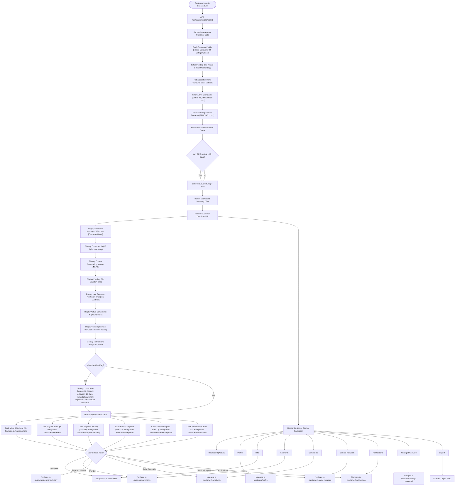

# 12 - Customer Dashboard Detailed Flowchart

```mermaid
flowchart TD
    StartDash([Customer Logs In Successfully]) --> LoadDashboard["GET /api/customer/dashboard"]

    LoadDashboard --> FetchDashboardData["Backend Aggregates Customer Data"]
    FetchDashboardData --> GetCustProfile["Fetch Customer Profile (Name, Consumer ID, Category, Load)"]
    GetCustProfile --> GetPendingBills["Fetch Pending Bills (Count & Total Outstanding)"]
    GetPendingBills --> GetLastPayment["Fetch Last Payment (Amount, Date, Method)"]
    GetLastPayment --> GetActiveComplaints["Fetch Active Complaints (OPEN, IN_PROGRESS count)"]
    GetActiveComplaints --> GetPendingSR["Fetch Pending Service Requests (PENDING count)"]
    GetPendingSR --> GetUnreadNotif["Fetch Unread Notifications Count"]

    GetUnreadNotif --> CheckOverdueStatus{"Any Bill Overdue > 15 Days?"}
    CheckOverdueStatus -->|Yes| SetOverdueAlert["Set overdue_alert_flag = true"]
    CheckOverdueStatus -->|No| SetOverdueAlert["Set overdue_alert_flag = false"]

    SetOverdueAlert --> ReturnDashboardData["Return Dashboard Summary DTO"]

    ReturnDashboardData --> RenderDashboardUI["Render Customer Dashboard UI"]

    RenderDashboardUI --> DisplayWelcome["Display Welcome Message: 'Welcome, [Customer Name]'"]
    DisplayWelcome --> DisplayConsumerID["Display Consumer ID (13 digits, read-only)"]
    DisplayConsumerID --> DisplayOutstanding["Display Current Outstanding Amount (₹X.XX)"]
    DisplayOutstanding --> DisplayPendingCount["Display Pending Bills Count (N bills)"]
    DisplayPendingCount --> DisplayLastPayment["Display Last Payment: ₹X.XX on [Date] via [Method]"]
    DisplayLastPayment --> DisplayComplaints["Display Active Complaints: N (View Details)"]
    DisplayComplaints --> DisplaySR["Display Pending Service Requests: N (View Details)"]
    DisplaySR --> DisplayNotifBadge["Display Notifications Badge: N unread"]

    DisplayNotifBadge --> CheckOverdueUI{"Overdue Alert Flag?"}
    CheckOverdueUI -->|Yes| DisplayOverdueBanner["Display Critical Alert Banner: '⚠️ Account delayed > 15 days! Immediate payment required to avoid service disruption.'"]
    CheckOverdueUI -->|No| RenderQuickActions

    DisplayOverdueBanner --> RenderQuickActions["Render Quick Action Cards"]

    RenderQuickActions --> ActionCard1["Card: View Bills (Icon: 📄) - Navigate to /customer/bills"]
    RenderQuickActions --> ActionCard2["Card: Pay Bill (Icon: 💳) - Navigate to /customer/payments"]
    RenderQuickActions --> ActionCard3["Card: Payment History (Icon: 📊) - Navigate to /customer/payments/history"]
    RenderQuickActions --> ActionCard4["Card: Raise Complaint (Icon: 📝) - Navigate to /customer/complaints"]
    RenderQuickActions --> ActionCard5["Card: Service Request (Icon: 🔧) - Navigate to /customer/service-requests"]
    RenderQuickActions --> ActionCard6["Card: Notifications (Icon: 🔔) - Navigate to /customer/notifications"]

    ActionCard1 --> UserAction{"User Selects Action"}
    ActionCard2 --> UserAction
    ActionCard3 --> UserAction
    ActionCard4 --> UserAction
    ActionCard5 --> UserAction
    ActionCard6 --> UserAction

    UserAction -->|View Bills| NavBills["Navigate to /customer/bills"]
    UserAction -->|Pay Bill| NavPayments["Navigate to /customer/payments"]
    UserAction -->|Payment History| NavPayHistory["Navigate to /customer/payments/history"]
    UserAction -->|Raise Complaint| NavComplaints["Navigate to /customer/complaints"]
    UserAction -->|Service Request| NavSR["Navigate to /customer/service-requests"]
    UserAction -->|Notifications| NavNotif["Navigate to /customer/notifications"]

    %% Sidebar Navigation
    RenderDashboardUI --> RenderSidebar["Render Customer Sidebar Navigation"]
    RenderSidebar --> SidebarItem1["Dashboard (Active)"]
    RenderSidebar --> SidebarItem2["Profile"]
    RenderSidebar --> SidebarItem3["Bills"]
    RenderSidebar --> SidebarItem4["Payments"]
    RenderSidebar --> SidebarItem5["Complaints"]
    RenderSidebar --> SidebarItem6["Service Requests"]
    RenderSidebar --> SidebarItem7["Notifications"]
    RenderSidebar --> SidebarItem8["Change Password"]
    RenderSidebar --> SidebarItem9["Logout"]

    SidebarItem2 --> NavProfile["Navigate to /customer/profile"]
    SidebarItem3 --> NavBills
    SidebarItem4 --> NavPayments
    SidebarItem5 --> NavComplaints
    SidebarItem6 --> NavSR
    SidebarItem7 --> NavNotif
    SidebarItem8 --> NavChangePass["Navigate to /customer/change-password"]
    SidebarItem9 --> LogoutAction["Execute Logout Flow"]
```
