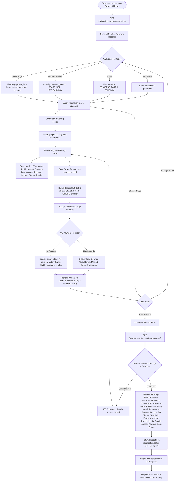

# 13 - Payment History Flowchart

```mermaid
flowchart TD
    StartPayHistory([Customer Navigates to Payment History]) --> LoadHistory["GET /api/customer/payments/history"]

    LoadHistory --> FetchPayments["Backend Fetches Payment Records"]
    FetchPayments --> ApplyFilters{"Apply Optional Filters"}
    ApplyFilters -->|Date Range| FilterDate["Filter by payment_date between start_date and end_date"]
    ApplyFilters -->|Payment Method| FilterMethod["Filter by payment_method (CARD, UPI, NET_BANKING)"]
    ApplyFilters -->|Status| FilterStatus["Filter by status (SUCCESS, FAILED, PENDING)"]
    ApplyFilters -->|No Filters| FetchAllPayments["Fetch all customer payments"]

    FilterDate --> PaginateResults["Apply Pagination (page, size, sort)"]
    FilterMethod --> PaginateResults
    FilterStatus --> PaginateResults
    FetchAllPayments --> PaginateResults

    PaginateResults --> CountTotal["Count total matching records"]
    CountTotal --> ReturnPaymentList["Return paginated Payment History DTO"]

    ReturnPaymentList --> RenderPaymentTable["Render Payment History Table"]

    RenderPaymentTable --> TableHeader["Table Headers: Transaction ID, Bill Number, Payment Date, Amount, Payment Method, Status, Receipt"]
    RenderPaymentTable --> TableRows["Table Rows: One row per payment record"]

    TableRows --> RowStatusBadge["Status Badge: SUCCESS (Green), FAILED (Red), PENDING (Amber)"]
    RowStatusBadge --> RowReceiptLink["Receipt Download Link (if available)"]

    RowReceiptLink --> CheckEmpty{"Any Payment Records?"}
    CheckEmpty -->|No Records| DisplayEmptyState["Display Empty State: 'No payment history found. Start by paying your bills.'"]
    CheckEmpty -->|Has Records| DisplayFilterControls["Display Filter Controls (Date Range, Method, Status Dropdowns)"]

    DisplayEmptyState --> RenderPagination["Render Pagination Controls (Previous, Page Numbers, Next)"]
    DisplayFilterControls --> RenderPagination

    RenderPagination --> UserFilterAction{"User Action"}
    UserFilterAction -->|Change Filters| ApplyFilters
    UserFilterAction -->|Change Page| PaginateResults
    UserFilterAction -->|Click Receipt| DownloadReceipt["Download Receipt Flow"]

    DownloadReceipt --> FetchReceiptData["GET /api/payments/receipt/{transactionId}"]
    FetchReceiptData --> ValidateReceiptOwnership{"Validate Payment Belongs to Customer"}
    ValidateReceiptOwnership -->|Unauthorized| ErrReceiptAccess["403 Forbidden: Receipt access denied"]
    ErrReceiptAccess --> RenderPaymentTable

    ValidateReceiptOwnership -->|Authorized| GenerateReceiptPDF["Generate Receipt PDF/JSON with: VidyutSeva Branding, Consumer ID, Customer Name, Bill Number, Billing Month, Bill Amount, Payment Amount, PG Charge, Total Paid, Payment Method, Transaction ID, Receipt Number, Payment Date, Status"]

    GenerateReceiptPDF --> ReturnReceiptFile["Return Receipt File (application/pdf or application/json)"]
    ReturnReceiptFile --> TriggerDownload["Trigger browser download of receipt file"]

    TriggerDownload --> ShowDownloadToast["Display Toast: 'Receipt downloaded successfully'"]
```
