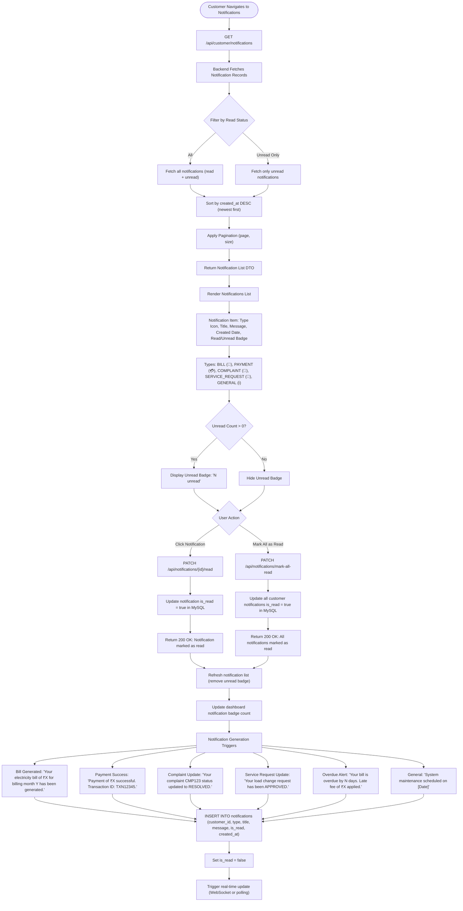

# 14 - Notifications Flowchart

```mermaid
flowchart TD
    StartNotif([Customer Navigates to Notifications]) --> LoadNotif["GET /api/customer/notifications"]

    LoadNotif --> FetchNotifData["Backend Fetches Notification Records"]
    FetchNotifData --> FilterNotif{"Filter by Read Status"}
    FilterNotif -->|All| FetchAllNotif["Fetch all notifications (read + unread)"]
    FilterNotif -->|Unread Only| FetchUnreadNotif["Fetch only unread notifications"]

    FetchAllNotif --> SortNotif["Sort by created_at DESC (newest first)"]
    FetchUnreadNotif --> SortNotif

    SortNotif --> PaginateNotif["Apply Pagination (page, size)"]
    PaginateNotif --> ReturnNotifList["Return Notification List DTO"]

    ReturnNotifList --> RenderNotifList["Render Notifications List"]

    RenderNotifList --> NotifItem["Notification Item: Type Icon, Title, Message, Created Date, Read/Unread Badge"]
    NotifItem --> NotifTypes["Types: BILL (📄), PAYMENT (💳), COMPLAINT (📝), SERVICE_REQUEST (🔧), GENERAL (ℹ️)"]

    NotifTypes --> CheckUnreadCount{"Unread Count > 0?"}
    CheckUnreadCount -->|Yes| DisplayUnreadBadge["Display Unread Badge: 'N unread'"]
    CheckUnreadCount -->|No| HideUnreadBadge["Hide Unread Badge"]

    DisplayUnreadBadge --> MarkAsReadAction{"User Action"}
    HideUnreadBadge --> MarkAsReadAction

    MarkAsReadAction -->|Click Notification| MarkSingleRead["PATCH /api/notifications/{id}/read"]
    MarkAsReadAction -->|Mark All as Read| MarkAllRead["PATCH /api/notifications/mark-all-read"]

    MarkSingleRead --> UpdateReadStatus["Update notification is_read = true in MySQL"]
    MarkAllRead --> UpdateAllReadStatus["Update all customer notifications is_read = true in MySQL"]

    UpdateReadStatus --> ReturnMarkedSuccess["Return 200 OK: Notification marked as read"]
    UpdateAllReadStatus --> ReturnAllMarkedSuccess["Return 200 OK: All notifications marked as read"]

    ReturnMarkedSuccess --> RefreshNotifList["Refresh notification list (remove unread badge)"]
    ReturnAllMarkedSuccess --> RefreshNotifList

    RefreshNotifList --> UpdateDashboardBadge["Update dashboard notification badge count"]

    %% Notification Generation Triggers
    UpdateDashboardBadge --> NotifTriggers["Notification Generation Triggers"]

    NotifTriggers --> TriggerBillGen["Bill Generated: 'Your electricity bill of ₹X for billing month Y has been generated.'"]
    NotifTriggers --> TriggerPaymentSuccess["Payment Success: 'Payment of ₹X successful. Transaction ID: TXN12345.'"]
    NotifTriggers --> TriggerComplaintUpdate["Complaint Update: 'Your complaint CMP123 status updated to RESOLVED.'"]
    NotifTriggers --> TriggerSRUpdate["Service Request Update: 'Your load change request has been APPROVED.'"]
    NotifTriggers --> TriggerOverdueAlert["Overdue Alert: 'Your bill is overdue by N days. Late fee of ₹X applied.'"]
    NotifTriggers --> TriggerGeneral["General: 'System maintenance scheduled on [Date]'"]

    TriggerBillGen --> CreateNotifRecord["INSERT INTO notifications (customer_id, type, title, message, is_read, created_at)"]
    TriggerPaymentSuccess --> CreateNotifRecord
    TriggerComplaintUpdate --> CreateNotifRecord
    TriggerSRUpdate --> CreateNotifRecord
    TriggerOverdueAlert --> CreateNotifRecord
    TriggerGeneral --> CreateNotifRecord

    CreateNotifRecord --> SetNotifUnread["Set is_read = false"]
    SetNotifUnread --> TriggerRealtimeUpdate["Trigger real-time update (WebSocket or polling)"]
```
