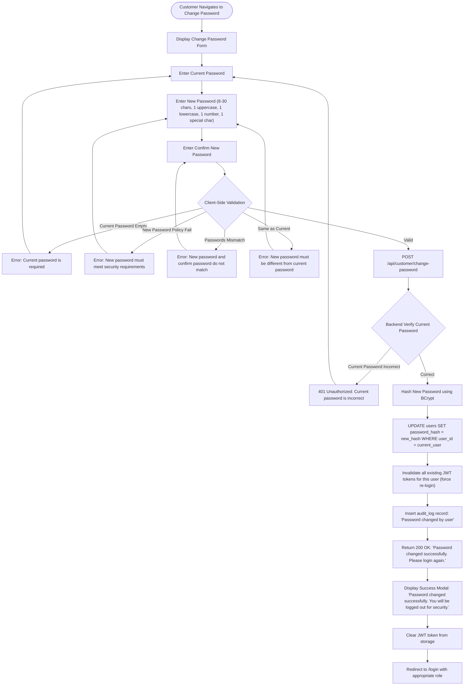

# 15 - Change Password Flowchart

```mermaid
flowchart TD
    StartChangePass([Customer Navigates to Change Password]) --> LoadChangePassForm["Display Change Password Form"]

    LoadChangePassForm --> InputCurrentPass["Enter Current Password"]
    InputCurrentPass --> InputNewPass["Enter New Password (8-30 chars, 1 uppercase, 1 lowercase, 1 number, 1 special char)"]
    InputNewPass --> InputConfirmNewPass["Enter Confirm New Password"]

    InputConfirmNewPass --> ValChangePassForm{"Client-Side Validation"}
    ValChangePassForm -->|Current Password Empty| ErrCurrentEmpty["Error: Current password is required"]
    ValChangePassForm -->|New Password Policy Fail| ErrNewPolicy["Error: New password must meet security requirements"]
    ValChangePassForm -->|Passwords Mismatch| ErrNewMismatch["Error: New password and confirm password do not match"]
    ValChangePassForm -->|Same as Current| ErrSamePass["Error: New password must be different from current password"]

    ErrCurrentEmpty --> InputCurrentPass
    ErrNewPolicy --> InputNewPass
    ErrNewMismatch --> InputConfirmNewPass
    ErrSamePass --> InputNewPass

    ValChangePassForm -->|Valid| SubmitChangePassAPI["POST /api/customer/change-password"]

    SubmitChangePassAPI --> VerifyCurrentPass{"Backend Verify Current Password"}
    VerifyCurrentPass -->|Current Password Incorrect| ErrWrongPass["401 Unauthorized: Current password is incorrect"]
    ErrWrongPass --> InputCurrentPass

    VerifyCurrentPass -->|Correct| HashNewPassword["Hash New Password using BCrypt"]
    HashNewPassword --> UpdateUserPassword["UPDATE users SET password_hash = new_hash WHERE user_id = current_user"]

    UpdateUserPassword --> InvalidateAllSessions["Invalidate all existing JWT tokens for this user (force re-login)"]
    InvalidateAllSessions --> LogPasswordChange["Insert audit_log record: 'Password changed by user'"]

    LogPasswordChange --> ReturnChangeSuccess["Return 200 OK: 'Password changed successfully. Please login again.'"]

    ReturnChangeSuccess --> DisplayChangeSuccess["Display Success Modal: 'Password changed successfully. You will be logged out for security.'"]

    DisplayChangeSuccess --> AutoLogout["Clear JWT token from storage"]
    AutoLogout --> RedirectLogin["Redirect to /login with appropriate role"]
```
