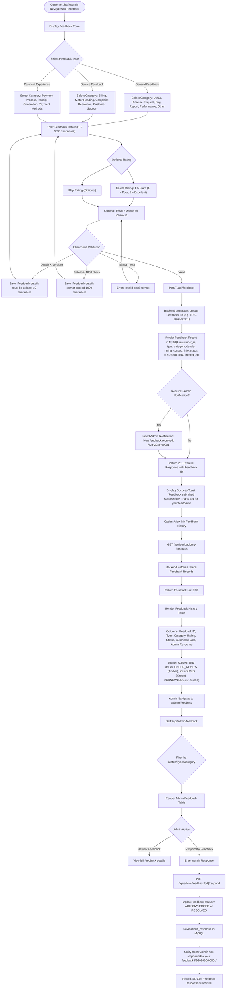

# 16 - Feedback System Flowchart

```mermaid
flowchart TD
    StartFeedback([Customer/Staff/Admin Navigates to Feedback]) --> LoadFeedbackForm["Display Feedback Form"]

    LoadFeedbackForm --> SelectFeedbackType{"Select Feedback Type"}
    SelectFeedbackType -->|General Feedback| GeneralForm["Select Category: UI/UX, Feature Request, Bug Report, Performance, Other"]
    SelectFeedbackType -->|Service Feedback| ServiceForm["Select Category: Billing, Meter Reading, Complaint Resolution, Customer Support"]
    SelectFeedbackType -->|Payment Experience| PaymentForm["Select Category: Payment Process, Receipt Generation, Payment Methods"]

    GeneralForm --> InputFeedbackDetails["Enter Feedback Details (10-1000 characters)"]
    ServiceForm --> InputFeedbackDetails
    PaymentForm --> InputFeedbackDetails

    InputFeedbackDetails --> InputRating{"Optional Rating"}
    InputRating --> SelectRating["Select Rating: 1-5 Stars (1 = Poor, 5 = Excellent)"]
    InputRating --> SkipRating["Skip Rating (Optional)"]

    SelectRating --> InputContactInfo["Optional: Email / Mobile for follow-up"]
    SkipRating --> InputContactInfo

    InputContactInfo --> ValFeedbackForm{"Client-Side Validation"}
    ValFeedbackForm -->|Details < 10 chars| ErrDetailsShort["Error: Feedback details must be at least 10 characters"]
    ValFeedbackForm -->|Details > 1000 chars| ErrDetailsLong["Error: Feedback details cannot exceed 1000 characters"]
    ValFeedbackForm -->|Invalid Email| ErrEmailInvalid["Error: Invalid email format"]

    ErrDetailsShort --> InputFeedbackDetails
    ErrDetailsLong --> InputFeedbackDetails
    ErrEmailInvalid --> InputContactInfo

    ValFeedbackForm -->|Valid| SubmitFeedbackAPI["POST /api/feedback"]

    SubmitFeedbackAPI --> GenFeedbackID["Backend generates Unique Feedback ID (e.g. FDB-2026-00001)"]
    GenFeedbackID --> SaveFeedbackDB["Persist Feedback Record in MySQL (customer_id, type, category, details, rating, contact_info, status = SUBMITTED, created_at)"]

    SaveFeedbackDB --> CheckAdminNotify{"Requires Admin Notification?"}
    CheckAdminNotify -->|Yes| NotifyAdmin["Insert Admin Notification: 'New feedback received: FDB-2026-00001'"]
    CheckAdminNotify -->|No| ReturnFeedbackSuccess

    NotifyAdmin --> ReturnFeedbackSuccess["Return 201 Created Response with Feedback ID"]

    ReturnFeedbackSuccess --> DisplayFeedbackSuccess["Display Success Toast: 'Feedback submitted successfully. Thank you for your feedback!'"]

    DisplayFeedbackSuccess --> ViewFeedbackHistory["Option: View My Feedback History"]

    ViewFeedbackHistory --> LoadFeedbackHistory["GET /api/feedback/my-feedback"]
    LoadFeedbackHistory --> FetchUserFeedback["Backend Fetches User's Feedback Records"]
    FetchUserFeedback --> ReturnFeedbackList["Return Feedback List DTO"]

    ReturnFeedbackList --> RenderFeedbackTable["Render Feedback History Table"]
    RenderFeedbackTable --> FeedbackColumns["Columns: Feedback ID, Type, Category, Rating, Status, Submitted Date, Admin Response"]

    FeedbackColumns --> FeedbackStatus["Status: SUBMITTED (Blue), UNDER_REVIEW (Amber), RESOLVED (Green), ACKNOWLEDGED (Green)"]

    %% Admin Feedback Review Flow
    FeedbackStatus --> AdminReviewFlow["Admin Navigates to /admin/feedback"]
    AdminReviewFlow --> FetchAllFeedback["GET /api/admin/feedback"]
    FetchAllFeedback --> FilterFeedback{"Filter by Status/Type/Category"}
    FilterFeedback --> RenderAdminFeedbackTable["Render Admin Feedback Table"]

    RenderAdminFeedbackTable --> AdminFeedbackAction{"Admin Action"}
    AdminFeedbackAction -->|Review Feedback| ViewFeedbackDetails["View full feedback details"]
    AdminFeedbackAction -->|Respond to Feedback| RespondFeedback["Enter Admin Response"]

    RespondFeedback --> SubmitResponse["PUT /api/admin/feedback/{id}/respond"]
    SubmitResponse --> UpdateFeedbackStatus["Update feedback status = ACKNOWLEDGED or RESOLVED"]
    UpdateFeedbackStatus --> SaveAdminResponse["Save admin_response in MySQL"]
    SaveAdminResponse --> NotifyUser["Notify User: 'Admin has responded to your feedback FDB-2026-00001'"]

    NotifyUser --> ReturnResponseSuccess["Return 200 OK: Feedback response submitted"]
```
