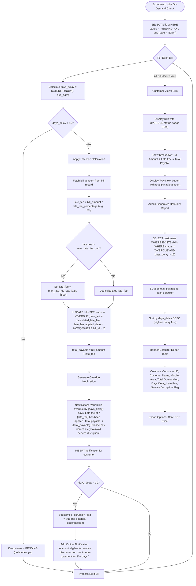

# 17 - Overdue Calculation & Late Fee Flowchart

```mermaid
flowchart TD
    StartOverdue([Scheduled Job / On-Demand Check]) --> FetchPendingBills["SELECT bills WHERE status = 'PENDING' AND due_date < NOW()"]

    FetchPendingBills --> CheckEachBill{"For Each Bill"}
    CheckEachBill --> CalculateDelay["Calculate days_delay = DATEDIFF(NOW(), due_date)"]

    CalculateDelay --> CheckDelayThreshold{"days_delay > 15?"}
    CheckDelayThreshold -->|No| KeepPending["Keep status = PENDING (no late fee yet)"]
    CheckDelayThreshold -->|Yes| ApplyLateFee["Apply Late Fee Calculation"]

    ApplyLateFee --> FetchBillAmount["Fetch bill_amount from bill record"]
    FetchBillAmount --> CalculateLateFee["late_fee = bill_amount * late_fee_percentage (e.g., 2%)"]
    CalculateLateFee --> CheckMaxLateFee{"late_fee > max_late_fee_cap?"}
    CheckMaxLateFee -->|Yes| CapLateFee["Set late_fee = max_late_fee_cap (e.g., ₹500)"]
    CheckMaxLateFee -->|No| UseCalculatedFee["Use calculated late_fee"]

    CapLateFee --> UpdateBillStatus["UPDATE bills SET status = 'OVERDUE', late_fee = calculated_late_fee, late_fee_applied_date = NOW() WHERE bill_id = X"]
    UseCalculatedFee --> UpdateBillStatus

    UpdateBillStatus --> UpdateTotalPayable["total_payable = bill_amount + late_fee"]
    UpdateTotalPayable --> TriggerOverdueNotif["Generate Overdue Notification"]

    TriggerOverdueNotif --> NotifContent["Notification: 'Your bill is overdue by {days_delay} days. Late fee of ₹{late_fee} has been applied. Total payable: ₹{total_payable}. Please pay immediately to avoid service disruption.'"]

    NotifContent --> SendOverdueAlert["INSERT notification for customer"]
    SendOverdueAlert --> CheckServiceDisruption{"days_delay > 30?"}
    CheckServiceDisruption -->|Yes| MarkForDisruption["Set service_disruption_flag = true (for potential disconnection)"]
    CheckServiceDisruption -->|No| NextBill

    MarkForDisruption --> AddDisruptionNotif["Add Critical Notification: 'Account eligible for service disconnection due to non-payment for 30+ days.'"]
    AddDisruptionNotif --> NextBill

    KeepPending --> NextBill["Process Next Bill"]
    NextBill --> CheckEachBill

    %% Customer UI Overdue Display
    CheckEachBill -->|All Bills Processed| CustomerViewOverdue["Customer Views Bills"]
    CustomerViewOverdue --> DisplayOverdueBills["Display bills with OVERDUE status badge (Red)"]
    DisplayOverdueBills --> ShowLateFeeBreakdown["Show breakdown: Bill Amount + Late Fee = Total Payable"]
    ShowLateFeeBreakdown --> DisplayPayButton["Display 'Pay Now' button with total payable amount"]

    %% Admin Defaulter Report
    DisplayPayButton --> AdminDefaulterReport["Admin Generates Defaulter Report"]
    AdminDefaulterReport --> FetchDefaulters["SELECT customers WHERE EXISTS (bills WHERE status = 'OVERDUE' AND days_delay > 15)"]
    FetchDefaulters --> CalculateTotalDues["SUM of total_payable for each defaulter"]
    CalculateTotalDues --> SortByDelay["Sort by days_delay DESC (highest delay first)"]
    SortByDelay --> RenderDefaulterTable["Render Defaulter Report Table"]

    RenderDefaulterTable --> DefaulterColumns["Columns: Consumer ID, Customer Name, Mobile, Area, Total Outstanding, Days Delay, Late Fee, Service Disruption Flag"]
    DefaulterColumns --> ExportOptions["Export Options: CSV, PDF, Excel"]
```
