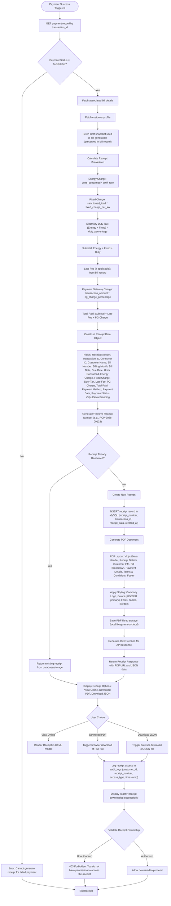

# 18 - Receipt Generation Detailed Flowchart

```mermaid
flowchart TD
    StartReceipt([Payment Success Triggered]) --> FetchPaymentDetails["GET payment record by transaction_id"]

    FetchPaymentDetails --> ValidatePayment{"Payment Status = SUCCESS?"}
    ValidatePayment -->|No| ErrPaymentNotSuccess["Error: Cannot generate receipt for failed payment"]
    ErrPaymentNotSuccess --> EndReceipt

    ValidatePayment -->|Yes| FetchBillDetails["Fetch associated bill details"]
    FetchBillDetails --> FetchCustomerDetails["Fetch customer profile"]

    FetchCustomerDetails --> FetchTariffSnapshot["Fetch tariff snapshot used at bill generation (preserved in bill record)"]
    FetchTariffSnapshot --> CalculateBreakdown["Calculate Receipt Breakdown"]

    CalculateBreakdown --> EnergyCharge["Energy Charge: units_consumed * tariff_rate"]
    EnergyCharge --> FixedCharge["Fixed Charge: sanctioned_load * fixed_charge_per_kw"]
    FixedCharge --> DutyTax["Electricity Duty Tax: (Energy + Fixed) * duty_percentage"]
    DutyTax --> Subtotal["Subtotal: Energy + Fixed + Duty"]
    Subtotal --> LateFee["Late Fee (if applicable): from bill record"]
    LateFee --> PGCharge["Payment Gateway Charge: transaction_amount * pg_charge_percentage"]
    PGCharge --> TotalPaid["Total Paid: Subtotal + Late Fee + PG Charge"]

    TotalPaid --> GenerateReceiptData["Construct Receipt Data Object"]
    GenerateReceiptData --> ReceiptFields["Fields: Receipt Number, Transaction ID, Consumer ID, Customer Name, Bill Number, Billing Month, Bill Date, Due Date, Units Consumed, Energy Charge, Fixed Charge, Duty Tax, Late Fee, PG Charge, Total Paid, Payment Method, Payment Date, Payment Status, VidyutSeva Branding"]

    ReceiptFields --> GenReceiptNumber["Generate/Retrieve Receipt Number (e.g., RCP-2026-00123)"]
    GenReceiptNumber --> CheckReceiptExists{"Receipt Already Generated?"}
    CheckReceiptExists -->|Yes| ReturnExistingReceipt["Return existing receipt from database/storage"]
    CheckReceiptExists -->|No| CreateNewReceipt

    ReturnExistingReceipt --> DisplayReceiptOptions["Display Receipt Options: View Online, Download PDF, Download JSON"]

    CreateNewReceipt["Create New Receipt"] --> PersistReceipt["INSERT receipt record in MySQL (receipt_number, transaction_id, receipt_data, created_at)"]
    PersistReceipt --> GeneratePDF["Generate PDF Document"]

    GeneratePDF --> PDFLayout["PDF Layout: VidyutSeva Header, Receipt Details, Customer Info, Bill Breakdown, Payment Details, Terms & Conditions, Footer"]
    PDFLayout --> PDFStyling["Apply Styling: Company Logo, Colors (#2563EB primary), Fonts, Tables, Borders"]
    PDFStyling --> SavePDFFile["Save PDF file to storage (local filesystem or cloud)"]

    SavePDFFile --> GenerateJSON["Generate JSON version for API response"]
    GenerateJSON --> ReturnReceiptResponse["Return Receipt Response with PDF URL and JSON data"]

    ReturnReceiptResponse --> DisplayReceiptOptions

    DisplayReceiptOptions --> UserReceiptChoice{"User Choice"}
    UserReceiptChoice -->|View Online| RenderReceiptHTML["Render Receipt in HTML modal"]
    UserReceiptChoice -->|Download PDF| DownloadPDFFile["Trigger browser download of PDF file"]
    UserReceiptChoice -->|Download JSON| DownloadJSONFile["Trigger browser download of JSON file"]

    DownloadPDFFile --> LogReceiptAccess["Log receipt access in audit_logs (customer_id, receipt_number, access_type, timestamp)"]
    DownloadJSONFile --> LogReceiptAccess

    LogReceiptAccess --> ShowDownloadSuccess["Display Toast: 'Receipt downloaded successfully'"]

    %% Receipt Validation for Download
    ShowDownloadSuccess --> ValidateReceiptAccess{"Validate Receipt Ownership"}
    ValidateReceiptAccess -->|Unauthorized| ErrReceiptAccessDenied["403 Forbidden: You do not have permission to access this receipt"]
    ErrReceiptAccessDenied --> EndReceipt

    ValidateReceiptAccess -->|Authorized| AllowDownload["Allow download to proceed"]
    AllowDownload --> EndReceipt
```
