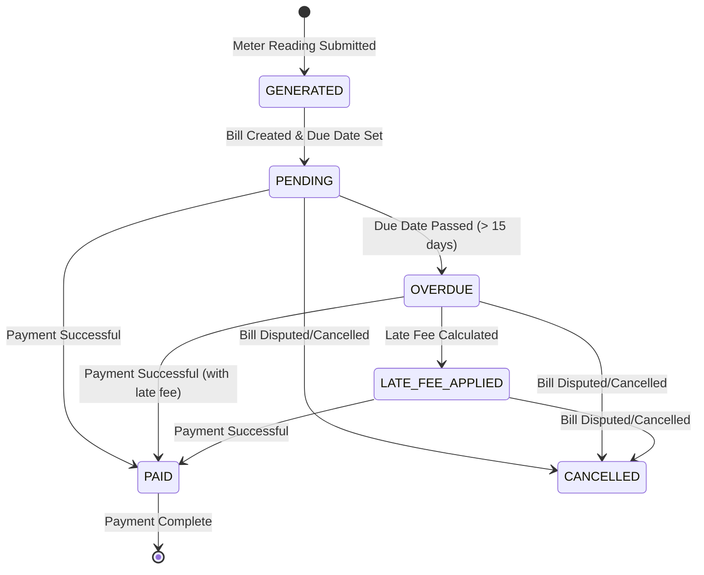
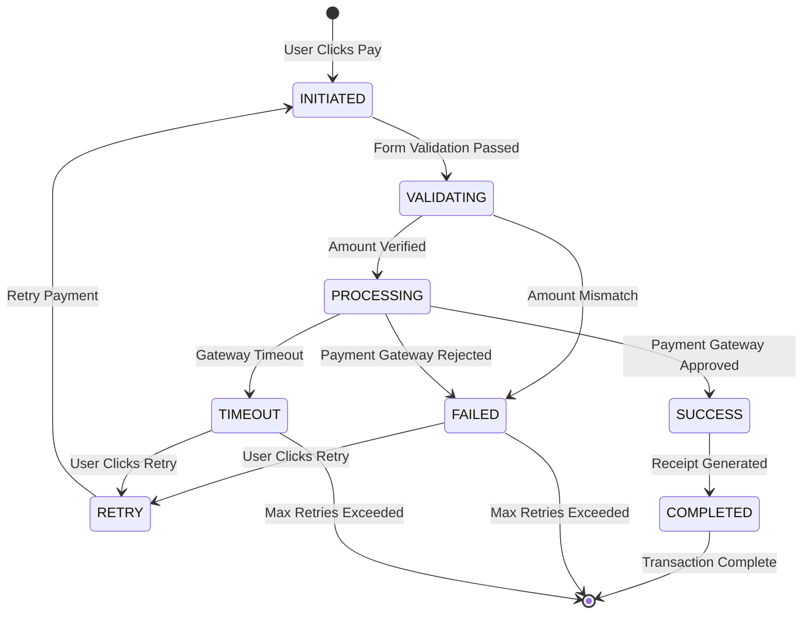
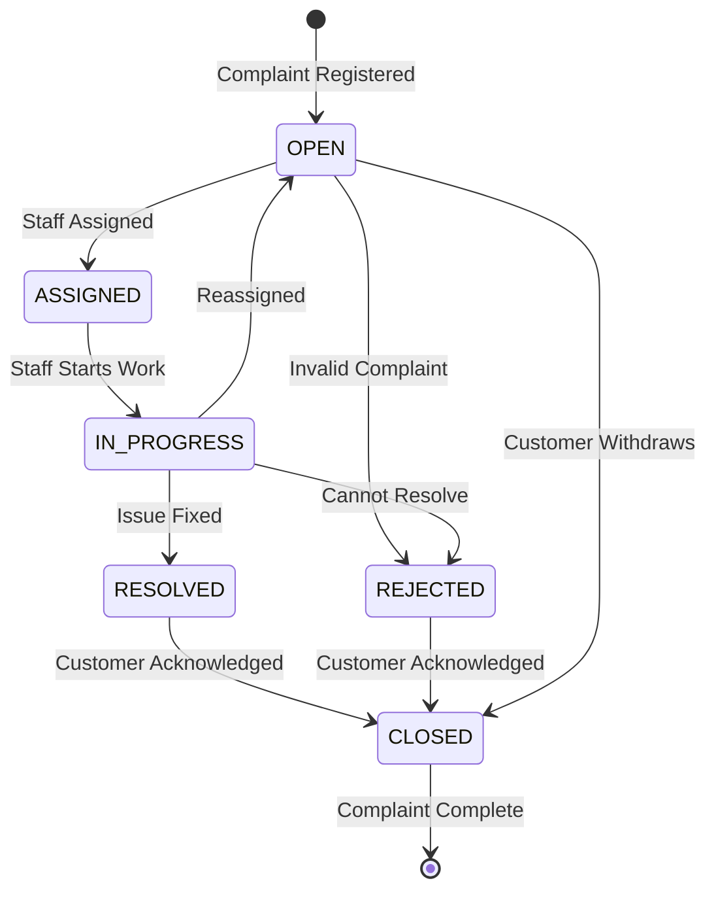
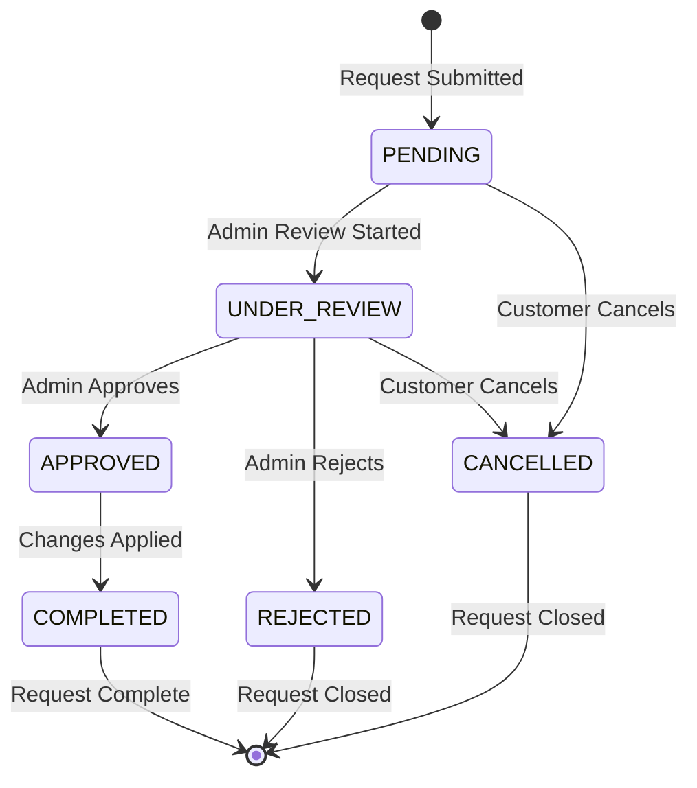
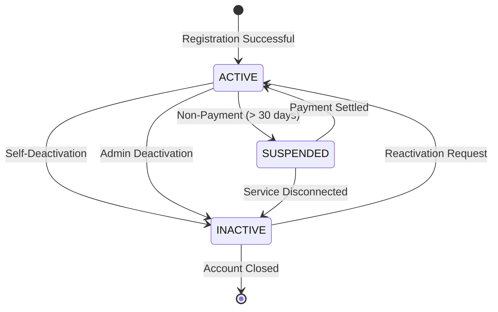
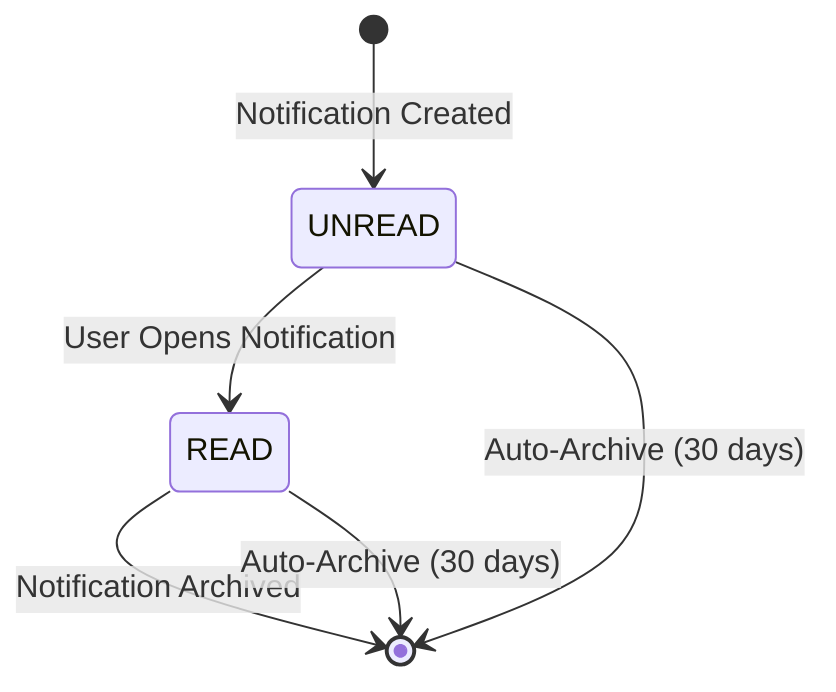
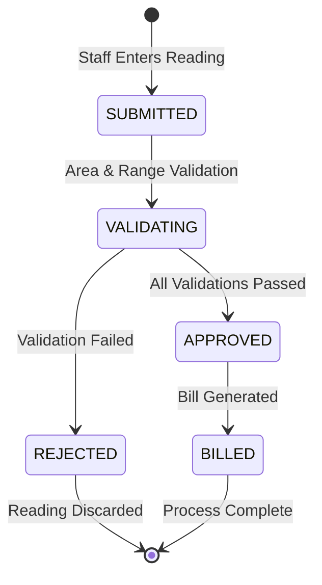
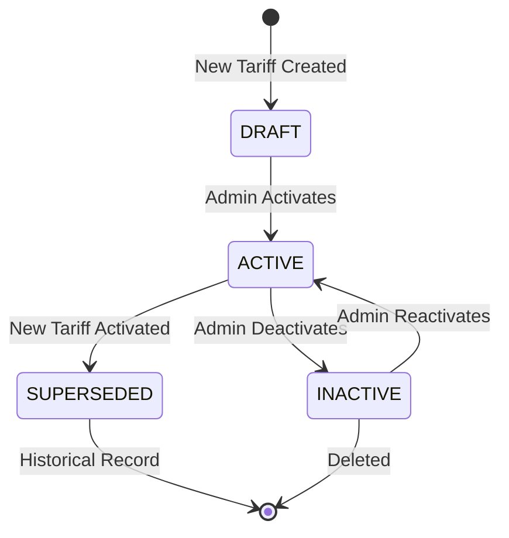

# 19 - State Machine Diagrams

## Bill State Machine

## Payment State Machine

## Complaint State Machine

## Service Request State Machine

## Customer State Machine

## Notification State Machine

## Meter Reading State Machine

## Tariff State Machine

