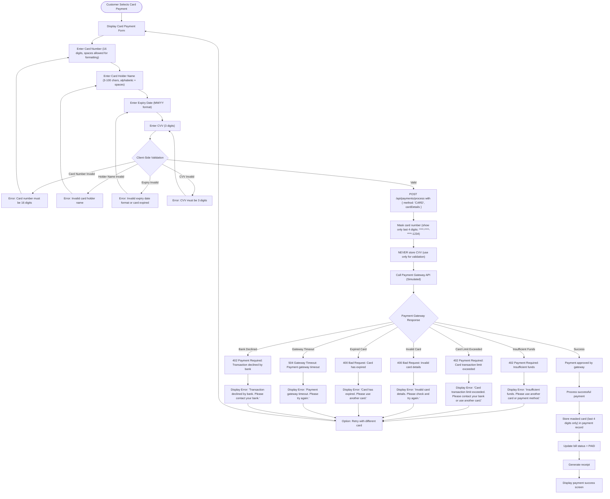
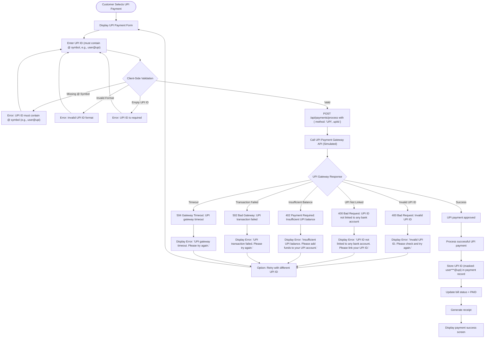
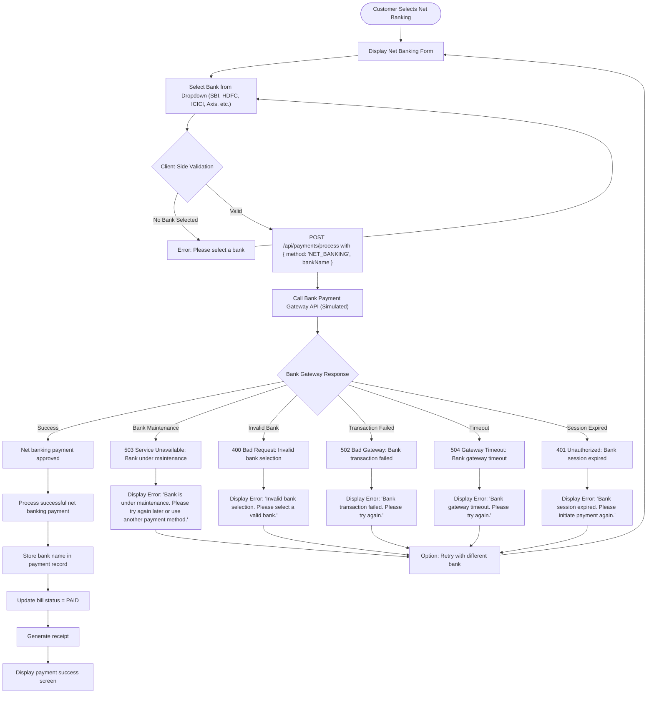

# 20 - Payment Method Detailed Flows with Failure Scenarios

## Card Payment Flow

```mermaid
flowchart TD
    StartCard([Customer Selects Card Payment]) --> DisplayCardForm["Display Card Payment Form"]

    DisplayCardForm --> InputCardNum["Enter Card Number (16 digits, spaces allowed for formatting)"]
    InputCardNum --> InputCardHolder["Enter Card Holder Name (3-100 chars, alphabetic + spaces)"]
    InputCardHolder --> InputCardExpiry["Enter Expiry Date (MM/YY format)"]
    InputCardExpiry --> InputCVV["Enter CVV (3 digits)"]

    InputCVV --> ValCardForm{"Client-Side Validation"}
    ValCardForm -->|Card Number Invalid| ErrCardNum["Error: Card number must be 16 digits"]
    ValCardForm -->|Holder Name Invalid| ErrHolderName["Error: Invalid card holder name"]
    ValCardForm -->|Expiry Invalid| ErrExpiry["Error: Invalid expiry date format or card expired"]
    ValCardForm -->|CVV Invalid| ErrCVV["Error: CVV must be 3 digits"]

    ErrCardNum --> InputCardNum
    ErrHolderName --> InputCardHolder
    ErrExpiry --> InputCardExpiry
    ErrCVV --> InputCVV

    ValCardForm -->|Valid| SubmitCardPayment["POST /api/payments/process with { method: 'CARD', cardDetails }"]

    SubmitCardPayment --> MaskCardData["Mask card number (show only last 4 digits: ****-****-****-1234)"]
    MaskCardData --> NeverStoreCVV["NEVER store CVV (use only for validation)"]
    NeverStoreCVV --> CallPaymentGateway["Call Payment Gateway API (Simulated)"]

    CallPaymentGateway --> GatewayResponse{"Payment Gateway Response"}
    GatewayResponse -->|Success| GatewaySuccess["Payment approved by gateway"]
    GatewayResponse -->|Insufficient Funds| GatewayInsufficient["402 Payment Required: Insufficient funds"]
    GatewayResponse -->|Card Limit Exceeded| GatewayLimitExceeded["402 Payment Required: Card transaction limit exceeded"]
    GatewayResponse -->|Invalid Card| GatewayInvalid["400 Bad Request: Invalid card details"]
    GatewayResponse -->|Expired Card| GatewayExpired["400 Bad Request: Card has expired"]
    GatewayResponse -->|Gateway Timeout| GatewayTimeout["504 Gateway Timeout: Payment gateway timeout"]
    GatewayResponse -->|Bank Declined| GatewayDeclined["402 Payment Required: Transaction declined by bank"]

    GatewaySuccess --> ProcessCardSuccess["Process successful payment"]
    GatewayInsufficient --> DisplayInsufficientErr["Display Error: 'Insufficient funds. Please use another card or payment method.'"]
    GatewayLimitExceeded --> DisplayLimitErr["Display Error: 'Card transaction limit exceeded. Please contact your bank or use another card.'"]
    GatewayInvalid --> DisplayInvalidErr["Display Error: 'Invalid card details. Please check and try again.'"]
    GatewayExpired --> DisplayExpiredErr["Display Error: 'Card has expired. Please use another card.'"]
    GatewayTimeout --> DisplayTimeoutErr["Display Error: 'Payment gateway timeout. Please try again.'"]
    GatewayDeclined --> DisplayDeclinedErr["Display Error: 'Transaction declined by bank. Please contact your bank.'"]

    DisplayInsufficientErr --> RetryCardPayment["Option: Retry with different card"]
    DisplayLimitErr --> RetryCardPayment
    DisplayInvalidErr --> RetryCardPayment
    DisplayExpiredErr --> RetryCardPayment
    DisplayTimeoutErr --> RetryCardPayment
    DisplayDeclinedErr --> RetryCardPayment

    RetryCardPayment --> DisplayCardForm

    ProcessCardSuccess --> StoreMaskedCard["Store masked card (last 4 digits only) in payment record"]
    StoreMaskedCard --> UpdateBillPaid["Update bill status = PAID"]
    UpdateBillPaid --> GenerateReceipt["Generate receipt"]
    GenerateReceipt --> CardPaymentSuccess["Display payment success screen"]
```

## UPI Payment Flow

```mermaid
flowchart TD
    StartUPI([Customer Selects UPI Payment]) --> DisplayUPIForm["Display UPI Payment Form"]

    DisplayUPIForm --> InputUPIID["Enter UPI ID (must contain @ symbol, e.g., user@upi)"]
    InputUPIID --> ValUPIForm{"Client-Side Validation"}
    ValUPIForm -->|Missing @ Symbol| ErrUPIAtSymbol["Error: UPI ID must contain @ symbol (e.g., user@upi)"]
    ValUPIForm -->|Invalid Format| ErrUPIFormat["Error: Invalid UPI ID format"]
    ValUPIForm -->|Empty UPI ID| ErrUPIEmpty["Error: UPI ID is required"]

    ErrUPIAtSymbol --> InputUPIID
    ErrUPIFormat --> InputUPIID
    ErrUPIEmpty --> InputUPIID

    ValUPIForm -->|Valid| SubmitUPIPayment["POST /api/payments/process with { method: 'UPI', upiId }"]

    SubmitUPIPayment --> CallUPIGateway["Call UPI Payment Gateway API (Simulated)"]
    CallUPIGateway --> UPIGatewayResponse{"UPI Gateway Response"}

    UPIGatewayResponse -->|Success| UPISuccess["UPI payment approved"]
    UPIGatewayResponse -->|Invalid UPI ID| UPIInvalid["400 Bad Request: Invalid UPI ID"]
    UPIGatewayResponse -->|UPI Not Linked| UPINotLinked["400 Bad Request: UPI ID not linked to any bank account"]
    UPIGatewayResponse -->|Insufficient Balance|UPIInsufficient["402 Payment Required: Insufficient UPI balance"]
    UPIGatewayResponse -->|Transaction Failed| UPITransactionFailed["502 Bad Gateway: UPI transaction failed"]
    UPIGatewayResponse -->|Timeout| UPITimeout["504 Gateway Timeout: UPI gateway timeout"]

    UPISuccess --> ProcessUPISuccess["Process successful UPI payment"]
    UPIInvalid --> DisplayUPIInvalidErr["Display Error: 'Invalid UPI ID. Please check and try again.'"]
    UPINotLinked --> DisplayUPINotLinkedErr["Display Error: 'UPI ID not linked to any bank account. Please link your UPI ID.'"]
    UPIInsufficient --> DisplayUPIInsufficientErr["Display Error: 'Insufficient UPI balance. Please add funds to your UPI account.'"]
    UPITransactionFailed --> DisplayUPITransactionFailedErr["Display Error: 'UPI transaction failed. Please try again.'"]
    UPITimeout --> DisplayUPITimeoutErr["Display Error: 'UPI gateway timeout. Please try again.'"]

    DisplayUPIInvalidErr --> RetryUPIPayment["Option: Retry with different UPI ID"]
    DisplayUPINotLinkedErr --> RetryUPIPayment
    DisplayUPIInsufficientErr --> RetryUPIPayment
    DisplayUPITransactionFailedErr --> RetryUPIPayment
    DisplayUPITimeoutErr --> RetryUPIPayment

    RetryUPIPayment --> DisplayUPIForm

    ProcessUPISuccess --> StoreUPIInfo["Store UPI ID (masked: user***@upi) in payment record"]
    StoreUPIInfo --> UpdateBillPaidUPI["Update bill status = PAID"]
    UpdateBillPaidUPI --> GenerateUPIReceipt["Generate receipt"]
    GenerateUPIReceipt --> UPIPaymentSuccess["Display payment success screen"]
```

## Net Banking Payment Flow

```mermaid
flowchart TD
    StartNetBanking([Customer Selects Net Banking]) --> DisplayBankForm["Display Net Banking Form"]

    DisplayBankForm --> SelectBank["Select Bank from Dropdown (SBI, HDFC, ICICI, Axis, etc.)"]
    SelectBank --> ValBankForm{"Client-Side Validation"}
    ValBankForm -->|No Bank Selected| ErrBankNotSelected["Error: Please select a bank"]
    ErrBankNotSelected --> SelectBank

    ValBankForm -->|Valid| SubmitNetBankingPayment["POST /api/payments/process with { method: 'NET_BANKING', bankName }"]

    SubmitNetBankingPayment --> CallBankGateway["Call Bank Payment Gateway API (Simulated)"]
    CallBankGateway --> BankGatewayResponse{"Bank Gateway Response"}

    BankGatewayResponse -->|Success| BankSuccess["Net banking payment approved"]
    BankGatewayResponse -->|Bank Maintenance| BankMaintenance["503 Service Unavailable: Bank under maintenance"]
    BankGatewayResponse -->|Invalid Bank| BankInvalid["400 Bad Request: Invalid bank selection"]
    BankGatewayResponse -->|Transaction Failed| BankTransactionFailed["502 Bad Gateway: Bank transaction failed"]
    BankGatewayResponse -->|Timeout| BankTimeout["504 Gateway Timeout: Bank gateway timeout"]
    BankGatewayResponse -->|Session Expired| BankSessionExpired["401 Unauthorized: Bank session expired"]

    BankSuccess --> ProcessBankSuccess["Process successful net banking payment"]
    BankMaintenance --> DisplayBankMaintenanceErr["Display Error: 'Bank is under maintenance. Please try again later or use another payment method.'"]
    BankInvalid --> DisplayBankInvalidErr["Display Error: 'Invalid bank selection. Please select a valid bank.'"]
    BankTransactionFailed --> DisplayBankTransactionFailedErr["Display Error: 'Bank transaction failed. Please try again.'"]
    BankTimeout --> DisplayBankTimeoutErr["Display Error: 'Bank gateway timeout. Please try again.'"]
    BankSessionExpired --> DisplayBankSessionExpiredErr["Display Error: 'Bank session expired. Please initiate payment again.'"]

    DisplayBankMaintenanceErr --> RetryNetBanking["Option: Retry with different bank"]
    DisplayBankInvalidErr --> RetryNetBanking
    DisplayBankTransactionFailedErr --> RetryNetBanking
    DisplayBankTimeoutErr --> RetryNetBanking
    DisplayBankSessionExpiredErr --> RetryNetBanking

    RetryNetBanking --> DisplayBankForm

    ProcessBankSuccess --> StoreBankInfo["Store bank name in payment record"]
    StoreBankInfo --> UpdateBillPaidBank["Update bill status = PAID"]
    UpdateBillPaidBank --> GenerateBankReceipt["Generate receipt"]
    GenerateBankReceipt --> NetBankingPaymentSuccess["Display payment success screen"]
```
