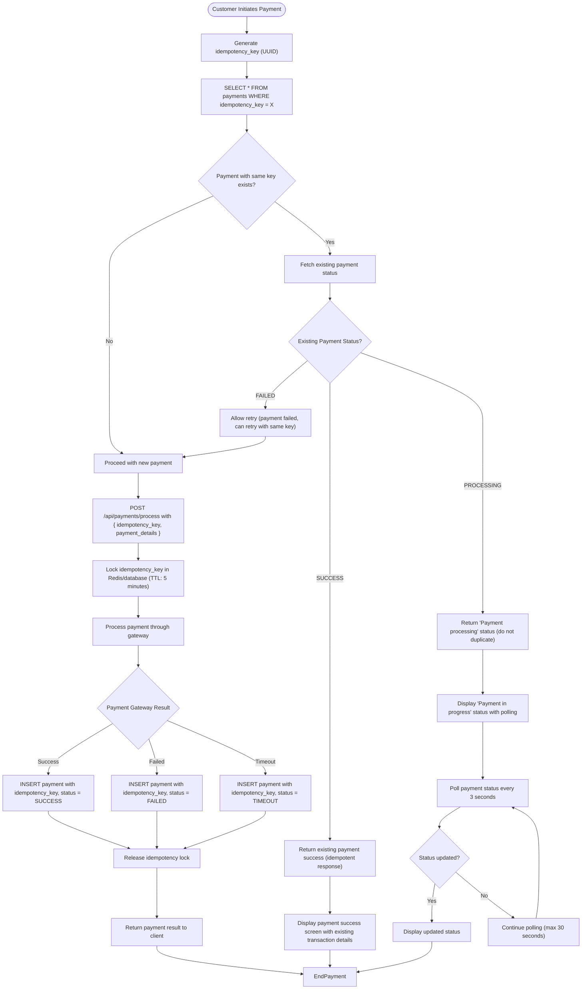
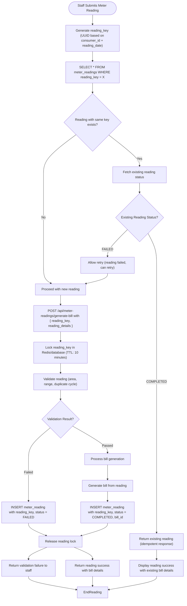
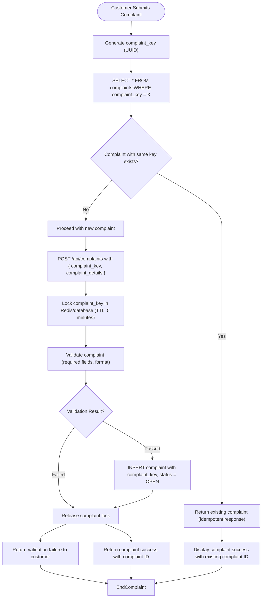
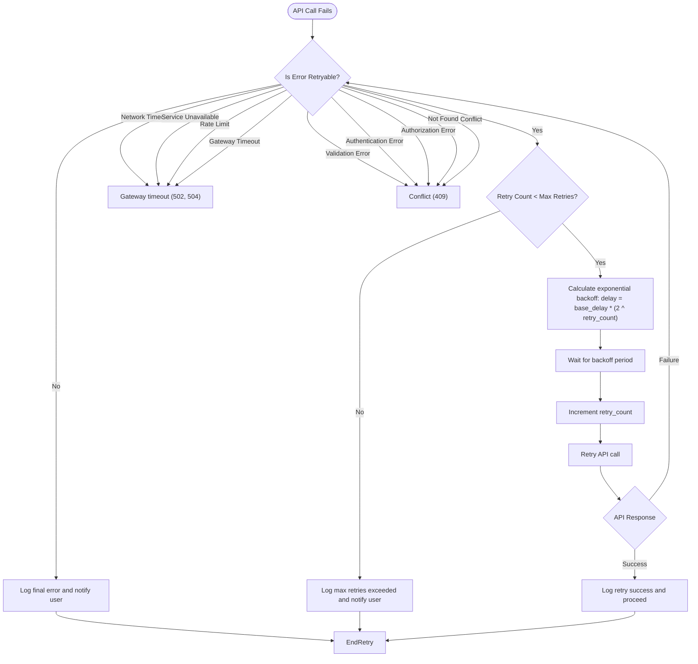

# 23 - Idempotency & Retry Flows

## Payment Idempotency Flow

```mermaid
flowchart TD
    StartPayment([Customer Initiates Payment]) --> GenerateIdempotencyKey["Generate idempotency_key (UUID)"]

    GenerateIdempotencyKey --> CheckExistingPayment["SELECT * FROM payments WHERE idempotency_key = X"]
    CheckExistingPayment --> PaymentExists{"Payment with same key exists?"}
    PaymentExists -->|Yes| FetchExistingPaymentStatus["Fetch existing payment status"]
    PaymentExists -->|No| ProceedNewPayment["Proceed with new payment"]

    FetchExistingPaymentStatus --> CheckPaymentStatus{"Existing Payment Status?"}
    CheckPaymentStatus -->|SUCCESS| ReturnExistingSuccess["Return existing payment success (idempotent response)"]
    CheckPaymentStatus -->|FAILED| AllowRetry["Allow retry (payment failed, can retry with same key)"]
    CheckPaymentStatus -->|PROCESSING| ReturnProcessing["Return 'Payment processing' status (do not duplicate)"]

    ReturnExistingSuccess --> DisplayPaymentSuccess["Display payment success screen with existing transaction details"]
    ReturnProcessing --> DisplayProcessingStatus["Display 'Payment in progress' status with polling"]
    AllowRetry --> ProceedNewPayment

    ProceedNewPayment --> SubmitPaymentWithKey["POST /api/payments/process with { idempotency_key, payment_details }"]
    SubmitPaymentWithKey --> LockIdempotencyKey["Lock idempotency_key in Redis/database (TTL: 5 minutes)"]

    LockIdempotencyKey --> ProcessPayment["Process payment through gateway"]
    ProcessPayment --> PaymentResult{"Payment Gateway Result"}

    PaymentResult -->|Success| SavePaymentSuccess["INSERT payment with idempotency_key, status = SUCCESS"]
    PaymentResult -->|Failed| SavePaymentFailed["INSERT payment with idempotency_key, status = FAILED"]
    PaymentResult -->|Timeout| SavePaymentTimeout["INSERT payment with idempotency_key, status = TIMEOUT"]

    SavePaymentSuccess --> ReleaseIdempotencyLock["Release idempotency lock"]
    SavePaymentFailed --> ReleaseIdempotencyLock
    SavePaymentTimeout --> ReleaseIdempotencyLock

    ReleaseIdempotencyLock --> ReturnPaymentResult["Return payment result to client"]
    ReturnPaymentResult --> EndPayment

    DisplayPaymentSuccess --> EndPayment
    DisplayProcessingStatus --> PollPaymentStatus["Poll payment status every 3 seconds"]
    PollPaymentStatus --> CheckStatusUpdate{"Status updated?"}
    CheckStatusUpdate -->|Yes| DisplayUpdatedStatus["Display updated status"]
    CheckStatusUpdate -->|No| ContinuePolling["Continue polling (max 30 seconds)"]
    ContinuePolling --> PollPaymentStatus
    DisplayUpdatedStatus --> EndPayment
```

## Meter Reading Idempotency Flow

```mermaid
flowchart TD
    StartMeterReading([Staff Submits Meter Reading]) --> GenerateReadingKey["Generate reading_key (UUID based on consumer_id + reading_date)"]

    GenerateReadingKey --> CheckExistingReading["SELECT * FROM meter_readings WHERE reading_key = X"]
    CheckExistingReading --> ReadingExists{"Reading with same key exists?"}
    ReadingExists -->|Yes| FetchExistingReadingStatus["Fetch existing reading status"]
    ReadingExists -->|No| ProceedNewReading["Proceed with new reading"]

    FetchExistingReadingStatus --> CheckReadingStatus{"Existing Reading Status?"}
    CheckReadingStatus -->|COMPLETED| ReturnExistingReading["Return existing reading (idempotent response)"]
    CheckReadingStatus -->|FAILED| AllowReadingRetry["Allow retry (reading failed, can retry)"]

    ReturnExistingReading --> DisplayReadingSuccess["Display reading success with existing bill details"]
    AllowReadingRetry --> ProceedNewReading

    ProceedNewReading --> SubmitReadingWithKey["POST /api/meter-readings/generate-bill with { reading_key, reading_details }"]
    SubmitReadingWithKey --> LockReadingKey["Lock reading_key in Redis/database (TTL: 10 minutes)"]

    LockReadingKey --> ValidateReading["Validate reading (area, range, duplicate cycle)"]
    ValidateReading --> ValidationResult{"Validation Result?"}
    ValidationResult -->|Failed| SaveReadingFailed["INSERT meter_reading with reading_key, status = FAILED"]
    ValidationResult -->|Passed| ProcessBillGeneration["Process bill generation"]

    SaveReadingFailed --> ReleaseReadingLock["Release reading lock"]
    ReleaseReadingLock --> ReturnReadingFailed["Return validation failure to staff"]

    ProcessBillGeneration --> GenerateBill["Generate bill from reading"]
    GenerateBill --> SaveReadingSuccess["INSERT meter_reading with reading_key, status = COMPLETED, bill_id"]
    SaveReadingSuccess --> ReleaseReadingLock
    ReleaseReadingLock --> ReturnReadingSuccess["Return reading success with bill details"]

    ReturnReadingFailed --> EndReading
    ReturnReadingSuccess --> EndReading
    DisplayReadingSuccess --> EndReading
```

## Complaint Idempotency Flow

```mermaid
flowchart TD
    StartComplaint([Customer Submits Complaint]) --> GenerateComplaintKey["Generate complaint_key (UUID)"]

    GenerateComplaintKey --> CheckExistingComplaint["SELECT * FROM complaints WHERE complaint_key = X"]
    CheckExistingComplaint --> ComplaintExists{"Complaint with same key exists?"}
    ComplaintExists -->|Yes| ReturnExistingComplaint["Return existing complaint (idempotent response)"]
    ComplaintExists -->|No| ProceedNewComplaint["Proceed with new complaint"]

    ReturnExistingComplaint --> DisplayComplaintSuccess["Display complaint success with existing complaint ID"]
    ProceedNewComplaint --> SubmitComplaintWithKey["POST /api/complaints with { complaint_key, complaint_details }"]

    SubmitComplaintWithKey --> LockComplaintKey["Lock complaint_key in Redis/database (TTL: 5 minutes)"]
    LockComplaintKey --> ValidateComplaint["Validate complaint (required fields, format)"]
    ValidateComplaint --> ValidationResult{"Validation Result?"}
    ValidationResult -->|Failed| ReleaseComplaintLock["Release complaint lock"]
    ValidationResult -->|Passed| SaveComplaint["INSERT complaint with complaint_key, status = OPEN"]

    ReleaseComplaintLock --> ReturnComplaintFailed["Return validation failure to customer"]
    SaveComplaint --> ReleaseComplaintLock
    ReleaseComplaintLock --> ReturnComplaintSuccess["Return complaint success with complaint ID"]

    ReturnComplaintFailed --> EndComplaint
    ReturnComplaintSuccess --> EndComplaint
    DisplayComplaintSuccess --> EndComplaint
```

## Retry Strategy Flow

```mermaid
flowchart TD
    StartRetry([API Call Fails]) --> CheckRetryable{"Is Error Retryable?"}
    CheckRetryable -->|No| LogFinalError["Log final error and notify user"]
    CheckRetryable -->|Yes| CheckRetryCount{"Retry Count < Max Retries?"}

    LogFinalError --> EndRetry
    CheckRetryCount -->|No| LogMaxRetriesExceeded["Log max retries exceeded and notify user"]
    LogMaxRetriesExceeded --> EndRetry

    CheckRetryCount -->|Yes| CalculateBackoff["Calculate exponential backoff: delay = base_delay * (2 ^ retry_count)"]
    CalculateBackoff --> WaitBackoff["Wait for backoff period"]
    WaitBackoff --> IncrementRetryCount["Increment retry_count"]
    IncrementRetryCount --> RetryAPICall["Retry API call"]

    RetryAPICall --> APIResponse{"API Response"}
    APIResponse -->|Success| LogRetrySuccess["Log retry success and proceed"]
    APIResponse -->|Failure| CheckRetryable

    LogRetrySuccess --> EndRetry

    %% Retryable Errors
    CheckRetryable -->|Network Timeout| IsRetryable["Network timeout (504, ETIMEDOUT)"]
    CheckRetryable -->|Service Unavailable| IsRetryable["Service unavailable (503)"]
    CheckRetryable -->|Rate Limit| IsRetryable["Rate limit (429) with Retry-After header"]
    CheckRetryable -->|Gateway Timeout| IsRetryable["Gateway timeout (502, 504)"]

    %% Non-Retryable Errors
    CheckRetryable -->|Validation Error| IsNotRetryable["Validation error (400, 422)"]
    CheckRetryable -->|Authentication Error| IsNotRetryable["Authentication error (401)"]
    CheckRetryable -->|Authorization Error| IsNotRetryable["Authorization error (403)"]
    CheckRetryable -->|Not Found| IsNotRetryable["Not found (404)"]
    CheckRetryable -->|Conflict| IsNotRetryable["Conflict (409)"]
```
