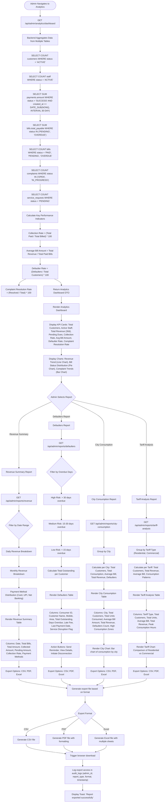

# 24 - Admin Analytics & Reports Flowchart

```mermaid
flowchart TD
    StartAnalytics([Admin Navigates to Analytics]) --> LoadAnalyticsDashboard["GET /api/admin/analytics/dashboard"]

    LoadAnalyticsDashboard --> FetchAggregateData["Backend Aggregates Data from Multiple Tables"]
    FetchAggregateData --> CustomerMetrics["SELECT COUNT customers WHERE status = 'ACTIVE'"]
    CustomerMetrics --> StaffMetrics["SELECT COUNT staff WHERE status = 'ACTIVE'"]
    StaffMetrics --> RevenueMetrics["SELECT SUM payments.amount WHERE status = 'SUCCESS' AND created_at >= DATE_SUB(NOW(), INTERVAL 30 DAY)"]
    RevenueMetrics --> PendingDuesMetrics["SELECT SUM bills.total_payable WHERE status IN ('PENDING', 'OVERDUE')"]
    PendingDuesMetrics --> BillMetrics["SELECT COUNT bills WHERE status = 'PAID', 'PENDING', 'OVERDUE'"]
    BillMetrics --> ComplaintMetrics["SELECT COUNT complaints WHERE status IN ('OPEN', 'IN_PROGRESS')"]
    ComplaintMetrics --> SRMetrics["SELECT COUNT service_requests WHERE status = 'PENDING'"]

    SRMetrics --> CalculateKPIs["Calculate Key Performance Indicators"]
    CalculateKPIs --> CollectionRate["Collection Rate = (Total Paid / Total Billed) * 100"]
    CollectionRate --> AvgBillAmount["Average Bill Amount = Total Revenue / Total Paid Bills"]
    AvgBillAmount --> DefaulterRate["Defaulter Rate = (Defaulters / Total Customers) * 100"]
    DefaulterRate --> ComplaintResolutionRate["Complaint Resolution Rate = (Resolved / Total) * 100"]

    DefaulterRate --> ReturnAnalyticsData["Return Analytics Dashboard DTO"]
    ReturnAnalyticsData --> RenderAnalyticsDashboard["Render Analytics Dashboard"]

    RenderAnalyticsDashboard --> DisplayKPICards["Display KPI Cards: Total Customers, Active Staff, Total Revenue (30d), Pending Dues, Collection Rate, Avg Bill Amount, Defaulter Rate, Complaint Resolution Rate"]
    DisplayKPICards --> DisplayCharts["Display Charts: Revenue Trend (Line Chart), Bill Status Distribution (Pie Chart), Complaint Trends (Bar Chart)"]

    DisplayCharts --> ReportSelection{"Admin Selects Report"}
    ReportSelection -->|Revenue Summary| RevenueReport["Revenue Summary Report"]
    ReportSelection -->|Defaulters Report| DefaulterReport["Defaulters Report"]
    ReportSelection -->|City Consumption| CityReport["City Consumption Report"]
    ReportSelection -->|Tariff Analysis| TariffReport["Tariff Analysis Report"]

    %% Revenue Summary Report
    RevenueReport --> FetchRevenueData["GET /api/admin/reports/revenue"]
    FetchRevenueData --> FilterRevenueByDate{"Filter by Date Range"}
    FilterRevenueByDate --> DailyRevenue["Daily Revenue Breakdown"]
    DailyRevenue --> MonthlyRevenue["Monthly Revenue Breakdown"]
    MonthlyRevenue --> PaymentMethodBreakdown["Payment Method Distribution (Card, UPI, Net Banking)"]
    PaymentMethodBreakdown --> RenderRevenueTable["Render Revenue Summary Table"]

    RenderRevenueTable --> RevenueColumns["Columns: Date, Total Bills, Total Amount, Collected Amount, Pending Amount, Collection Rate, Payment Methods"]
    RevenueColumns --> ExportRevenue["Export Options: CSV, PDF, Excel"]

    %% Defaulters Report
    DefaulterReport --> FetchDefaulterData["GET /api/admin/reports/defaulters"]
    FetchDefaulterData --> FilterDefaulters{"Filter by Overdue Days"}
    FilterDefaulters --> HighRiskDefaulters["High Risk: > 30 days overdue"]
    HighRiskDefaulters --> MediumRiskDefaulters["Medium Risk: 15-30 days overdue"]
    MediumRiskDefaulters --> LowRiskDefaulters["Low Risk: < 15 days overdue"]

    LowRiskDefaulters --> CalculateTotalDues["Calculate Total Outstanding per Customer"]
    CalculateTotalDues --> RenderDefaulterTable["Render Defaulters Table"]

    RenderDefaulterTable --> DefaulterColumns["Columns: Consumer ID, Customer Name, Mobile, Area, Total Outstanding, Days Overdue, Late Fee, Last Payment Date, Service Disruption Flag"]
    DefaulterColumns --> ActionButtons["Action Buttons: Send Reminder, View Details, Initiate Disconnection"]
    ActionButtons --> ExportDefaulters["Export Options: CSV, PDF, Excel"]

    %% City Consumption Report
    CityReport --> FetchCityData["GET /api/admin/reports/city-consumption"]
    FetchCityData --> GroupByCity["Group by City"]
    GroupByCity --> CalculateCityMetrics["Calculate per City: Total Customers, Total Consumption, Average Bill, Total Revenue, Defaulters"]
    CalculateCityMetrics --> RenderCityTable["Render City Consumption Table"]

    RenderCityTable --> CityColumns["Columns: City, Total Customers, Total Units Consumed, Average Bill Amount, Total Revenue, Defaulters Count, High Consumption Zones"]
    CityColumns --> RenderCityChart["Render City Chart: Bar chart of consumption by city"]
    RenderCityChart --> ExportCity["Export Options: CSV, PDF, Excel"]

    %% Tariff Analysis Report
    TariffReport --> FetchTariffData["GET /api/admin/reports/tariff-analysis"]
    FetchTariffData --> GroupByTariff["Group by Tariff Type (Residential, Commercial)"]
    GroupByTariff --> CalculateTariffMetrics["Calculate per Tariff: Total Customers, Total Revenue, Average Bill, Consumption Patterns"]
    CalculateTariffMetrics --> RenderTariffTable["Render Tariff Analysis Table"]

    RenderTariffTable --> TariffColumns["Columns: Tariff Type, Total Customers, Total Units, Average Bill, Total Revenue, Peak Consumption Hours"]
    TariffColumns --> RenderTariffChart["Render Tariff Chart: Comparison of Residential vs Commercial"]
    RenderTariffChart --> ExportTariff["Export Options: CSV, PDF, Excel"]

    %% Export Functionality
    ExportRevenue --> GenerateExportFile["Generate export file based on format"]
    ExportDefaulters --> GenerateExportFile
    ExportCity --> GenerateExportFile
    ExportTariff --> GenerateExportFile

    GenerateExportFile --> ExportFormat{"Export Format"}
    ExportFormat -->|CSV| GenerateCSV["Generate CSV file"]
    ExportFormat -->|PDF| GeneratePDF["Generate PDF file with formatting"]
    ExportFormat -->|Excel| GenerateExcel["Generate Excel file with multiple sheets"]

    GenerateCSV --> TriggerDownload["Trigger browser download"]
    GeneratePDF --> TriggerDownload
    GenerateExcel --> TriggerDownload

    TriggerDownload --> LogExportAccess["Log export access in audit_logs (admin_id, report_type, format, timestamp)"]
    LogExportAccess --> ShowExportSuccess["Display Toast: 'Report exported successfully'"]
```
