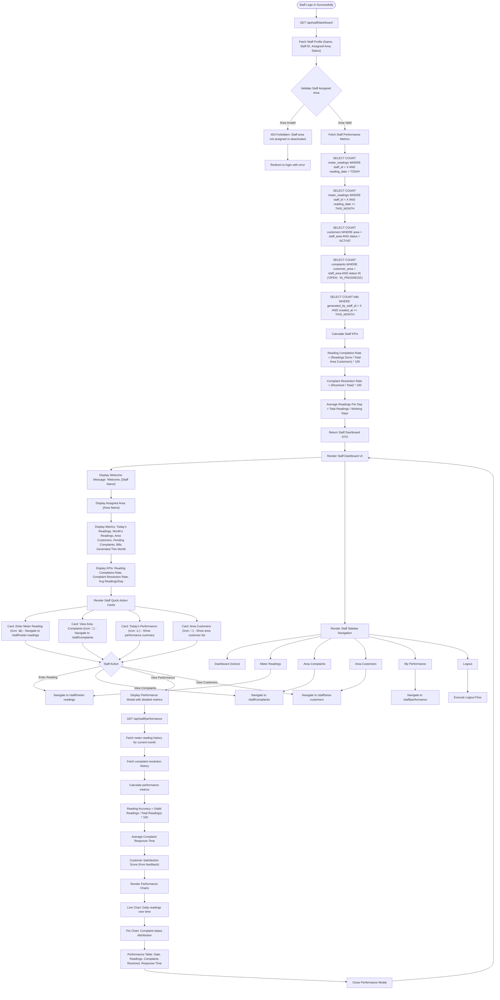

# 25 - Staff Dashboard Detailed Flowchart

```mermaid
flowchart TD
    StartStaffDash([Staff Logs In Successfully]) --> LoadStaffDashboard["GET /api/staff/dashboard"]

    LoadStaffDashboard --> FetchStaffProfile["Fetch Staff Profile (Name, Staff ID, Assigned Area, Status)"]
    FetchStaffProfile --> ValidateStaffArea{"Validate Staff Assigned Area"}
    ValidateStaffArea -->|Area Invalid| ErrStaffArea["403 Forbidden: Staff area not assigned or deactivated"]
    ErrStaffArea --> RedirectLogin["Redirect to login with error"]
    ValidateStaffArea -->|Area Valid| FetchStaffMetrics

    FetchStaffMetrics["Fetch Staff Performance Metrics"] --> TodayReadings["SELECT COUNT meter_readings WHERE staff_id = X AND reading_date = TODAY"]
    TodayReadings --> MonthReadings["SELECT COUNT meter_readings WHERE staff_id = X AND reading_date >= THIS_MONTH"]
    MonthReadings --> AreaCustomers["SELECT COUNT customers WHERE area = staff_area AND status = 'ACTIVE'"]
    AreaCustomers --> PendingAreaComplaints["SELECT COUNT complaints WHERE customer_area = staff_area AND status IN ('OPEN', 'IN_PROGRESS')"]
    PendingAreaComplaints --> GeneratedBills["SELECT COUNT bills WHERE generated_by_staff_id = X AND created_at >= THIS_MONTH"]

    GeneratedBills --> CalculateStaffKPIs["Calculate Staff KPIs"]
    CalculateStaffKPIs --> ReadingCompletionRate["Reading Completion Rate = (Readings Done / Total Area Customers) * 100"]
    ReadingCompletionRate --> ComplaintResolutionRate["Complaint Resolution Rate = (Resolved / Total) * 100"]
    ComplaintResolutionRate --> AvgReadingPerDay["Average Readings Per Day = Total Readings / Working Days"]

    AvgReadingPerDay --> ReturnStaffDashboardData["Return Staff Dashboard DTO"]
    ReturnStaffDashboardData --> RenderStaffDashboardUI["Render Staff Dashboard UI"]

    RenderStaffDashboardUI --> DisplayStaffWelcome["Display Welcome Message: 'Welcome, [Staff Name]'"]
    DisplayStaffWelcome --> DisplayStaffArea["Display Assigned Area: [Area Name]"]
    DisplayStaffArea --> DisplayStaffMetrics["Display Metrics: Today's Readings, Month's Readings, Area Customers, Pending Complaints, Bills Generated This Month"]
    DisplayStaffMetrics --> DisplayKPIs["Display KPIs: Reading Completion Rate, Complaint Resolution Rate, Avg Readings/Day"]

    DisplayKPIs --> RenderStaffQuickActions["Render Staff Quick Action Cards"]
    RenderStaffQuickActions --> ActionCard1["Card: Enter Meter Reading (Icon: 📊) - Navigate to /staff/meter-readings"]
    RenderStaffQuickActions --> ActionCard2["Card: View Area Complaints (Icon: 📝) - Navigate to /staff/complaints"]
    RenderStaffQuickActions --> ActionCard3["Card: Today's Performance (Icon: 📈) - Show performance summary"]
    RenderStaffQuickActions --> ActionCard4["Card: Area Customers (Icon: 👥) - Show area customer list"]

    ActionCard1 --> StaffAction{"Staff Action"}
    ActionCard2 --> StaffAction
    ActionCard3 --> StaffAction
    ActionCard4 --> StaffAction

    StaffAction -->|Enter Reading| NavMeterReading["Navigate to /staff/meter-readings"]
    StaffAction -->|View Complaints| NavComplaints["Navigate to /staff/complaints"]
    StaffAction -->|View Performance| ShowPerformanceModal["Display Performance Modal with detailed metrics"]
    StaffAction -->|View Customers| NavAreaCustomers["Navigate to /staff/area-customers"]

    %% Sidebar Navigation
    RenderStaffDashboardUI --> RenderStaffSidebar["Render Staff Sidebar Navigation"]
    RenderStaffSidebar --> StaffSidebarItem1["Dashboard (Active)"]
    RenderStaffSidebar --> StaffSidebarItem2["Meter Readings"]
    RenderStaffSidebar --> StaffSidebarItem3["Area Complaints"]
    RenderStaffSidebar --> StaffSidebarItem4["Area Customers"]
    RenderStaffSidebar --> StaffSidebarItem5["My Performance"]
    RenderStaffSidebar --> StaffSidebarItem6["Logout"]

    StaffSidebarItem2 --> NavMeterReading
    StaffSidebarItem3 --> NavComplaints
    StaffSidebarItem4 --> NavAreaCustomers
    StaffSidebarItem5 --> NavPerformance["Navigate to /staff/performance"]
    StaffSidebarItem6 --> LogoutAction["Execute Logout Flow"]

    %% Performance Modal Details
    ShowPerformanceModal --> FetchPerformanceData["GET /api/staff/performance"]
    FetchPerformanceData --> FetchReadingHistory["Fetch meter reading history for current month"]
    FetchReadingHistory --> FetchComplaintHistory["Fetch complaint resolution history"]
    FetchComplaintHistory --> CalculatePerformance["Calculate performance metrics"]

    CalculatePerformance --> ReadingAccuracy["Reading Accuracy = (Valid Readings / Total Readings) * 100"]
    ReadingAccuracy --> ComplaintResponseTime["Average Complaint Response Time"]
    ComplaintResponseTime --> CustomerSatisfaction["Customer Satisfaction Score (from feedback)"]
    CustomerSatisfaction --> RenderPerformanceCharts["Render Performance Charts"]

    RenderPerformanceCharts --> ReadingTrendChart["Line Chart: Daily readings over time"]
    ReadingTrendChart --> ComplaintStatusChart["Pie Chart: Complaint status distribution"]
    ComplaintStatusChart --> PerformanceTable["Performance Table: Date, Readings, Complaints Resolved, Response Time"]

    PerformanceTable --> ClosePerformanceModal["Close Performance Modal"]
    ClosePerformanceModal --> RenderStaffDashboardUI
```
