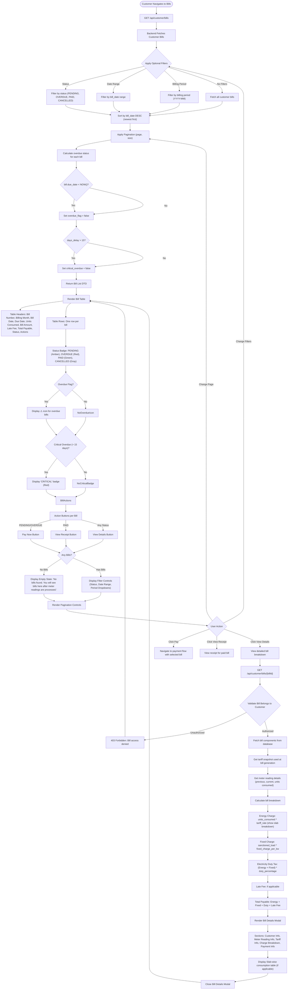

# 26 - Customer Bill Viewing Detailed Flowchart

```mermaid
flowchart TD
    StartBillView([Customer Navigates to Bills]) --> LoadBillList["GET /api/customer/bills"]

    LoadBillList --> FetchCustomerBills["Backend Fetches Customer Bills"]
    FetchCustomerBills --> ApplyBillFilters{"Apply Optional Filters"}
    ApplyBillFilters -->|Status| FilterStatus["Filter by status (PENDING, OVERDUE, PAID, CANCELLED)"]
    ApplyBillFilters -->|Date Range| FilterBillDate["Filter by bill_date range"]
    ApplyBillFilters -->|Billing Period| FilterPeriod["Filter by billing period (YYYY-MM)"]
    ApplyBillFilters -->|No Filters| FetchAllBills["Fetch all customer bills"]

    FilterStatus --> SortBills["Sort by bill_date DESC (newest first)"]
    FilterBillDate --> SortBills
    FilterPeriod --> SortBills
    FetchAllBills --> SortBills

    SortBills --> PaginateBills["Apply Pagination (page, size)"]
    PaginateBills --> CalculateOverdueStatus["Calculate overdue status for each bill"]
    CalculateOverdueStatus --> CheckDueDate{"bill.due_date < NOW()?"}
    CheckDueDate -->|Yes| SetOverdueFlag["Set overdue_flag = true"]
    CheckDueDate -->|No| SetOverdueFlag["Set overdue_flag = false"]

    SetOverdueFlag --> Check15DayDelay{"days_delay > 15?"}
    Check15DayDelay -->|Yes| SetCriticalOverdue["Set critical_overdue = true"]
    Check15DayDelay -->|No| SetCriticalOverdue["Set critical_overdue = false"]

    SetCriticalOverdue --> ReturnBillList["Return Bill List DTO"]

    ReturnBillList --> RenderBillTable["Render Bill Table"]

    RenderBillTable --> BillTableHeader["Table Headers: Bill Number, Billing Month, Bill Date, Due Date, Units Consumed, Bill Amount, Late Fee, Total Payable, Status, Actions"]
    RenderBillTable --> BillTableRows["Table Rows: One row per bill"]

    BillTableRows --> BillStatusBadge["Status Badge: PENDING (Amber), OVERDUE (Red), PAID (Green), CANCELLED (Gray)"]
    BillStatusBadge --> OverdueWarning{"Overdue Flag?"}
    OverdueWarning -->|Yes| DisplayOverdueIcon["Display ⚠️ icon for overdue bills"]
    OverdueWarning -->|No| NoOverdueIcon
    DisplayOverdueIcon --> CriticalOverdueWarning
    NoOverdueIcon --> CriticalOverdueWarning

    CriticalOverdueWarning{"Critical Overdue (> 15 days)?"}
    CriticalOverdueWarning -->|Yes| DisplayCriticalBadge["Display 'CRITICAL' badge (Red)"]
    CriticalOverdueWarning -->|No| NoCriticalBadge
    DisplayCriticalBadge --> BillActions
    NoCriticalBadge --> BillActions

    BillActions --> ActionButtons["Action Buttons per Bill"]
    ActionButtons -->|PENDING/OVERDUE| PayButton["Pay Now Button"]
    ActionButtons -->|PAID| ViewReceiptButton["View Receipt Button"]
    ActionButtons -->|Any Status| ViewDetailsButton["View Details Button"]

    PayButton --> CheckEmptyBills{"Any Bills?"}
    ViewReceiptButton --> CheckEmptyBills
    ViewDetailsButton --> CheckEmptyBills

    CheckEmptyBills -->|No Bills| DisplayEmptyBillsState["Display Empty State: 'No bills found. You will see bills here after meter readings are processed.'"]
    CheckEmptyBills -->|Has Bills| DisplayFilterControls["Display Filter Controls (Status, Date Range, Period Dropdowns)"]

    DisplayEmptyBillsState --> RenderBillPagination["Render Pagination Controls"]
    DisplayFilterControls --> RenderBillPagination

    RenderBillPagination --> UserBillAction{"User Action"}
    UserBillAction -->|Change Filters| ApplyBillFilters
    UserBillAction -->|Change Page| PaginateBills
    UserBillAction -->|Click Pay| InitiatePayment["Navigate to payment flow with selected bill"]
    UserBillAction -->|Click View Receipt| ViewBillReceipt["View receipt for paid bill"]
    UserBillAction -->|Click View Details| ViewBillDetails["View detailed bill breakdown"]

    %% Bill Details View
    ViewBillDetails --> FetchBillBreakdown["GET /api/customer/bills/{billId}"]
    FetchBillBreakdown --> ValidateBillOwnership{"Validate Bill Belongs to Customer"}
    ValidateBillOwnership -->|Unauthorized| ErrBillAccess["403 Forbidden: Bill access denied"]
    ErrBillAccess --> RenderBillTable

    ValidateBillOwnership -->|Authorized| FetchBillComponents["Fetch bill components from database"]
    FetchBillComponents --> GetTariffSnapshot["Get tariff snapshot used at bill generation"]
    GetTariffSnapshot --> GetMeterReading["Get meter reading details (previous, current, units consumed)"]
    GetMeterReading --> CalculateBillBreakdown["Calculate bill breakdown"]

    CalculateBillBreakdown --> EnergyChargeBreakdown["Energy Charge: units_consumed * tariff_rate (show slab breakdown)"]
    EnergyChargeBreakdown --> FixedChargeBreakdown["Fixed Charge: sanctioned_load * fixed_charge_per_kw"]
    FixedChargeBreakdown --> DutyTaxBreakdown["Electricity Duty Tax: (Energy + Fixed) * duty_percentage"]
    DutyTaxBreakdown --> LateFeeBreakdown["Late Fee: if applicable"]
    LateFeeBreakdown --> TotalBreakdown["Total Payable: Energy + Fixed + Duty + Late Fee"]

    TotalBreakdown --> RenderBillDetailsModal["Render Bill Details Modal"]
    RenderBillDetailsModal --> BillDetailsSections["Sections: Customer Info, Meter Reading Info, Tariff Info, Charge Breakdown, Payment Info"]

    BillDetailsSections --> DisplaySlabTable["Display Slab-wise consumption table (if applicable)"]
    DisplaySlabTable --> CloseBillDetails["Close Bill Details Modal"]
    CloseBillDetails --> RenderBillTable
```
