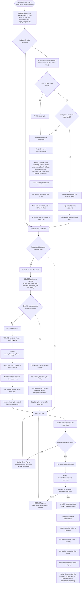

# 27 - Service Disruption Flow (Non-Payment)

```mermaid
flowchart TD
    StartDisruption([Scheduled Job: Check Service Disruption Eligibility]) --> FetchOverdueCustomers["SELECT customers WHERE EXISTS (bills WHERE status = 'OVERDUE' AND days_delay >= 30)"]

    FetchOverdueCustomers --> CheckEachCustomer{"For Each Overdue Customer"}
    CheckEachCustomer --> CalculateTotalOutstanding["Calculate total outstanding amount (sum of all overdue bills)"]
    CalculateTotalOutstanding --> CheckDisruptionHistory{"Previous Disruption History?"}
    CheckDisruptionHistory -->|Yes| CheckDisruptionCount{"Disruptions in last 12 months < 3?"}
    CheckDisruptionHistory -->|No| FirstTimeDisruption["First time disruption"]

    CheckDisruptionCount -->|Yes| EligibleForDisruption["Eligible for service disruption"]
    CheckDisruptionCount -->|No| ExceedsLimit["Exceeds disruption limit (contact legal)"]
    FirstTimeDisruption --> EligibleForDisruption

    ExceedsLimit --> LogDisruptionExceeded["Log disruption limit exceeded"]
    LogDisruptionExceeded --> NotifyLegal["Notify legal department for action"]
    NotifyLegal --> NextCustomer

    EligibleForDisruption --> GenerateDisruptionNotice["Generate service disruption notice"]
    GenerateDisruptionNotice --> NoticeContent["Notice Content: 'Your electricity service will be disconnected on [Date] due to non-payment of ₹[Amount]. Pay immediately to avoid disconnection.'"]

    NoticeContent --> SendDisruptionWarning["Send warning notification to customer"]
    SendDisruptionWarning --> SetDisruptionFlag["Set service_disruption_flag = true"]
    SetDisruptionFlag --> ScheduleDisruptionDate["Schedule disruption_date = NOW + 7 days"]

    ScheduleDisruptionDate --> LogDisruptionScheduled["Log disruption scheduled in audit_logs"]
    LogDisruptionScheduled --> NextCustomer

    CheckEachCustomer --> NextCustomer["Process Next Customer"]
    NextCustomer --> CheckEachCustomer

    %% Disruption Execution
    NextCustomer --> CheckScheduledDisruptions{"Scheduled Disruptions Reached Date?"}
    CheckScheduledDisruptions -->|Yes| ExecuteDisruption["Execute service disruption"]
    CheckScheduledDisruptions -->|No| EndDisruption

    ExecuteDisruption --> FetchScheduledCustomers["SELECT customers WHERE service_disruption_flag = true AND disruption_date <= NOW()"]
    FetchScheduledCustomers --> CheckPaymentBeforeDisruption{"Check if payment made before disruption?"}
    CheckPaymentBeforeDisruption -->|Yes| CancelDisruption["Cancel disruption (payment received)"]
    CheckPaymentBeforeDisruption -->|No| ProceedDisruption

    CancelDisruption --> ClearDisruptionFlag["Set service_disruption_flag = false"]
    ClearDisruptionFlag --> SendPaymentReceivedNotice["Send notification: 'Payment received. Service disruption cancelled.'"]
    SendPaymentReceivedNotice --> LogDisruptionCancelled["Log disruption cancelled in audit_logs"]
    LogDisruptionCancelled --> EndDisruption

    ProceedDisruption --> UpdateCustomerStatus["UPDATE customer status = 'SUSPENDED'"]
    UpdateCustomerStatus --> RecordDisruptionDate["Record actual_disruption_date = NOW"]
    RecordDisruptionDate --> NotifyFieldStaff["Notify field staff for physical disconnection"]
    NotifyFieldStaff --> SendFinalNotice["Send final disconnection notice to customer"]

    SendFinalNotice --> LogDisruptionExecuted["Log disruption executed in audit_logs"]
    LogDisruptionExecuted --> UpdateDisruptionCount["Increment disruption_count in customer record"]
    UpdateDisruptionCount --> EndDisruption

    %% Service Restoration Flow
    EndDisruption --> CustomerRequestsRestoration["Customer requests service restoration"]
    CustomerRequestsRestoration --> CheckOutstandingSettled{"All outstanding bills paid?"}
    CheckOutstandingSettled -->|No| DisplayOutstandingError["Display Error: 'Pay all outstanding bills to request service restoration.'"]
    DisplayOutstandingError --> EndDisruption

    CheckOutstandingSettled -->|Yes| PayRestorationFee["Pay restoration fee (₹500)"]
    PayRestorationFee --> SubmitRestorationRequest["POST /api/customer/service-restoration"]

    SubmitRestorationRequest --> ValidateRestoration["Validate: All bills paid + restoration fee paid"]
    ValidateRestoration -->|Invalid| ErrRestorationInvalid["400 Bad Request: Restoration requirements not met"]
    ErrRestorationInvalid --> EndDisruption

    ValidateRestoration -->|Valid| ScheduleRestoration["Schedule restoration_date = NOW + 2 business days"]
    ScheduleRestoration --> NotifyFieldStaffRestoration["Notify field staff for reconnection"]
    NotifyFieldStaffRestoration --> SendRestorationNotice["Send restoration notice to customer"]

    SendRestorationNotice --> UpdateCustomerActive["UPDATE customer status = 'ACTIVE'"]
    UpdateCustomerActive --> ClearDisruptionFlagRestoration["Set service_disruption_flag = false"]
    ClearDisruptionFlagRestoration --> LogRestorationExecuted["Log restoration executed in audit_logs"]
    LogRestorationExecuted --> DisplayRestorationSuccess["Display Success: 'Service restoration scheduled. Your electricity will be reconnected by [Date].'"]
```
