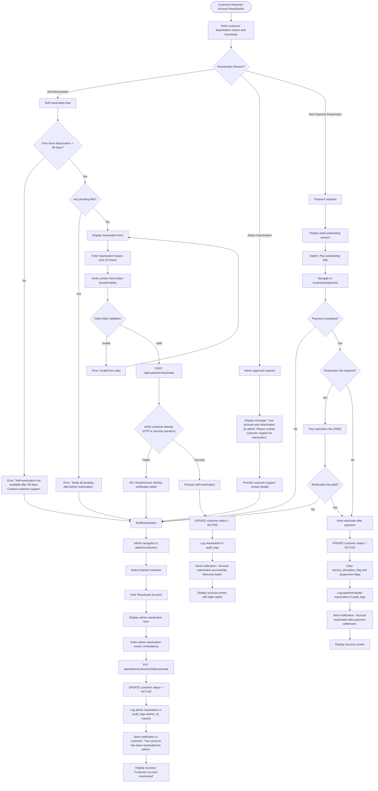

# 28 - Customer Reactivation Flow

```mermaid
flowchart TD
    StartReactivation([Customer Requests Account Reactivation]) --> CheckDeactivationReason["Fetch customer deactivation reason and timestamp"]

    CheckDeactivationReason --> DeactivationReason{"Deactivation Reason?"}
    DeactivationReason -->|Self-Deactivation| SelfReactivationFlow["Self-reactivation flow"]
    DeactivationReason -->|Admin Deactivation| AdminReactivationFlow["Admin approval required"]
    DeactivationReason -->|Non-Payment Suspension| PaymentReactivationFlow["Payment required"]

    %% Self-Reactivation Flow
    SelfReactivationFlow --> CheckReactivationEligibility{"Time since deactivation < 90 days?"}
    CheckReactivationEligibility -->|No| ErrTimeExceeded["Error: 'Self-reactivation not available after 90 days. Contact customer support.'"]
    ErrTimeExceeded --> EndReactivation

    CheckReactivationEligibility -->|Yes| CheckPendingBills{"Any pending bills?"}
    CheckPendingBills -->|Yes| ErrPendingBills["Error: 'Settle all pending bills before reactivation.'"]
    ErrPendingBills --> EndReactivation

    CheckPendingBills -->|No| DisplayReactivationForm["Display reactivation form"]

    DisplayReactivationForm --> InputReactivationReason["Enter reactivation reason (min 20 chars)"]
    InputReactivationReason --> InputContactInfo["Verify contact information (email/mobile)"]
    InputContactInfo --> ValReactivationForm{"Client-Side Validation"}

    ValReactivationForm -->|Invalid| ErrReactivationVal["Error: Invalid form data"]
    ErrReactivationVal --> DisplayReactivationForm

    ValReactivationForm -->|Valid| SubmitReactivationRequest["POST /api/customer/reactivate"]

    SubmitReactivationRequest --> VerifyIdentity{"Verify customer identity (OTP or security question)"}
    VerifyIdentity -->|Failed| ErrIdentityFailed["401 Unauthorized: Identity verification failed"]
    ErrIdentityFailed --> EndReactivation

    VerifyIdentity -->|Success| ProcessSelfReactivation["Process self-reactivation"]
    ProcessSelfReactivation --> UpdateCustomerStatus["UPDATE customer status = 'ACTIVE'"]
    UpdateCustomerStatus --> LogReactivation["Log reactivation in audit_logs"]
    LogReactivation --> SendReactivationNotif["Send notification: 'Account reactivated successfully. Welcome back!'"]
    SendReactivationNotif --> DisplayReactivationSuccess["Display success screen with login option"]

    %% Admin-Required Reactivation
    AdminReactivationFlow --> DisplayContactSupport["Display message: 'Your account was deactivated by admin. Please contact customer support for reactivation.'"]
    DisplayContactSupport --> ProvideContactInfo["Provide customer support contact details"]
    ProvideContactInfo --> EndReactivation

    %% Payment-Required Reactivation
    PaymentReactivationFlow --> DisplayOutstandingAmount["Display total outstanding amount"]
    DisplayOutstandingAmount --> PayOutstandingBills["Option: Pay outstanding bills"]
    PayOutstandingBills --> NavigateToPayment["Navigate to /customer/payments"]

    NavigateToPayment --> PaymentCompleted{"Payment completed?"}
    PaymentCompleted -->|No| EndReactivation
    PaymentCompleted -->|Yes| CheckRestorationFee{"Restoration fee required?"}
    CheckRestorationFee -->|Yes| PayRestorationFee["Pay restoration fee (₹500)"]
    CheckRestorationFee -->|No| AutoReactivate

    PayRestorationFee --> RestorationFeePaid{"Restoration fee paid?"}
    RestorationFeePaid -->|No| EndReactivation
    RestorationFeePaid -->|Yes| AutoReactivate

    AutoReactivate["Auto-reactivate after payment"] --> UpdateCustomerStatusPayment["UPDATE customer status = 'ACTIVE'"]
    UpdateCustomerStatusPayment --> ClearSuspensionFlags["Clear service_disruption_flag and suspension flags"]
    ClearSuspensionFlags --> LogPaymentReactivation["Log payment-based reactivation in audit_logs"]
    LogPaymentReactivation --> SendPaymentReactivationNotif["Send notification: 'Account reactivated after payment settlement.'"]
    SendPaymentReactivationNotif --> DisplayPaymentReactivationSuccess["Display success screen"]

    %% Admin Manual Reactivation
    EndReactivation --> AdminManualReactivation["Admin navigates to /admin/customers"]
    AdminManualReactivation --> SelectInactiveCustomer["Select inactive customer"]
    SelectInactiveCustomer --> ClickReactivate["Click 'Reactivate Account'"]

    ClickReactivate --> DisplayAdminReactivationForm["Display admin reactivation form"]
    DisplayAdminReactivationForm --> InputAdminReason["Enter admin reactivation reason (mandatory)"]
    InputAdminReason --> SubmitAdminReactivation["PUT /api/admin/customers/{id}/reactivate"]

    SubmitAdminReactivation --> UpdateCustomerStatusAdmin["UPDATE customer status = 'ACTIVE'"]
    UpdateCustomerStatusAdmin --> LogAdminReactivation["Log admin reactivation in audit_logs (admin_id, reason)"]
    LogAdminReactivation --> NotifyCustomerReactivation["Send notification to customer: 'Your account has been reactivated by admin.'"]
    NotifyCustomerReactivation --> DisplayAdminReactivationSuccess["Display success: 'Customer account reactivated'"]
```
