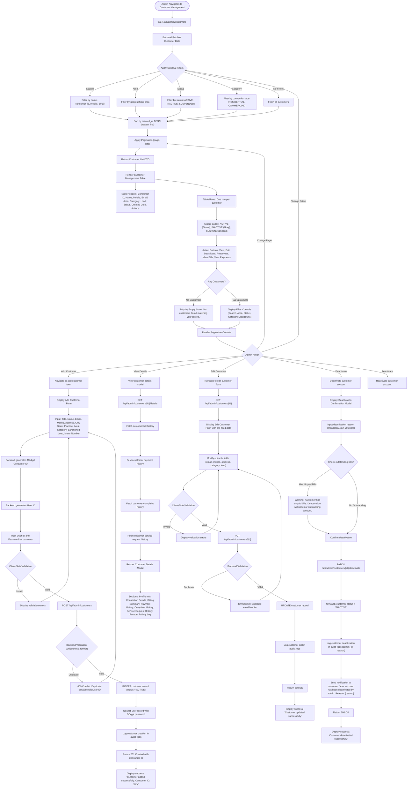

# 29 - Admin Customer Management Detailed Flowchart

```mermaid
flowchart TD
    StartCustMgmt([Admin Navigates to Customer Management]) --> LoadCustomerList["GET /api/admin/customers"]

    LoadCustomerList --> FetchCustomerData["Backend Fetches Customer Data"]
    FetchCustomerData --> ApplyCustFilters{"Apply Optional Filters"}
    ApplyCustFilters -->|Search| FilterSearch["Filter by name, consumer_id, mobile, email"]
    ApplyCustFilters -->|Area| FilterArea["Filter by geographical area"]
    ApplyCustFilters -->|Status| FilterStatus["Filter by status (ACTIVE, INACTIVE, SUSPENDED)"]
    ApplyCustFilters -->|Category| FilterCategory["Filter by connection type (RESIDENTIAL, COMMERCIAL)"]
    ApplyCustFilters -->|No Filters| FetchAllCustomers["Fetch all customers"]

    FilterSearch --> SortCustomers["Sort by created_at DESC (newest first)"]
    FilterArea --> SortCustomers
    FilterStatus --> SortCustomers
    FilterCategory --> SortCustomers
    FetchAllCustomers --> SortCustomers

    SortCustomers --> PaginateCustomers["Apply Pagination (page, size)"]
    PaginateCustomers --> ReturnCustomerList["Return Customer List DTO"]

    ReturnCustomerList --> RenderCustomerTable["Render Customer Management Table"]
    RenderCustomerTable --> CustTableHeader["Table Headers: Consumer ID, Name, Mobile, Email, Area, Category, Load, Status, Created Date, Actions"]
    RenderCustomerTable --> CustTableRows["Table Rows: One row per customer"]

    CustTableRows --> CustStatusBadge["Status Badge: ACTIVE (Green), INACTIVE (Gray), SUSPENDED (Red)"]
    CustStatusBadge --> CustActionButtons["Action Buttons: View, Edit, Deactivate, Reactivate, View Bills, View Payments"]

    CustActionButtons --> CheckEmptyCustomers{"Any Customers?"}
    CheckEmptyCustomers -->|No Customers| DisplayEmptyCustState["Display Empty State: 'No customers found matching your criteria.'"]
    CheckEmptyCustomers -->|Has Customers| DisplayCustFilterControls["Display Filter Controls (Search, Area, Status, Category Dropdowns)"]

    DisplayEmptyCustState --> RenderCustPagination["Render Pagination Controls"]
    DisplayCustFilterControls --> RenderCustPagination

    RenderCustPagination --> AdminCustAction{"Admin Action"}
    AdminCustAction -->|Change Filters| ApplyCustFilters
    AdminCustAction -->|Change Page| PaginateCustomers
    AdminCustAction -->|Add Customer| AddNewCustomer["Navigate to add customer form"]
    AdminCustAction -->|View Details| ViewCustomerDetails["View customer details modal"]
    AdminCustAction -->|Edit Customer| EditCustomerForm["Navigate to edit customer form"]
    AdminCustAction -->|Deactivate| DeactivateCustomer["Deactivate customer account"]
    AdminCustAction -->|Reactivate| ReactivateCustomer["Reactivate customer account"]

    %% Add Customer Flow
    AddNewCustomer --> DisplayAddCustForm["Display Add Customer Form"]
    DisplayAddCustForm --> InputCustDetails["Input: Title, Name, Email, Mobile, Address, City, State, Pincode, Area, Category, Sanctioned Load, Meter Number"]
    InputCustDetails --> GenerateConsumerIDAdmin["Backend generates 13-digit Consumer ID"]
    GenerateConsumerIDAdmin --> GenerateUserID["Backend generates User ID"]
    GenerateUserID --> InputCustCredentials["Input User ID and Password for customer"]
    InputCustCredentials --> ValAddCustForm{"Client-Side Validation"}
    ValAddCustForm -->|Invalid| ErrAddCustVal["Display validation errors"]
    ErrAddCustVal --> InputCustDetails

    ValAddCustForm -->|Valid| SubmitAddCustAPI["POST /api/admin/customers"]
    SubmitAddCustAPI --> BackendAddCustVal{"Backend Validation (uniqueness, format)"}
    BackendAddCustVal -->|Duplicate| ErrAddCustDup["409 Conflict: Duplicate email/mobile/user ID"]
    ErrAddCustDup --> InputCustDetails

    BackendAddCustVal -->|Valid| CreateCustRecord["INSERT customer record (status = ACTIVE)"]
    CreateCustRecord --> CreateUserRecord["INSERT user record with BCrypt password"]
    CreateUserRecord --> LogCustCreation["Log customer creation in audit_logs"]
    LogCustCreation --> ReturnAddCustSuccess["Return 201 Created with Consumer ID"]
    ReturnAddCustSuccess --> DisplayAddCustSuccess["Display success: 'Customer added successfully. Consumer ID: XXX'"]

    %% Edit Customer Flow
    EditCustomerForm --> FetchCustForEdit["GET /api/admin/customers/{id}"]
    FetchCustForEdit --> DisplayEditCustForm["Display Edit Customer Form with pre-filled data"]
    DisplayEditCustForm --> ModifyCustFields["Modify editable fields (email, mobile, address, category, load)"]
    ModifyCustFields --> ValEditCustForm{"Client-Side Validation"}
    ValEditCustForm -->|Invalid| ErrEditCustVal["Display validation errors"]
    ErrEditCustVal --> ModifyCustFields

    ValEditCustForm -->|Valid| SubmitEditCustAPI["PUT /api/admin/customers/{id}"]
    SubmitEditCustAPI --> BackendEditCustVal{"Backend Validation"}
    BackendEditCustVal -->|Duplicate| ErrEditCustDup["409 Conflict: Duplicate email/mobile"]
    ErrEditCustDup --> ModifyCustFields

    BackendEditCustVal -->|Valid| UpdateCustRecord["UPDATE customer record"]
    UpdateCustRecord --> LogCustEdit["Log customer edit in audit_logs"]
    LogCustEdit --> ReturnEditCustSuccess["Return 200 OK"]
    ReturnEditCustSuccess --> DisplayEditCustSuccess["Display success: 'Customer updated successfully'"]

    %% Deactivate Customer Flow
    DeactivateCustomer --> DisplayDeactivateCustModal["Display Deactivation Confirmation Modal"]
    DisplayDeactivateCustModal --> InputDeactivateReason["Input deactivation reason (mandatory, min 20 chars)"]
    InputDeactivateReason --> CheckPendingBillsDeactivate{"Check outstanding bills?"}
    CheckPendingBillsDeactivate -->|Has Unpaid Bills| WarnPendingBills["Warning: 'Customer has unpaid bills. Deactivation will not clear outstanding amount.'"]
    CheckPendingBillsDeactivate -->|No Outstanding| ConfirmDeactivate

    WarnPendingBills --> ConfirmDeactivate["Confirm deactivation"]
    ConfirmDeactivate --> SubmitDeactivateCustAPI["PATCH /api/admin/customers/{id}/deactivate"]
    SubmitDeactivateCustAPI --> SoftDeleteCustRecord["UPDATE customer status = 'INACTIVE'"]
    SoftDeleteCustRecord --> LogCustDeactivation["Log customer deactivation in audit_logs (admin_id, reason)"]
    LogCustDeactivation --> NotifyCustDeactivation["Send notification to customer: 'Your account has been deactivated by admin. Reason: {reason}'"]
    NotifyCustDeactivation --> ReturnDeactivateSuccess["Return 200 OK"]
    ReturnDeactivateSuccess --> DisplayDeactivateSuccess["Display success: 'Customer deactivated successfully'"]

    %% View Customer Details
    ViewCustomerDetails --> FetchCustDetails["GET /api/admin/customers/{id}/details"]
    FetchCustDetails --> FetchCustBills["Fetch customer bill history"]
    FetchCustBills --> FetchCustPayments["Fetch customer payment history"]
    FetchCustPayments --> FetchCustComplaints["Fetch customer complaint history"]
    FetchCustComplaints --> FetchCustServiceRequests["Fetch customer service request history"]

    FetchCustServiceRequests --> RenderCustDetailsModal["Render Customer Details Modal"]
    RenderCustDetailsModal --> CustDetailsSections["Sections: Profile Info, Connection Details, Billing Summary, Payment History, Complaint History, Service Request History, Account Activity Log"]
```
