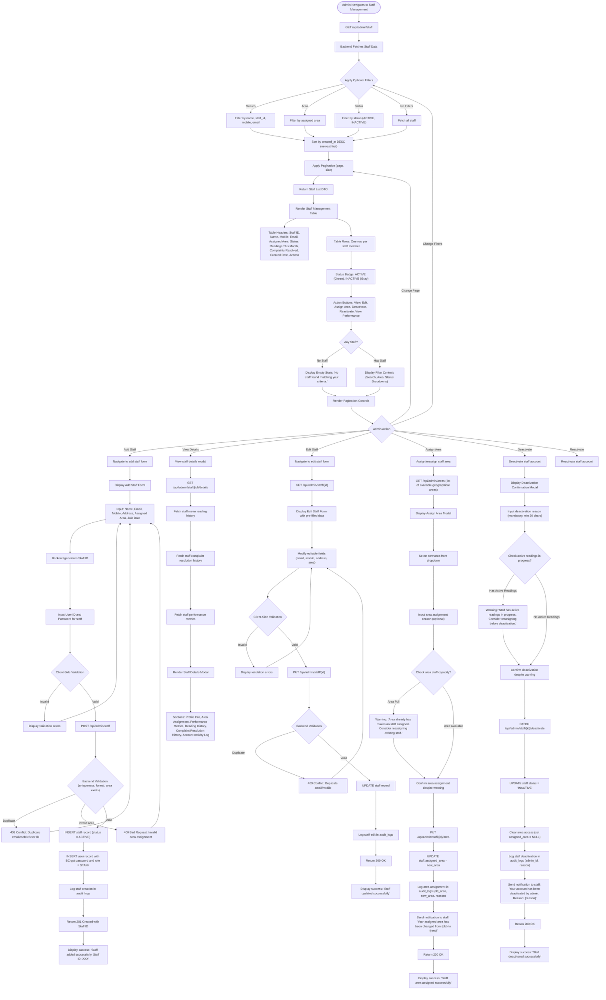

# 30 - Admin Staff Management Detailed Flowchart

```mermaid
flowchart TD
    StartStaffMgmt([Admin Navigates to Staff Management]) --> LoadStaffList["GET /api/admin/staff"]

    LoadStaffList --> FetchStaffData["Backend Fetches Staff Data"]
    FetchStaffData --> ApplyStaffFilters{"Apply Optional Filters"}
    ApplyStaffFilters -->|Search| FilterStaffSearch["Filter by name, staff_id, mobile, email"]
    ApplyStaffFilters -->|Area| FilterStaffArea["Filter by assigned area"]
    ApplyStaffFilters -->|Status| FilterStaffStatus["Filter by status (ACTIVE, INACTIVE)"]
    ApplyStaffFilters -->|No Filters| FetchAllStaff["Fetch all staff"]

    FilterStaffSearch --> SortStaff["Sort by created_at DESC (newest first)"]
    FilterStaffArea --> SortStaff
    FilterStaffStatus --> SortStaff
    FetchAllStaff --> SortStaff

    SortStaff --> PaginateStaff["Apply Pagination (page, size)"]
    PaginateStaff --> ReturnStaffList["Return Staff List DTO"]

    ReturnStaffList --> RenderStaffTable["Render Staff Management Table"]
    RenderStaffTable --> StaffTableHeader["Table Headers: Staff ID, Name, Mobile, Email, Assigned Area, Status, Readings This Month, Complaints Resolved, Created Date, Actions"]
    RenderStaffTable --> StaffTableRows["Table Rows: One row per staff member"]

    StaffTableRows --> StaffStatusBadge["Status Badge: ACTIVE (Green), INACTIVE (Gray)"]
    StaffStatusBadge --> StaffActionButtons["Action Buttons: View, Edit, Assign Area, Deactivate, Reactivate, View Performance"]

    StaffActionButtons --> CheckEmptyStaff{"Any Staff?"}
    CheckEmptyStaff -->|No Staff| DisplayEmptyStaffState["Display Empty State: 'No staff found matching your criteria.'"]
    CheckEmptyStaff -->|Has Staff| DisplayStaffFilterControls["Display Filter Controls (Search, Area, Status Dropdowns)"]

    DisplayEmptyStaffState --> RenderStaffPagination["Render Pagination Controls"]
    DisplayStaffFilterControls --> RenderStaffPagination

    RenderStaffPagination --> AdminStaffAction{"Admin Action"}
    AdminStaffAction -->|Change Filters| ApplyStaffFilters
    AdminStaffAction -->|Change Page| PaginateStaff
    AdminStaffAction -->|Add Staff| AddNewStaff["Navigate to add staff form"]
    AdminStaffAction -->|View Details| ViewStaffDetails["View staff details modal"]
    AdminStaffAction -->|Edit Staff| EditStaffForm["Navigate to edit staff form"]
    AdminStaffAction -->|Assign Area| AssignStaffArea["Assign/reassign staff area"]
    AdminStaffAction -->|Deactivate| DeactivateStaff["Deactivate staff account"]
    AdminStaffAction -->|Reactivate| ReactivateStaff["Reactivate staff account"]

    %% Add Staff Flow
    AddNewStaff --> DisplayAddStaffForm["Display Add Staff Form"]
    DisplayAddStaffForm --> InputStaffDetails["Input: Name, Email, Mobile, Address, Assigned Area, Join Date"]
    InputStaffDetails --> GenerateStaffID["Backend generates Staff ID"]
    GenerateStaffID --> InputStaffCredentials["Input User ID and Password for staff"]
    InputStaffCredentials --> ValAddStaffForm{"Client-Side Validation"}
    ValAddStaffForm -->|Invalid| ErrAddStaffVal["Display validation errors"]
    ErrAddStaffVal --> InputStaffDetails

    ValAddStaffForm -->|Valid| SubmitAddStaffAPI["POST /api/admin/staff"]
    SubmitAddStaffAPI --> BackendAddStaffVal{"Backend Validation (uniqueness, format, area exists)"}
    BackendAddStaffVal -->|Duplicate| ErrAddStaffDup["409 Conflict: Duplicate email/mobile/user ID"]
    ErrAddStaffDup --> InputStaffDetails

    BackendAddStaffVal -->|Invalid Area| ErrStaffArea["400 Bad Request: Invalid area assignment"]
    ErrStaffArea --> InputStaffDetails

    BackendAddStaffVal -->|Valid| CreateStaffRecord["INSERT staff record (status = ACTIVE)"]
    CreateStaffRecord --> CreateUserRecordStaff["INSERT user record with BCrypt password and role = STAFF"]
    CreateUserRecordStaff --> LogStaffCreation["Log staff creation in audit_logs"]
    LogStaffCreation --> ReturnAddStaffSuccess["Return 201 Created with Staff ID"]
    ReturnAddStaffSuccess --> DisplayAddStaffSuccess["Display success: 'Staff added successfully. Staff ID: XXX'"]

    %% Assign Area Flow
    AssignStaffArea --> FetchAvailableAreas["GET /api/admin/areas (list of available geographical areas)"]
    FetchAvailableAreas --> DisplayAssignAreaModal["Display Assign Area Modal"]
    DisplayAssignAreaModal --> SelectNewArea["Select new area from dropdown"]
    SelectNewArea --> InputAreaReason["Input area assignment reason (optional)"]
    InputAreaReason --> CheckAreaStaffCount{"Check area staff capacity?"}
    CheckAreaStaffCount -->|Area Full| WarnAreaFull["Warning: 'Area already has maximum staff assigned. Consider reassigning existing staff.'"]
    CheckAreaStaffCount -->|Area Available| ConfirmAreaAssign

    WarnAreaFull --> ConfirmAreaAssign["Confirm area assignment despite warning"]
    ConfirmAreaAssign --> SubmitAssignAreaAPI["PUT /api/admin/staff/{id}/area"]
    SubmitAssignAreaAPI --> UpdateStaffArea["UPDATE staff.assigned_area = new_area"]
    UpdateStaffArea --> LogAreaAssignment["Log area assignment in audit_logs (old_area, new_area, reason)"]
    LogAreaAssignment --> NotifyStaffAreaChange["Send notification to staff: 'Your assigned area has been changed from {old} to {new}'"]
    NotifyStaffAreaChange --> ReturnAssignAreaSuccess["Return 200 OK"]
    ReturnAssignAreaSuccess --> DisplayAssignAreaSuccess["Display success: 'Staff area assigned successfully'"]

    %% Edit Staff Flow
    EditStaffForm --> FetchStaffForEdit["GET /api/admin/staff/{id}"]
    FetchStaffForEdit --> DisplayEditStaffForm["Display Edit Staff Form with pre-filled data"]
    DisplayEditStaffForm --> ModifyStaffFields["Modify editable fields (email, mobile, address, area)"]
    ModifyStaffFields --> ValEditStaffForm{"Client-Side Validation"}
    ValEditStaffForm -->|Invalid| ErrEditStaffVal["Display validation errors"]
    ErrEditStaffVal --> ModifyStaffFields

    ValEditStaffForm -->|Valid| SubmitEditStaffAPI["PUT /api/admin/staff/{id}"]
    SubmitEditStaffAPI --> BackendEditStaffVal{"Backend Validation"}
    BackendEditStaffVal -->|Duplicate| ErrEditStaffDup["409 Conflict: Duplicate email/mobile"]
    ErrEditStaffDup --> ModifyStaffFields

    BackendEditStaffVal -->|Valid| UpdateStaffRecord["UPDATE staff record"]
    UpdateStaffRecord --> LogStaffEdit["Log staff edit in audit_logs"]
    LogStaffEdit --> ReturnEditStaffSuccess["Return 200 OK"]
    ReturnEditStaffSuccess --> DisplayEditStaffSuccess["Display success: 'Staff updated successfully'"]

    %% Deactivate Staff Flow
    DeactivateStaff --> DisplayDeactivateStaffModal["Display Deactivation Confirmation Modal"]
    DisplayDeactivateStaffModal --> InputDeactivateReason["Input deactivation reason (mandatory, min 20 chars)"]
    InputDeactivateReason --> CheckActiveReadings{"Check active readings in progress?"}
    CheckActiveReadings -->|Has Active Readings| WarnActiveReadings["Warning: 'Staff has active readings in progress. Consider reassigning before deactivation.'"]
    CheckActiveReadings -->|No Active Readings| ConfirmStaffDeactivate

    WarnActiveReadings --> ConfirmStaffDeactivate["Confirm deactivation despite warning"]
    ConfirmStaffDeactivate --> SubmitDeactivateStaffAPI["PATCH /api/admin/staff/{id}/deactivate"]
    SubmitDeactivateStaffAPI --> SoftDeleteStaffRecord["UPDATE staff status = 'INACTIVE'"]
    SoftDeleteStaffRecord --> ClearStaffAreaAccess["Clear area access (set assigned_area = NULL)"]
    ClearStaffAreaAccess --> LogStaffDeactivation["Log staff deactivation in audit_logs (admin_id, reason)"]
    LogStaffDeactivation --> NotifyStaffDeactivation["Send notification to staff: 'Your account has been deactivated by admin. Reason: {reason}'"]
    NotifyStaffDeactivation --> ReturnDeactivateStaffSuccess["Return 200 OK"]
    ReturnDeactivateStaffSuccess --> DisplayDeactivateStaffSuccess["Display success: 'Staff deactivated successfully'"]

    %% View Staff Details
    ViewStaffDetails --> FetchStaffDetails["GET /api/admin/staff/{id}/details"]
    FetchStaffDetails --> FetchStaffReadings["Fetch staff meter reading history"]
    FetchStaffReadings --> FetchStaffComplaints["Fetch staff complaint resolution history"]
    FetchStaffComplaints --> FetchStaffPerformance["Fetch staff performance metrics"]

    FetchStaffPerformance --> RenderStaffDetailsModal["Render Staff Details Modal"]
    RenderStaffDetailsModal --> StaffDetailsSections["Sections: Profile Info, Area Assignment, Performance Metrics, Reading History, Complaint Resolution History, Account Activity Log"]
```
