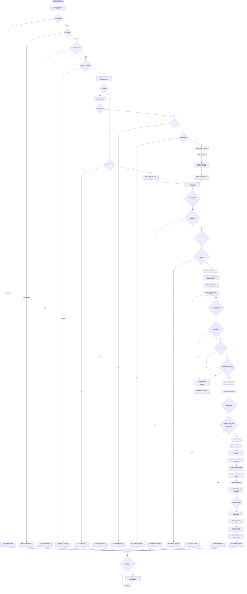

# 32 - API Security Flowchart

```mermaid
flowchart TD
    StartSecurity([API Request Received]) --> PreRequestCheck["Pre-Request Security Checks"]

    PreRequestCheck --> CheckCORS{"CORS Validation"}
    CheckCORS -->|Invalid Origin| ErrCORS["403 Forbidden: Invalid CORS origin"]
    ErrCORS --> EndSecurity

    CheckCORS -->|Valid| CheckRateLimit{"Rate Limiting"}
    CheckRateLimit -->|Limit Exceeded| ErrRateLimit["429 Too Many Requests: Rate limit exceeded"]
    ErrRateLimit --> EndSecurity

    CheckRateLimit -->|Within Limit| CheckContentType{"Content-Type Validation"}
    CheckContentType -->|Invalid| ErrContentType["415 Unsupported Media Type: Invalid Content-Type"]
    ErrContentType --> EndSecurity

    CheckContentType -->|Valid| CheckRequestSize{"Request Size Validation"}
    CheckRequestSize -->|Too Large| ErrRequestSize["413 Payload Too Large: Request size exceeds limit"]
    ErrRequestSize --> EndSecurity

    CheckRequestSize -->|Valid| ExtractJWT["Extract JWT from Authorization header"]

    ExtractJWT --> CheckJWTExists{"JWT Present?"}
    CheckJWTExists -->|No| CheckPublicEndpoint{"Is Public Endpoint?"}
    CheckJWTExists -->|Yes| ValidateJWT

    CheckPublicEndpoint -->|Yes| AllowPublicAccess["Allow public access (login, register, forgot-password)"]
    CheckPublicEndpoint -->|No| ErrUnauthorized["401 Unauthorized: Authentication required"]

    AllowPublicAccess --> ProceedToValidation
    ErrUnauthorized --> EndSecurity

    ValidateJWT["Validate JWT Token"] --> CheckSignature{"Signature Valid?"}
    CheckSignature -->|Invalid| ErrInvalidToken["401 Unauthorized: Invalid JWT signature"]
    ErrInvalidToken --> EndSecurity

    CheckSignature -->|Valid| CheckExpiry{"Token Expired?"}
    CheckExpiry -->|Yes| ErrTokenExpired["401 Unauthorized: Token expired"]
    ErrTokenExpired --> EndSecurity

    CheckExpiry -->|No| CheckRevoked{"Token Revoked?"}
    CheckRevoked -->|Yes| ErrTokenRevoked["401 Unauthorized: Token revoked"]
    ErrTokenRevoked --> EndSecurity

    CheckRevoked -->|No| ExtractClaims["Extract claims from JWT"]
    ExtractClaims --> ExtractUserID["Extract user_id"]
    ExtractUserID --> ExtractRole["Extract role (ADMIN, STAFF, CUSTOMER)"]
    ExtractRole --> ExtractConsumerIDs["Extract consumer_ids (if customer)"]
    ExtractConsumerIDs --> ProceedToValidation

    ProceedToValidation["Proceed to Request Validation"] --> CheckEndpointPermissions{"Check Endpoint Permissions"}
    CheckEndpointPermissions --> ValidateRoleAccess{"Role has access to endpoint?"}
    ValidateRoleAccess -->|No| ErrForbidden["403 Forbidden: Insufficient permissions"]
    ErrForbidden --> EndSecurity

    ValidateRoleAccess -->|Yes| CheckResourceOwnership{"Resource Ownership Check"}
    CheckResourceOwnership --> ValidateResourceAccess{"User owns requested resource?"}
    ValidateResourceAccess -->|No| ErrResourceForbidden["403 Forbidden: Resource access denied"]
    ErrResourceForbidden --> EndSecurity

    ValidateResourceAccess -->|Yes| SanitizeInput["Sanitize Input Parameters"]
    SanitizeInput --> RemoveSQLInjection["Remove potential SQL injection patterns"]
    RemoveSQLInjection --> RemoveXSS["Remove potential XSS patterns"]
    RemoveXSS --> ValidateInputFormat["Validate input format and length"]

    ValidateInputFormat -->|Invalid| ErrValidation["400 Bad Request: Input validation failed"]
    ErrValidation --> EndSecurity

    ValidateInputFormat -->|Valid| CheckSensitiveData{"Check for Sensitive Data Exposure"}
    CheckSensitiveData --> ValidateNoPasswords{"Request contains passwords?"}
    ValidateNoPasswords -->|Yes| LogSecurityEvent["Log security event: Potential password exposure"]
    ValidateNoPasswords -->|No| ValidateNoCVV{"Request contains CVV?"}
    LogSecurityEvent --> BlockRequest["Block request for security review"]
    BlockRequest --> EndSecurity

    ValidateNoCVV -->|Yes| LogSecurityEvent
    ValidateNoCVV -->|No| ValidateNoCardNumbers{"Request contains full card numbers?"}
    ValidateNoCardNumbers -->|Yes| LogSecurityEvent
    ValidateNoCardNumbers -->|No| ProceedToController

    ProceedToController["Proceed to Controller"] --> ExecuteBusinessLogic["Execute business logic"]
    ExecuteBusinessLogic --> CheckAuthorization{"Business Logic Authorization"}
    CheckAuthorization --> ValidateBusinessRules{"Validate business rules (area access, bill ownership, etc.)"}
    ValidateBusinessRules -->|Failed| ErrBusinessAuth["403 Forbidden: Business rule violation"]
    ErrBusinessAuth --> EndSecurity

    ValidateBusinessRules -->|Passed| ProcessRequest["Process request"]
    ProcessRequest --> GenerateResponse["Generate response"]

    GenerateResponse --> FilterSensitiveData["Filter sensitive data from response"]
    FilterSensitiveData --> RemovePasswordHash["Remove password_hash from response"]
    RemovePasswordHash --> MaskCardNumbers["Mask card numbers (show last 4 only)"]
    MaskCardNumbers --> RemoveInternalFields["Remove internal/debug fields"]
    RemoveInternalFields --> SanitizeResponse["Sanitize response data"]

    SanitizeResponse --> LogAPICall["Log API call in audit_logs (user_id, endpoint, status, timestamp)"]
    LogAPICall --> CheckSecurityHeaders{"Add Security Headers"}
    CheckSecurityHeaders --> AddCSPHeader["Add Content-Security-Policy header"]
    AddCSPHeader --> AddXFrameOptions["Add X-Frame-Options header"]
    AddXFrameOptions --> AddXContentType["Add X-Content-Type-Options header"]
    AddXContentType --> AddStrictTransport["Add Strict-Transport-Security header"]

    AddStrictTransport --> ReturnResponse["Return sanitized response with security headers"]
    ReturnResponse --> EndSecurity

    %% Security Event Logging
    EndSecurity --> CheckSecurityEvents{"Any security events logged?"}
    CheckSecurityEvents -->|Yes| NotifySecurityTeam["Notify security team of potential threats"]
    CheckSecurityEvents -->|No| EndProcess
    NotifySecurityTeam --> EndProcess
```
