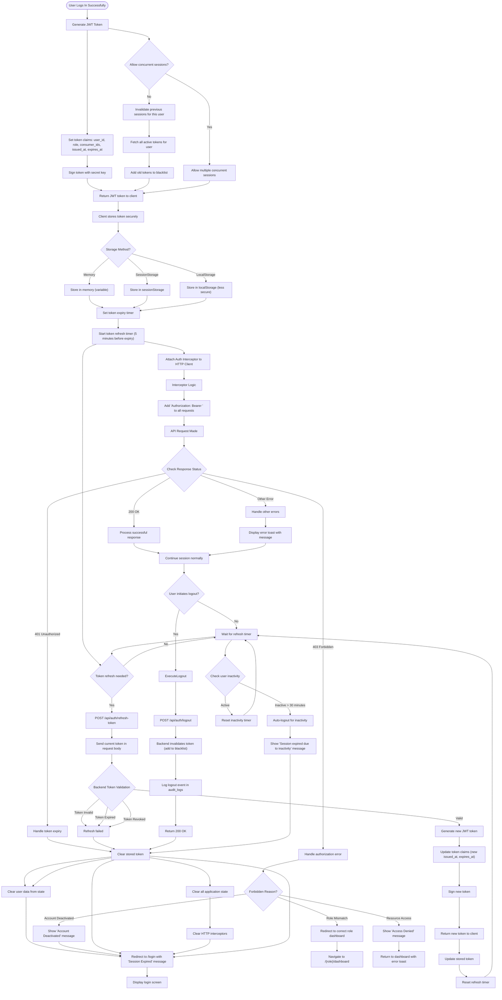

# 33 - Session Management Flowchart

```mermaid
flowchart TD
    StartSession([User Logs In Successfully]) --> GenerateJWT["Generate JWT Token"]

    GenerateJWT --> SetTokenClaims["Set token claims: user_id, role, consumer_ids, issued_at, expires_at"]
    SetTokenClaims --> SignToken["Sign token with secret key"]
    SignToken --> ReturnTokenToClient["Return JWT token to client"]

    ReturnTokenToClient --> ClientStorage["Client stores token securely"]
    ClientStorage --> CheckStorageMethod{"Storage Method?"}
    CheckStorageMethod -->|Memory| StoreMemory["Store in memory (variable)"]
    CheckStorageMethod -->|SessionStorage| StoreSession["Store in sessionStorage"]
    CheckStorageMethod -->|LocalStorage| StoreLocal["Store in localStorage (less secure)"]

    StoreMemory --> SetTokenExpiry["Set token expiry timer"]
    StoreSession --> SetTokenExpiry
    StoreLocal --> SetTokenExpiry

    SetTokenExpiry --> StartTokenRefresh["Start token refresh timer (5 minutes before expiry)"]

    StartTokenRefresh --> AttachInterceptor["Attach Auth Interceptor to HTTP Client"]
    AttachInterceptor --> InterceptorLogic["Interceptor Logic"]
    InterceptorLogic --> AddAuthHeader["Add 'Authorization: Bearer <token>' to all requests"]

    AddAuthHeader --> APIRequest["API Request Made"]
    APIRequest --> CheckResponse{"Check Response Status"}
    CheckResponse -->|200 OK| ProcessSuccess["Process successful response"]
    CheckResponse -->|401 Unauthorized| HandleTokenExpired["Handle token expiry"]
    CheckResponse -->|403 Forbidden| HandleForbidden["Handle authorization error"]
    CheckResponse -->|Other Error| HandleOtherError["Handle other errors"]

    ProcessSuccess --> ContinueSession["Continue session normally"]

    HandleTokenExpired --> ClearToken["Clear stored token"]
    ClearToken --> ClearUserData["Clear user data from state"]
    ClearUserData --> RedirectLogin["Redirect to /login with 'Session Expired' message"]
    RedirectLogin --> DisplayLoginScreen["Display login screen"]

    HandleForbidden --> CheckForbiddenReason{"Forbidden Reason?"}
    CheckForbiddenReason -->|Role Mismatch| RedirectRoleDashboard["Redirect to correct role dashboard"]
    CheckForbiddenReason -->|Resource Access| ShowAccessDenied["Show 'Access Denied' message"]
    CheckForbiddenReason -->|Account Deactivated| ShowDeactivatedMessage["Show 'Account Deactivated' message"]

    RedirectRoleDashboard --> NavigateToCorrectDashboard["Navigate to /{role}/dashboard"]
    ShowAccessDenied --> ReturnToDashboard["Return to dashboard with error toast"]
    ShowDeactivatedMessage --> RedirectLogin

    HandleOtherError --> DisplayErrorToast["Display error toast with message"]
    DisplayErrorToast --> ContinueSession

    %% Token Refresh Flow
    StartTokenRefresh --> CheckRefreshNeeded{"Token refresh needed?"}
    CheckRefreshNeeded -->|No| WaitRefreshTimer["Wait for refresh timer"]
    WaitRefreshTimer --> CheckRefreshNeeded

    CheckRefreshNeeded -->|Yes| CallRefreshAPI["POST /api/auth/refresh-token"]
    CallRefreshAPI --> SendCurrentToken["Send current token in request body"]
    SendCurrentToken --> BackendRefreshValidation{"Backend Token Validation"}

    BackendRefreshValidation -->|Token Invalid| RefreshFailed["Refresh failed"]
    BackendRefreshValidation -->|Token Expired| RefreshFailed
    BackendRefreshValidation -->|Token Revoked| RefreshFailed
    BackendRefreshValidation -->|Valid| GenerateNewToken["Generate new JWT token"]

    RefreshFailed --> ClearToken
    ClearToken --> RedirectLogin

    GenerateNewToken --> UpdateTokenClaims["Update token claims (new issued_at, expires_at)"]
    UpdateTokenClaims --> SignNewToken["Sign new token"]
    SignNewToken --> ReturnNewToken["Return new token to client"]
    ReturnNewToken --> UpdateStoredToken["Update stored token"]
    UpdateStoredToken --> ResetRefreshTimer["Reset refresh timer"]
    ResetRefreshTimer --> WaitRefreshTimer

    %% Logout Flow
    ContinueSession --> UserInitiatesLogout{"User initiates logout?"}
    UserInitiatesLogout -->|No| WaitRefreshTimer
    UserInitiatesLogout -->|Yes| ExecuteLogout

    ExecuteLogout --> CallLogoutAPI["POST /api/auth/logout"]
    CallLogoutAPI --> InvalidateToken["Backend invalidates token (add to blacklist)"]
    InvalidateToken --> LogLogoutEvent["Log logout event in audit_logs"]
    LogLogoutEvent --> ReturnLogoutSuccess["Return 200 OK"]

    ReturnLogoutSuccess --> ClearToken
    ClearToken --> ClearUserData
    ClearToken --> ClearAllState["Clear all application state"]
    ClearAllState --> ClearInterceptors["Clear HTTP interceptors"]
    ClearInterceptors --> RedirectLogin

    %% Session Timeout (Inactivity)
    WaitRefreshTimer --> CheckInactivity{"Check user inactivity"}
    CheckInactivity -->|Inactive > 30 minutes| AutoLogout["Auto-logout for inactivity"]
    CheckInactivity -->|Active| ResetInactivityTimer["Reset inactivity timer"]
    ResetInactivityTimer --> WaitRefreshTimer

    AutoLogout --> ShowInactivityMessage["Show 'Session expired due to inactivity' message"]
    ShowInactivityMessage --> ClearToken
    ClearToken --> RedirectLogin

    %% Concurrent Session Management
    GenerateJWT --> CheckConcurrentSessions{"Allow concurrent sessions?"}
    CheckConcurrentSessions -->|No| InvalidateOldSessions["Invalidate previous sessions for this user"]
    CheckConcurrentSessions -->|Yes| AllowMultipleSessions["Allow multiple concurrent sessions"]

    InvalidateOldSessions --> FetchActiveTokens["Fetch all active tokens for user"]
    FetchActiveTokens --> AddToBlacklist["Add old tokens to blacklist"]
    AddToBlacklist --> ReturnTokenToClient

    AllowMultipleSessions --> ReturnTokenToClient
```
