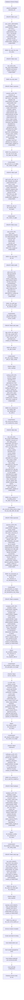

# 34 - Database Schema Flowchart

```mermaid
flowchart TD
    StartSchema([Database Schema Design]) --> CreateDatabase["CREATE DATABASE vidyutseva_db"]

    CreateDatabase --> CreateUsersTable["CREATE TABLE users"]
    CreateUsersTable --> UserColumns["user_id (PK, VARCHAR20, UNIQUE), email (VARCHAR255, UNIQUE, NOT NULL), password_hash (VARCHAR255, NOT NULL), role (ENUM: ADMIN, STAFF, CUSTOMER), status (ENUM: ACTIVE, INACTIVE), created_at (TIMESTAMP), updated_at (TIMESTAMP)"]
    UserColumns --> UserIndexes["INDEX: idx_email, idx_role, idx_status"]

    UserIndexes --> CreateRolesTable["CREATE TABLE roles"]
    CreateRolesTable --> RoleColumns["role_id (PK, INT), role_name (VARCHAR50, UNIQUE), permissions (JSON), created_at (TIMESTAMP)"]
    RoleColumns --> RoleIndexes["INDEX: idx_role_name"]

    RoleIndexes --> CreateCustomersTable["CREATE TABLE customers"]
    CreateCustomersTable --> CustomerColumns["customer_id (PK, INT), consumer_id (VARCHAR13, UNIQUE, NOT NULL), user_id (FK, UNIQUE), title (VARCHAR10), full_name (VARCHAR50, NOT NULL), email (VARCHAR255, UNIQUE), mobile (VARCHAR10, UNIQUE), address (VARCHAR500), city (VARCHAR100), state (VARCHAR100), pincode (VARCHAR10), area (VARCHAR100, NOT NULL), meter_number (VARCHAR20, UNIQUE), connection_type (ENUM: RESIDENTIAL, COMMERCIAL), sanctioned_load_kw (DECIMAL10,2), status (ENUM: ACTIVE, INACTIVE, SUSPENDED), previous_meter_reading (DECIMAL10,2), service_disruption_flag (BOOLEAN), disruption_count (INT, DEFAULT 0), created_at (TIMESTAMP), updated_at (TIMESTAMP)"]
    CustomerColumns --> CustomerIndexes["INDEX: idx_consumer_id, idx_user_id, idx_area, idx_status, idx_mobile"]
    CustomerIndexes --> CustomerConstraints["CONSTRAINT: chk_consumer_id_13_digits, chk_mobile_10_digits"]

    CustomerConstraints --> CreateStaffTable["CREATE TABLE staff"]
    CreateStaffTable --> StaffColumns["staff_id (PK, INT), user_id (FK, UNIQUE), full_name (VARCHAR100, NOT NULL), email (VARCHAR255, UNIQUE), mobile (VARCHAR10, UNIQUE), assigned_area (VARCHAR100), status (ENUM: ACTIVE, INACTIVE), join_date (DATE), created_at (TIMESTAMP), updated_at (TIMESTAMP)"]
    StaffColumns --> StaffIndexes["INDEX: idx_user_id, idx_assigned_area, idx_status"]
    StaffIndexes --> StaffConstraints["CONSTRAINT: chk_mobile_10_digits"]

    StaffConstraints --> CreateAreasTable["CREATE TABLE areas"]
    CreateAreasTable --> AreaColumns["area_id (PK, INT), area_name (VARCHAR100, UNIQUE), city (VARCHAR100), state (VARCHAR100), pincode_start (VARCHAR6), pincode_end (VARCHAR6), status (ENUM: ACTIVE, INACTIVE), created_at (TIMESTAMP)"]
    AreaColumns --> AreaIndexes["INDEX: idx_area_name, idx_city"]

    AreaIndexes --> CreateTariffsTable["CREATE TABLE tariffs"]
    CreateTariffsTable --> TariffColumns["tariff_id (PK, INT), tariff_type (ENUM: RESIDENTIAL, COMMERCIAL), version_number (INT), status (ENUM: DRAFT, ACTIVE, INACTIVE, SUPERSEDED), effective_from (DATE), effective_to (DATE), fixed_charge_per_kw (DECIMAL10,2), duty_percentage (DECIMAL5,2), created_by (FK), created_at (TIMESTAMP)"]
    TariffColumns --> TariffIndexes["INDEX: idx_tariff_type, idx_version, idx_status, idx_effective_dates"]
    TariffIndexes --> TariffConstraints["CONSTRAINT: chk_effective_dates, UNIQUE: tariff_type + version_number"]

    TariffConstraints --> CreateTariffSlabsTable["CREATE TABLE tariff_slabs"]
    CreateTariffSlabsTable --> TariffSlabColumns["slab_id (PK, INT), tariff_id (FK), slab_number (INT), units_from (INT), units_to (INT), rate_per_unit (DECIMAL10,2), created_at (TIMESTAMP)"]
    TariffSlabColumns --> TariffSlabIndexes["INDEX: idx_tariff_id, idx_slab_number"]
    TariffSlabIndexes --> TariffSlabConstraints["CONSTRAINT: chk_units_range, UNIQUE: tariff_id + slab_number"]

    TariffSlabConstraints --> CreateMeterReadingsTable["CREATE TABLE meter_readings"]
    CreateMeterReadingsTable --> MeterReadingColumns["reading_id (PK, INT), consumer_id (FK), previous_reading (DECIMAL10,2), current_reading (DECIMAL10,2, NOT NULL), units_consumed (DECIMAL10,2), reading_date (DATE, NOT NULL), reading_key (VARCHAR36, UNIQUE), staff_id (FK), status (ENUM: SUBMITTED, VALIDATING, COMPLETED, FAILED), bill_id (FK), created_at (TIMESTAMP)"]
    MeterReadingColumns --> MeterReadingIndexes["INDEX: idx_consumer_id, idx_reading_date, idx_reading_key, idx_staff_id"]
    MeterReadingIndexes --> MeterReadingConstraints["CONSTRAINT: chk_current_ge_previous, chk_reading_key_unique"]

    MeterReadingConstraints --> CreateBillsTable["CREATE TABLE bills"]
    CreateBillsTable --> BillColumns["bill_id (PK, INT), bill_number (VARCHAR20, UNIQUE), consumer_id (FK), billing_period (VARCHAR7, NOT NULL), bill_date (DATE, NOT NULL), due_date (DATE, NOT NULL), previous_reading (DECIMAL10,2), current_reading (DECIMAL10,2), units_consumed (DECIMAL10,2), tariff_id (FK), energy_charge (DECIMAL10,2), fixed_charge (DECIMAL10,2), duty_tax (DECIMAL10,2), bill_amount (DECIMAL10,2), late_fee (DECIMAL10,2, DEFAULT 0), total_payable (DECIMAL10,2), status (ENUM: GENERATED, PENDING, OVERDUE, PAID, CANCELLED), late_fee_applied_date (DATE), payment_date (DATE), generated_by_staff_id (FK), created_at (TIMESTAMP), updated_at (TIMESTAMP)"]
    BillColumns --> BillIndexes["INDEX: idx_consumer_id, idx_billing_period, idx_status, idx_due_date"]
    BillIndexes --> BillConstraints["CONSTRAINT: chk_consumer_billing_period_unique, chk_due_date_after_bill_date"]

    BillConstraints --> CreatePaymentsTable["CREATE TABLE payments"]
    CreatePaymentsTable --> PaymentColumns["payment_id (PK, INT), transaction_id (VARCHAR30, UNIQUE), receipt_number (VARCHAR20, UNIQUE), bill_id (FK), consumer_id (FK), amount (DECIMAL10,2, NOT NULL), payment_method (ENUM: CARD, UPI, NET_BANKING), card_last4 (VARCHAR4), upi_id_masked (VARCHAR50), bank_name (VARCHAR100), pg_charge (DECIMAL10,2), total_paid (DECIMAL10,2), status (ENUM: INITIATED, VALIDATING, PROCESSING, SUCCESS, FAILED, TIMEOUT), idempotency_key (VARCHAR36, UNIQUE), payment_gateway_response (JSON), created_at (TIMESTAMP), updated_at (TIMESTAMP)"]
    PaymentColumns --> PaymentIndexes["INDEX: idx_transaction_id, idx_receipt_number, idx_bill_id, idx_consumer_id, idx_idempotency_key"]
    PaymentIndexes --> PaymentConstraints["CONSTRAINT: chk_transaction_id_unique, chk_receipt_number_unique, chk_idempotency_key_unique"]

    PaymentConstraints --> CreateComplaintsTable["CREATE TABLE complaints"]
    CreateComplaintsTable --> ComplaintColumns["complaint_id (PK, INT), complaint_number (VARCHAR20, UNIQUE), consumer_id (FK), complaint_type (VARCHAR50), category (VARCHAR50), contact_person (VARCHAR100), mobile (VARCHAR10), address (VARCHAR500), landmark (VARCHAR255), description (TEXT, NOT NULL), status (ENUM: OPEN, ASSIGNED, IN_PROGRESS, RESOLVED, REJECTED, CLOSED), resolution_remarks (TEXT), assigned_staff_id (FK), resolved_by (FK), resolved_date (DATE), created_at (TIMESTAMP), updated_at (TIMESTAMP)"]
    ComplaintColumns --> ComplaintIndexes["INDEX: idx_complaint_number, idx_consumer_id, idx_status, idx_assigned_staff_id"]
    ComplaintIndexes --> ComplaintConstraints["CONSTRAINT: chk_complaint_number_unique, chk_description_min_length"]

    ComplaintConstraints --> CreateServiceRequestsTable["CREATE TABLE service_requests"]
    CreateServiceRequestsTable --> SRColumns["sr_id (PK, INT), request_number (VARCHAR20, UNIQUE), consumer_id (FK), request_type (ENUM: LOAD_CHANGE, CATEGORY_CHANGE), current_value (VARCHAR50), requested_value (VARCHAR50, NOT NULL), reason (TEXT, NOT NULL), status (ENUM: PENDING, UNDER_REVIEW, APPROVED, REJECTED, CANCELLED), admin_remarks (TEXT), approved_by (FK), approved_date (DATE), created_at (TIMESTAMP), updated_at (TIMESTAMP)"]
    SRColumns --> SRIndexes["INDEX: idx_request_number, idx_consumer_id, idx_status"]
    SRIndexes --> SRConstraints["CONSTRAINT: chk_request_number_unique, chk_reason_min_length"]

    SRConstraints --> CreateNotificationsTable["CREATE TABLE notifications"]
    CreateNotificationsTable --> NotificationColumns["notification_id (PK, INT), consumer_id (FK), type (ENUM: BILL, PAYMENT, COMPLAINT, SERVICE_REQUEST, GENERAL), title (VARCHAR200), message (TEXT, NOT NULL), is_read (BOOLEAN, DEFAULT FALSE), created_at (TIMESTAMP)"]
    NotificationColumns --> NotificationIndexes["INDEX: idx_consumer_id, idx_is_read, idx_created_at"]

    NotificationIndexes --> CreateFeedbackTable["CREATE TABLE feedback"]
    CreateFeedbackTable --> FeedbackColumns["feedback_id (PK, INT), feedback_number (VARCHAR20, UNIQUE), consumer_id (FK, NULLABLE), staff_id (FK, NULLABLE), type (VARCHAR50), category (VARCHAR50), details (TEXT, NOT NULL), rating (INT, NULLABLE), contact_info (VARCHAR255), status (ENUM: SUBMITTED, UNDER_REVIEW, ACKNOWLEDGED, RESOLVED), admin_response (TEXT), admin_id (FK), responded_at (TIMESTAMP), created_at (TIMESTAMP)"]
    FeedbackColumns --> FeedbackIndexes["INDEX: idx_feedback_number, idx_consumer_id, idx_status"]
    FeedbackIndexes --> FeedbackConstraints["CONSTRAINT: chk_feedback_number_unique, chk_rating_range"]

    FeedbackConstraints --> CreateAuditLogsTable["CREATE TABLE audit_logs"]
    CreateAuditLogsTable --> AuditLogColumns["log_id (PK, BIGINT), user_id (FK, NULLABLE), action (VARCHAR100, NOT NULL), entity_type (VARCHAR50), entity_id (VARCHAR50), old_values (JSON, NULLABLE), new_values (JSON, NULLABLE), ip_address (VARCHAR45), user_agent (VARCHAR500), created_at (TIMESTAMP)"]
    AuditLogColumns --> AuditLogIndexes["INDEX: idx_user_id, idx_action, idx_entity_type, idx_created_at"]

    AuditLogIndexes --> CreateTokenBlacklistTable["CREATE TABLE token_blacklist"]
    CreateTokenBlacklistTable --> TokenBlacklistColumns["blacklist_id (PK, BIGINT), token_jti (VARCHAR36, UNIQUE, NOT NULL), user_id (FK), expires_at (TIMESTAMP, NOT NULL), created_at (TIMESTAMP)"]
    TokenBlacklistColumns --> TokenBlacklistIndexes["INDEX: idx_token_jti, idx_user_id, idx_expires_at"]

    TokenBlacklistIndexes --> EndSchema["Schema Creation Complete"]
    EndSchema --> CreateSeedData["Create seed data for testing"]
    CreateSeedData --> InsertDefaultAdmin["Insert default admin user"]
    InsertDefaultAdmin --> InsertSampleAreas["Insert sample geographical areas"]
    InsertSampleAreas --> InsertDefaultTariffs["Insert default residential and commercial tariffs"]
    InsertDefaultTariffs --> InsertTariffSlabs["Insert tariff slab configurations"]
    InsertTariffSlabs --> SchemaReady["Database schema ready for use"]
```
